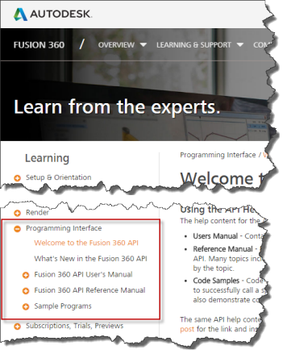
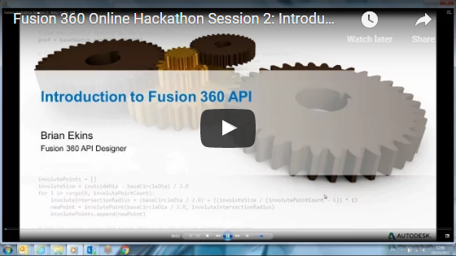

# Welcome to the Fusion API (Application Programming Interface)

## What is an API?

For those new to customizing applications by writing programs, the first question might be, "What is an API?". An API, or *Application Programming Interface* is a term used to describe a set of functionalities exposed by an application that allows it to be controlled by a program. For example, you can use Fusion's API to write a program that will perform the same types of operations you can perform when using Fusion interactively.

Fusion, by definition, is a general CAD system, meaning that it is not aimed at any specific industry or set of individuals that only model certain types of products. By providing an API, Fusion allows specialized functionality to be added and repetitive operations to be automated, resulting in the improved productivity that comes from a tailored solution.

An API is also important in that it allows third-party applications to integrate with Fusion.

## API Help Content

This online documentation is the primary source for details about the API and the content is accessed through the table of contents, as shown below. There are also some other resources that are referenced below.

The help content for the API consists of three major categories:

* **[User's Manual](UserManualIndex_UM.htm)** - Contains high level overviews of the various parts of the API and describes how to use them. The User's Manual is the place to start if you're new to the API.
* **[Reference Manual](ReferenceManual_UM.htm)** - Provides details about every object, method, property, event, and enum exposed by the API. Many topics include links to code samples that demonstrate how to use that specific object or function. This is the heart of the API documentation and is something you will use continually as you write programs for Fusion.
* **[Code Samples](SampleList.htm)** - These are complete code samples that you can copy, paste and run. Most code samples simply demonstrate how to successfully call a specific function and are not necessarily meant to accomplish a useful task; however, many of them also demonstrate common and useful workflows. Most of the small samples that demonstrate a specific function are not in the sample list but are accessed from the specific topic it is demonstrating.

## Searching the API Documentation

The Fusion help system has built-in support for searching. There is a search field near the top of the page, as shown below. Using this help supports filters to restrict the results but still often ends up with a large list of results that can be difficult to refine and pick the most appropriate topic. Better search results can usually be achieved by using a Google search. The entire help system is indexed by Google.

## Offline Access to the API Documentation

The same API help content is also available as a [CHM file](../ExtraFiles/FusionAPI.chm) that can be used offline. Support to view a CHM file is built-in to windows and there are apps available for Mac.

## Additional Resources

Fusion Object Model - As discussed in the [Basics Concepts of Fusion's API](BasicConcepts_UM.htm) topic here's a link to the [pdf of the Fusion object model](../ExtraFiles/Fusion.pdf).

Here are a few additional resources outside of this standard documentation that can also be very useful.

* [**Autodesk Discussion Groups**](http://forums.autodesk.com/t5/api-and-scripts/bd-p/22) - Autodesk discussion groups where there are open discussions about all of Autodesk's products. The Fusion **API and Scripts** group can be used to ask API questions and is a great resource for looking at previous questions and answers. The answers you find to questions using web searches will often lead you to topics here.
* [**Videos on YouTube**](https://www.youtube.com/channel/UC6Fl_1mFNt0rBqa068Vaxcg/search?query=Fusion) - A series of presentations were made at the end of 2015 for an Autodesk sponsored Hackathon to encourage the development of Apps for Fusion. These presentations are available as videos on YouTube. The API has grown a lot since these videos were produced but they still provide a lot of useful information and the concepts remain the same.

  

  |  |
  | --- |
  | [Introduction to the Fusion API](https://www.youtube.com/watch?v=6vUEJ5Iy2AQ) |
  | [Introduction to the Fusion Object Model](https://www.youtube.com/watch?v=IBO3XeteylA) |
  | [Commands and User Interface](https://www.youtube.com/watch?v=v1obVw1vMlg) |
  | [Document Structure](https://www.youtube.com/watch?v=x_plTzoajMI) |
  | [Geometry in Fusion](https://www.youtube.com/watch?v=S5BqOktfF2I) |
  | [More About Commands](https://www.youtube.com/watch?v=VaXwc3iTKJk) |
  | [Odd and Ends](https://www.youtube.com/watch?v=ORbKBZvzB8c) |
* [**Resources on GitHub**](https://autodeskfusion360.github.io/) - The Fusion GitHub site provides access to additional sample programs. To use the samples, you will need to copy them from GitHub to your machine. This process is described in detail in the [Using Samples From GitHub topic.](UsingSamplesFromGitHub_UM.htm)
* [***Mod the Machine* Blog**](http://blogs.autodesk.com/modthemachine) - A blog dedicated to the Autodesk Manufacturing API's