New Dialog
Old Dialog

## Creating a Script or Add-In Using the Old Dialog

### Creating, Editing, and Running Your First Script

Technically, there is not much difference between a script and an add-in. The process of creating, editing, and debugging them is mostly the same so the description below applies to both. Before getting into the details, here are the basic steps to create, edit, and run a Python script or add-in. The process is very similar for creating a C++ script or add-in.

1. Run the **Scripts and Add-Ins** command from the UTILITIES tab in the toolbar, as shown below.

   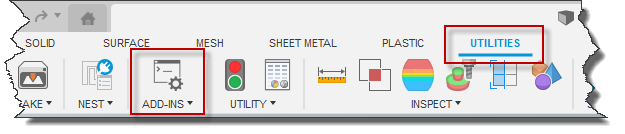
2. In the **Scripts and Add-Ins** dialog, click the “Create” button as shown below.

   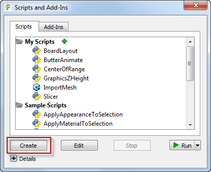
3. In the “Create New Script or Add-In” dialog, choose “Script” and “Python” for the programming language, enter a name for the script name, and optionally enter some information in the “Description”, and “Author” fields and then click “Create”. This will take you back to the “Scripts and Add-Ins” dialog.

   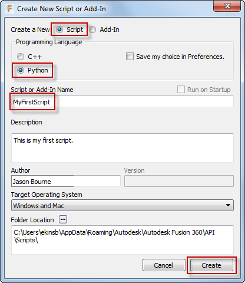
4. Now you have a script and will see it in the list of programs in the "Scripts" tab. To edit it, select it and click the "Edit" button, as shown below.

   

For Python programs, Fusion uses Visual Studio Code (VS Code) as the development environment. If it is not already installed when you try to edit or debug, Fusion will display the dialog below to install VS Code. You only need to do this the first time you edit any script or add-in. When VS Code finishes installing, do the Edit step again to open the script in VS Code.

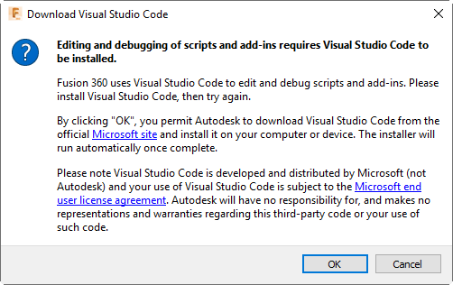

The first time you run VS Code from Fusion, you will see a window pop-up saying an extension is being installed. Fusion is installing the Python extension for VS Code. This also only needs to be done once. Finally, once everything is installed VS Code will open, as shown below.


5. You can now use VS Code to edit your program. For this simple example, edit the text for the messageBox to any message you would like, such as shown below, and save the changes.

   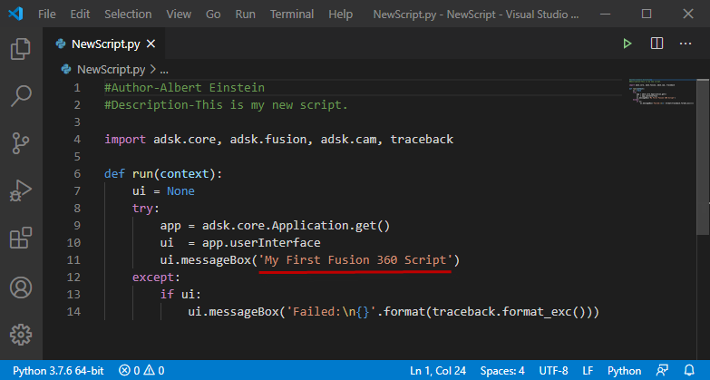
6. Congratulations, you have just written your first script. To run your script, run the **Scripts and Add-Ins** command, choose your script from the list, and then click “Run” as shown below.

   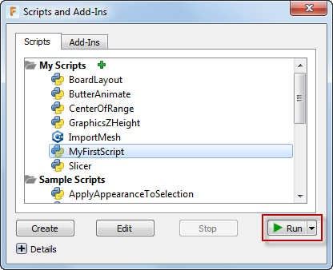

   The script will run and do whatever it is programmed to do. In this case it will display the message box shown below.

   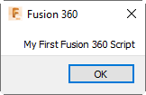

   - The most important feature of a development environment is the ability to debug your program. Debugging is very different between Python and C++. You can learn about debugging your [Python](PythonSpecific_UM.htm) and [C++](CPPSpecific_UM.htm) programs in the language specific topics.

### Script and Add-In Details

Now that you have seen the basic process of creating and debugging a script, here is some more information about the details of both scripts and add-ins.

The **Scripts and Add-Ins** dialog is the main access point to scripts and add-ins for both users and programmers. It contains two tabs; one where the available scripts are listed and the other where the available add-ins are listed. From these lists you can select a script or add-in and then run or edit it. The "Debug" option in the drop-down under the "Run" button does the same thing as "Edit" so there's no reason to use it.

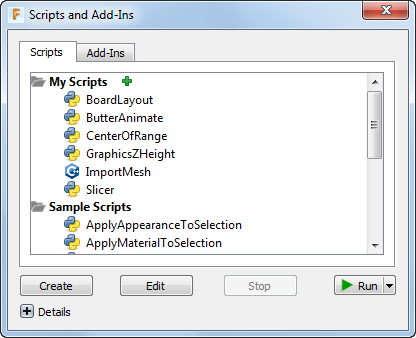

When creating a new script or add-in, the “Create New Script or Add-In” dialog is displayed where you enter information about your script or add-in.

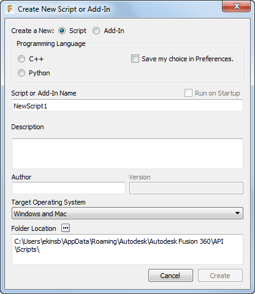

The various settings in the dialog are described below.

* **Programming Language** – Choose whether you want to create a Python or C++ script or add-in. If you check the “Save my choice in Preferences” then this will be remembered and automatically set the next time you create a new script or add-in.
* **Run on Startup** – This setting is add-in specific and indicates if the add-in should be run automatically when Fusion is started. Most add-ins will want to take advantage of this capability so the commands they define will be available to the user as soon as Fusion starts.
* **Script or Add-In Name** – This is the name of your script or add-in. This name will be used to create a new folder in the location specified by the “Folder Location” and this will also be used for the name of the script or add-in code files.
* **Description** – An optional description of the script or add-in.
* **Author** – An optional name of the author of the script or add-in.
* **Version** – This is an optional setting that is add-in specific and is the version of the add-in. This is a string and can be any form of a version label, for example, “1.0.0”, “2016”, “R1”, “V2”, etc.
* **Target Operating System** – Indicates which operating system(s) the script or add-in should be available in. For example, if your script or add-in uses Windows specific libraries you would set this to “Windows”, so Fusion won’t attempt to display or load it on a Mac.
* **Folder Location** – The location where the script or add-in will be created. When you create a new script or add-in using the dialog, a new folder with the script or add-in name is created and the add-in files are created in that folder. The default locations for add-ins and scripts are shown below, but you can edit the default path in the "General" -> "API section" in the **Preferences** command to point to any location you want.

  **Add-Ins**
  :   Windows – %appdata%\Autodesk\Autodesk Fusion\API\AddIns
  :   Mac – $HOME/Library/Application Support/Autodesk/Autodesk Fusion/API/AddIns

  **Scripts**
  :   Windows – %appdata%\Autodesk\Autodesk Fusion\API\Scripts
  :   Mac – $HOME/Library/Application Support/Autodesk/Autodesk Fusion/API/Scripts

  Scripts and add-ins can exist at any location on the machine but it’s only in the locations listed above where Fusion automatically searches for add-ins when it starts up. A script or add-in in any other location will need to be explicitly located using the green “+” icon near the top of the “Scripts and Add-Ins” dialog. When copying or installing an add-in onto another computer you should copy it to the location specified above so Fusion will find it automatically.

### Script and Add-In Files

When a new script or add-in is created a new folder is created using the specified name and the code files (a .py file for Python and a .cpp and other related files for C++) are created. In addition to the code files, a .manifest file is also created that contains additional information about the script or add-in. For example, if you create a Python add-in called MyAddIn, a MyAddIn folder with the files shown below is created in “…/Autodesk/Autodesk Fusion/API/AddIns”. Additional files associated with the script or add-in (icons, for example) should be added to this folder so the add-in is completely self-contained and can be “installed” by simply copying this folder to the correct location.

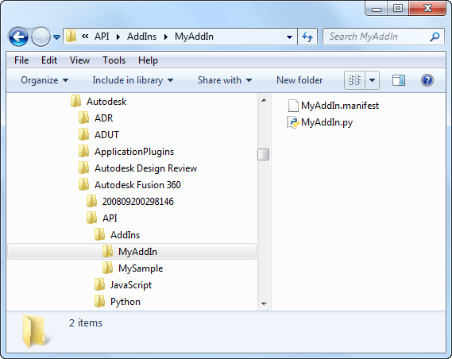

### The Manifest File

The .manifest file contains the information that you specified in the “Create New Script or Add-In” dialog when you initially created the script or add-in. It also contains additional information Fusion uses to determine when it should be displayed and loaded. The manifest file has the same name as the add-in but has a .manifest extension. The file is a text file in JSON format. Shown below is an example of a typical manifest file for an add-in.

```
{
	"autodeskProduct":	"Fusion360",
	"type":	"addin",
	"id":	"62a9e55a-dbe4-408d-ad8b-cb802473725e",
	"author":	"Brian Ekins",
	"description":	{
		"":	"This is a test add-in."
	},
	"version":	"V1",
	"runOnStartup":	true,
	"supportedOS":	"windows|mac"
}
```

Below is a description of each of the items in the manifest.

* **autodeskProduct** – This property will always have the value “Fusion360”.
* **type** – This property can be “addin” or “script” to indicate if this program is an add-in or script.
* **id** – This property is a GUID that uniquely identifies this add-in. If you ever create a new add-in or script by copying an existing add-in or script you should replace this ID with a new GUID so the ID of each one is unique. This is not currently being used by Fusion but is likely to be used in the future.
* **author** – This property is a string containing the name of the author. This is displayed in the “Scripts and Add-Ins” dialog.
* **description** – This is a JSON object with properties that define the description of the add-in. Using the JSON format it is defined as an object with one or more properties so that descriptions can be specified in multiple languages. The example below has one property with an empty name, which is the default description and will be used for any language that does not have a specific description. The other properties define the text to use for the other languages supported by Fusion, using industry standard language codes.

  ```
  "Description":{
                 "":"Default description",
                 "1028": "說明在中國",
                 "1031": "Beschreibung auf Deutsch",
                 "1033": "Description in English",
                 "1034": "Descripción en Español",
                 "1036": "Description en Français",
                 "1040": "Descrizione in Italiano",
                 "1041": "日本語での説明",
                 "1042": "한국어 설명"
  }
  ```

* **version** – This property defines the version of the add-in and can be any string, i.e. “1.0.0”, “2016”, “R1”, “V2”, etc.
* **runOnStartup** – This property can be true or false to indicate if this add-in should be automatically started by Fusion when Fusion is started.
* **supportedOS** – This property can be “windows”, “mac”, or “windows|mac”. This defines which operating systems the add-in will load on. One example of where this is used is in the case where an add-in uses OS specific libraries, so the add-in won’t work on any other OS. For example, if I write an add-in that uses a Windows specific library, I can set the supportedOS to “windows” so that on a Mac, Fusion won’t display the add-in in the “Scripts and Add-Ins” dialog and also won’t attempt to run it on startup. Most Python scripts and add-ins should be compatible with both Mac and Windows so this should be set to “windows|mac” to indicate the add-in can be loaded for both operating systems. C++ scripts and add-ins must be compiled separately for each platform so it is more likely they may use this option when the developer doesn't have access to both a Windows and Mac machine to compile.
* **sourcewindows and sourcemac** –

  A C++ script or add-in has two additional properties that identify the filename of the project file for both Windows and Mac. When you select the "Edit" option in the "Scripts and Add-Ins" dialog, Fusion opens the associated project file using whatever application is associated with that file type. For example, in the example below a .vcxproj file is specified for the sourcewindows property so Visual Studio will be invoked since it is defined within Windows as the associated application for .vcxproj files. By changing this file you can choose to use any code editor that you want.

  ```
  	"sourcewindows":	"NewCPPTest.vcxproj",
  	"sourcemac":	"NewCPPTest.xcodeproj"
  ```

Notice that, except for the sourcewindows and sourcemac properties, the name of the script or add-in is not specified in the manifest file. The name is defined by the name used for the main directory and the files. To change the name of a script or add-in, change the names of the directory and files to the new name.

### Script Code

Below is the code that is automatically written when a new Python script is created. Notice the “run” function. Fusion will automatically call the run function when the script is executed. Fusion also passes in information through the “context” argument as to whether the script is being run at Fusion startup or is being loaded during a session. For a script, this can be ignored because for a script it is always run during a Fusion session and never at startup. The run function is the entry point into your script and once it is complete, the script is finished and Fusion unloads it.

```
Import adsk.core, adsk.fusion, traceback

def run(context):
    ui = None
    try:
        app = adsk.core.Application.get()
        ui  = app.userInterface
        ui.messageBox('Hello script')

    except:
        if ui:
            ui.messageBox('Failed:\n{}'.format(traceback.format_exc()))
```

### Add-In Code

The code below is a minimal add-in. Notice that it is exactly the same as a new script except that it also contains a “stop” function. When you create a new Python add-in using the **Scripts and Add-Ins** command, it creates much more than this to help you get started. You can read more about it in the [Python Add-in Template](PythonTemplate_UM.htm) topic.

```
import adsk.core, adsk.fusion, traceback

def run(context):
    ui = None
    try:
        app = adsk.core.Application.get()
        ui = app.userInterface
        ui.messageBox('Hello addin')

    except:
        if ui:
            ui.messageBox('Failed:\n{}'.format(traceback.format_exc()))

def stop(context):
    ui = None
    try:
        app = adsk.core.Application.get()
        ui  = app.userInterface
        ui.messageBox('Stop addin')

    except:
        if ui:
            ui.messageBox('Failed:\n{}'.format(traceback.format_exc()))
```

The “stop” function is called by Fusion whenever the add-in is being stopped and unloaded. This can happen because the user is stopping it using the “Scripts and Add-Ins” dialog or more typically it is because Fusion is shutting down and all add-ins are being stopped. The stop function is where the add-in can perform any needed clean up, like removing any user-interface elements that it created.

Both the run and the stop functions have a single argument called “context” that is used to pass additional information to the add-in indicating the context of why the run or stop function is being called. Depending on the language, this information is passed using different types, but in all cases, it represents a set of name:value pairs. Python passes this in as a Dictionary object and C++ passes it in as a string in JSON format. The following name:value pairs are currently supported.

**run**

|  |  |  |
| --- | --- | --- |
| Name | Value | Description |
| IsApplicationStartup | true or false | Indicates the add-in is being started as a result automatic loading during Fusion startup (true) or is being loaded by the user through the “Scripts and Add-Ins” dialog (false). |

**stop**

|  |  |  |
| --- | --- | --- |
| Name | Value | Description |
| IsApplicationClosing | true or false | Indicates the add-in is being shut down as a result Fusion being shut down (true) or because the user stopped it through the “Scripts and Add-Ins” dialog (false). |

### Scripts vs. Add-Ins

As was said earlier, there is very little technical difference between a script and an add-in. The primary difference is how they are executed and their lifetime. A script is executed by the user through the “Scripts and Add-Ins” command and stops immediately after the run function completes execution. A script runs and then it is done.

An add-in is typically automatically loaded by Fusion when Fusion starts up. An add-in also usually creates one or more custom commands and adds them to the user interface during start up. The add-in continues to run throughout the Fusion session so it can react whenever any of its commands are executed by the user. The add-in remains running until Fusion is shut down or the user explicitly stops it through the “Scripts and Add-Ins” dialog. When it stops, it cleans up whatever user interface customization it created in its stop function.

How an add-in uses the Fusion API is not any different from a script. It is the same API and none of the API calls are limited to either scripts or add-ins. However, there are a couple of areas of the API that are more useful to an add-in than a script. The first is the portion of the API that deals with working with the Fusion user-interface and adding buttons or other controls to access your custom commands. For example, if you create a custom command that draws geometry in a sketch you will want to add a new button to the Sketch panel so it will be easy for the user to find. Because an add-in can be loaded at startup it can add its custom commands to the user interface whenever Fusion starts up so they are always available to the user and appear as a standard Fusion command. This is described in more detail in the [User Interface](UserInterface_UM.htm) topic.

A second area of the API that is useful for add-ins is commands. The use of commands is not limited to add-ins and there are sometimes reasons to use the command functionality within a script, but it is typically used and make more sense within an add-in. This is described in the [Commands](Commands_UM.htm) topic.

### Editing and Debugging

For more detailed information about editing and debugging your scripts and add-ins see the language specific topics ([Python](PythonSpecific_UM.htm) or [C++](CPPSpecific_UM.htm)) because the process is different depending on which programming language you're using.

# Managing Scripts and Add-Ins

## Contents

* [Managing, Running, and Creating Scripts and Add-Ins Using the New Dialog](#NewDialog)
* [Working with Installed Scripts and Add-Ins](#Working)

+ [Filtering the List of Displayed Scripts and Add-Ins](#Filters)
+ [Installing, Linking, and Removing Scripts and Add-Ins](#Installing)

- [Default Folders for Scripts and Add-Ins](#DefaultFolders)
- [User Defined Folder for Scripts and Add-Ins](#UserDefinedFolders)
- [Linking Scripts and Add-Ins](#Linking)
- [Uninstalling Scripts and Add-Ins](#Uninstall)

+ [Running Scripts and Add-Ins](#Running)

* [Creating, Editing, and Running Your First Script](#CreatingEditingRunning)
* [Script and Add-In Details](#Details)

+ [Script and Add-In Files](#Files)

- [The Manifest File](#Manifest)
- [Script Code](#ScriptCode)
- [Add-In Code](#AddInCode)

* [Scripts vs. Add-Ins](#ScriptsVsAddIns)
* [Editing and Debugging](#EditingDebugging)
* [Known Issues](#KnownIssues)

## Managing, Running, and Creating Scripts and Add-Ins Using the New Dialog

This release makes the new dialog for the "Scripts and Add-Ins" command the default dialog. Most of the known issues have been addressed, with a couple of other fixes coming in the next release. If, for some reason, you need to use the old dialog there is now a preference setting to switch back. If you're doing this, please let us know in the [forum](https://forums.autodesk.com/t5/fusion-api-and-scripts/bd-p/22) why would prefer the old dialog.

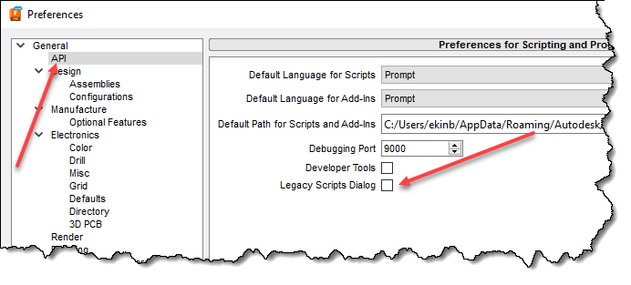

### Working with Installed Scripts and Add-Ins

The purpose of the Scripts and Add-Ins dialog is to provide the needed functionality to manage your scripts and add-ins. It provides the following capabilities:

* List all the currently available scripts and add-ins and show additional related information.
* Search and filter that list in different ways.
* Run a script.
* Start an add-in, see if an add-in is running, and stop a running add-in.
* Specify if an add-in should start running automatically when Fusion starts.
* See where a script or add-in is located on your machine and open a new File Explorer or Finder window in that folder.
* Create new scripts and add-ins.
* Create links to scripts and add-ins that exist anywhere on your computer.

Below is the Scripts and Add-Ins dialog with the three main sections highlighted. The section to the left provides the various filters to control which scripts and add-ins are displayed. The center section displays the list of scripts and add-ins. The section on the right displays detailed information for the selected script or add-in. Each of these is described in more detail below.

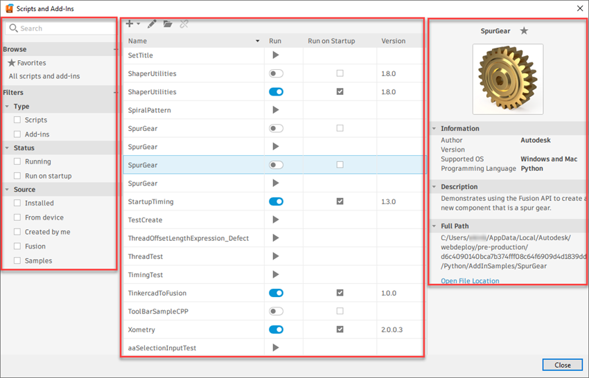

#### Filtering the List of Scripts and Add-Ins

The left side of the Scripts and Add-Ins dialog provides different filters for controlling what's displayed in the list in the center section of the dialog. If "Favorites" is selected, only scripts or add-ins that have been marked as a favorite will be displayed and the selected filters are applied to further filter the list. Clicking "Favorites again will show all scripts that meet the current filters. Clicking "All scripts and add-ins" clears all filters and "Favorites", so all scripts and add-ins will be displayed.

Selecting a filter displays the scripts and add-ins with that attribute. For example, if you select "Add-ins", only add-ins will be displayed, and then if you select "Running", it will combine the filters so only the currently running add-ins will be displayed. Any number of filters can be selected at once. You can deselect individual filters to remove that filter.

A powerful filtering feature is an ability to identify any script or add-in as a "Favorite". You can set a script or add-in to be a favorite by using its context menu or by clicking on the star beside its name in the right-hand section of the dialog, as shown below. Clicking the "Favorites" option at the top of the "Browse" section on the left panel will display your favorite scripts and add-ins. You can select other filters to filter the list of favorites further.

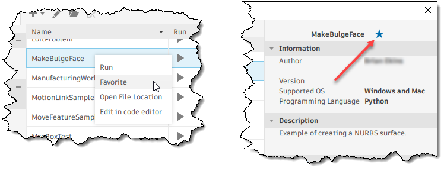

Selecting a script or add-in in the list of scripts and add-ins will display its details in the right-hand section of the dialog. In this dialog section, you can view current state information and perform various operations for the selected script or add-in using the associated context menu, as shown below.

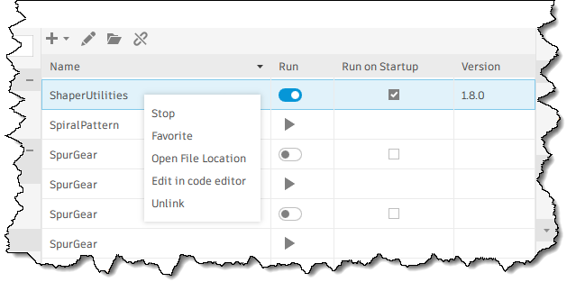

The first column displays the script or add-in's name. The second column indicates its current running state. From this, you can also infer whether the item is a script or an add-in. The four possible icons are shown below.

*  - Indicates a script that is not running. Clicking this icon will run the script.
*  - Indicates a script that is currently running. It is rare to see this state because scripts typically run and end. However, creating a script that doesn't end automatically when the run function finishes is possible.*  - Indicates an add-in that is currently not running. Clicking this icon will start the add-in.*  - Indicates an add-in that is running. Clicking this icon will stop the add-in.

The third column indicates if the add-in is set to run automatically on start-up. If this is checked, the add-in will be automatically started by Fusion when Fusion starts and will remain running for the entire session or until you manually stop it. This setting is only available for add-ins. The fourth column shows the version of the add-in

The fourth column shows the version of the add-in.

A small toolbar with several commands is at the top of the list section. The button on the left displays a pop-up menu where you can go to the Autodesk App Store, add a local script or add-in to the list (linking), or create a new script or add-in. Linking and creation are discussed in more detail below. The command with the pencil icon will open the code editor for the currently selected script or add-in to allow you to edit and debug the script or add-in. The command with the folder icon will open the folder where the script or add-in is located using Window's File Explorer or Mac's Finder. The command with the broken paper clip will unlink a linked script or add-in.

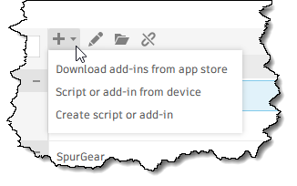

### Installing, Linking, and Removing Scripts and Add-Ins

An "installed" script or add-in is one that exists locally on your computer and that Fusion is aware of. A script or add-in is a folder that contains the code and other associated files, like icon files. Fusion automatically searches several directories on your machine for scripts and add-ins.

#### Default Folders for Scripts and Add-Ins

Several default folders are always searched for scripts and add-ins when Fusion starts. These folders are listed below.

* The default path when creating new scripts. As described below, the default path can be redefined by setting a user preference. However, even if the default path is changed, this path is still searched.
  :   Windows - `C:\Users\<userName>\AppData\Roaming\Autodesk\Autodesk Fusion 360\API\Scripts`
  :   Mac - `~/Library/Application Support/Autodesk/Autodesk Fusion 360/API/Scripts`

* The default path when creating new add-ins. As described below, the default path can be redefined by setting a user preference. However, it is still searched even if the default path has changed.
  :   Windows - `C:\Users\<userName>\AppData\Roaming\Autodesk\Autodesk Fusion 360\API\AddIns`
  :   Mac - `~/Library/Application Support/Autodesk/Autodesk Fusion 360/API/AddIns`

* This is the location where apps downloaded from the Autodesk App Store are installed. It is a shared location where apps for all Autodesk applications, not just Fusion apps, are installed. The folder structure of apps in this location is different. Each add-in is in a .bundle folder. Even though this location is intended for Autodesk App Store apps, other applications sometimes also install in it. Still, they have to follow the rules for having the .bundle folder and a PackageContents.xml file that identifies it as a Fusion app.
  :   Windows - `C:\Users\<userName>\AppData\Roaming\Autodesk\ApplicationPlugins`<
  :   Mac - `~/Library/Application Support/Autodesk/ApplicationPlugins`

* The location is intended for apps to be installed that are not from the Autodesk App Store. Apps in this location are Fusion-specific and follow the standard folder structure, with each add-in in a folder with the same name as the add-in. You DO NOT need to use a .bundle folder for this location.
  :   Windows - `C:\Users\<userName>\AppData\Roaming\Autodesk\FusionAddins`code>
  :   Mac - `~/Library/Application Support/Autodesk/FusionAddins`

#### User Defined Folder for Scripts and Add-Ins

A user preference defines the path when creating a new script or add-in. The default path is shown above, but you can set this to any location using the preference shown below. Fusion will search for scripts and add-ins in this defined path in the "Scripts" and "AddIns" folders. If you change this path from the default, Fusion will continue to search the default location.

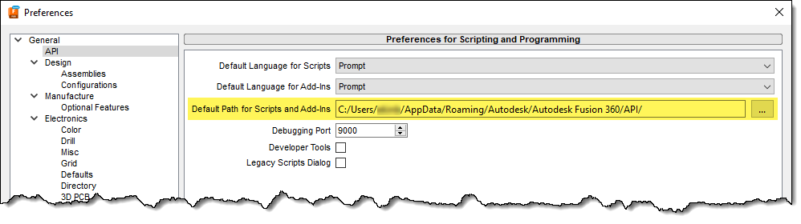

---

|  |  |
| --- | --- |
| © Copyright 2025 Autodesk, Inc. | Comment on this page. |