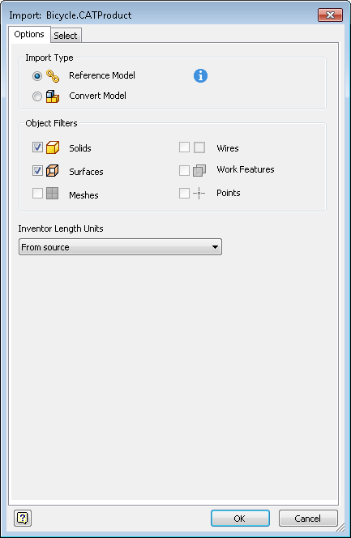
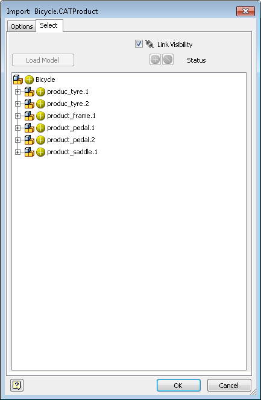

# Any CAD

### Introduction to AnyCAD

AnyCAD is introduced since Inventor 2016,  it not only means to consolidate the import process for any other CAD file formats that Inventor can translate into Inventor data, additionally it also means that the other CAD files can be associatively imported into Inventor. Currently below CAD files can be associatively imported into Inventor:

Alias, CATIA V5, ProE/Creo Patametric, NX, SolidWorks, STEP and AutoCAD

### AnyCAD consolidated import process in UI:





###

In Inventor API, the associatively imported AnyCAD files are defined as ImportedComponent objects. To create  an ImportedComponent you should define the ImportedComponentDefinition for it first, use the ImportedComponents.CreateDefinition allows you to create an ImportedComponentDefinition object, please note that currently we have two definition objects for AutoCAD and other CAD file formats respectively:  The ImportedDWGComponentDefinition and ImportedGenericComponentDefinition objects are derived from the ImportedComponentDefinition, and the created ImportedComponentDefinition should be either ImportedDWGComponentDefinition or ImportedGenericComponentDefinition, which is determined by the input AnyCAD file format, and the ImportedDWGComponentDefinition or ImportedGenericComponentDefinition have more properties than the base ImportedComponentDefinition object which allow users to set how to import AnyCAD file into Inventor.

### Working with AnyCAD through the API

When import a generic AnyCAD file other than AutoCAD  DWG file to Inventor part and assembly you can refer to below VBA samples:

Import a generic AnyCAD file to Inventor part:

```vb
Sub AssociativelyImportAliasToPartSample()
    Dim oDoc As PartDocument
    Set oDoc = ThisApplication.Documents.Add(kPartDocumentObject)
    Dim oPartCompDef As PartComponentDefinition
    Set oPartCompDef = oDoc.ComponentDefinition
    ' Create the ImportedGenericComponentDefinition bases on an Alias file
    Dim oImportedGenericCompDef As ImportedGenericComponentDefinition
    Set oImportedGenericCompDef = oPartCompDef.ReferenceComponents.ImportedComponents.CreateDefinition("C:\ProjectName\iPod.wire")
    '
    Set the ReferenceModel to associatively import the Alias file, set this property to False will just convert the
    oImportedGenericCompDef.ReferenceModel = True
    oImportedGenericCompDef.IncludeAll
    ' Import the Alias
    Dim oImportedComp As ImportedComponent
    Set oImportedComp = oPartCompDef.ReferenceComponents.ImportedComponents.Add(oImportedGenericCompDef)
End Sub
```

Import a generic AnyCAD file to Inventor assembly:

```vb
Sub AssociativelyImportSolidworksToAssemblySample()
    Dim oDoc As AssemblyDocument
    Set oDoc = ThisApplication.Documents.Add(kAssemblyDocumentObject)
    Dim oAssyCompDef As AssemblyComponentDefinition
    Set oAssyCompDef = oDoc.ComponentDefinition
    'Create the ImportedGenericComponentDefinition bases on an Alias file
    Dim oImportedGenericCompDef As ImportedGenericComponentDefinition
    Set oImportedGenericCompDef = oAssyCompDef.ImportedComponents.CreateDefinition("C:\ProjectName\iPod.SLDPRT")
    'Set the ReferenceModel to associatively import the Alias file
    oImportedGenericCompDef.ReferenceModel = True
    'Import the Solidworks to assembly
    Dim oImportedComp As ImportedComponent
    Set oImportedComp = oAssyCompDef.ImportedComponents.Add(oImportedGenericCompDef)
End Sub
```

When import an AutoCAD DWG file into part you can refer to below VBA sample:

```vb
Sub AssociativelyImportDWGToPartSample()
    Dim oDoc As PartDocument
    Set oDoc = ThisApplication.Documents.Add(kPartDocumentObject)
    Dim oPartCompDef As PartComponentDefinition
    Set oPartCompDef = oDoc.ComponentDefinition
    'Create the ImportedDWGComponentDefinition bases on an AutoCAD DWG file
    Dim oImportedDWGCompDef As ImportedDWGComponentDefinition
    Set oImportedDWGCompDef = oPartCompDef.ReferenceComponents.ImportedComponents.CreateDefinition("C:\ProjectName\Basic.dwg")
    'Import the AutoCAD DWG
    Dim oImportedComp As ImportedComponent
    Set oImportedComp = oPartCompDef.ReferenceComponents.ImportedComponents.Add(oImportedDWGCompDef)
End Sub
```

### More info about AnyCAD

When import generic AnyCAD files into assembly documents, Inventor will generate embedded documents referenced by component occurrences for the imported components, and the ComponentOccurrence.HasAssociativeImportedComponent can be used to determine if a ComponentOccurrence has associative imported component, and then use the ComponentOccurrence.ImportedComponent to get the imported component if it has. Please be aware that if you associatively import AnyCAD file which is an assembly file(like Solidworks assembly), only the top AnyCAD assembly will be treated as ImportedComponent, that means only the top level ComponentOccurrence will have the HasAssociativeImportedComponent return True, and the sub-occurrences won't have equivalent imported components, but you can use the ComponentOccurrence.IsAssociativelyImported to check whether it is created along with importing AnyCAD assembly file, and the ComponentOccurrence.AssociativeForeignFilename returns the referenced AnyCAD file name. For the embedded documents, they are saved in the same file as the embedding document on disk, you can access them via API but because they are resulted from the imported AnyCAD files you should not treat them as normal Inventor documents, and the embedded documents will be updated if their referenced AnyCAD files have changed, the IsEmbeddedDocument can tell you if a part or assembly is embedded document, so you can ignore it because edit or save embedded documents directly are not allowed.