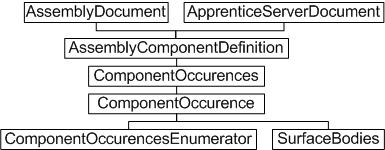
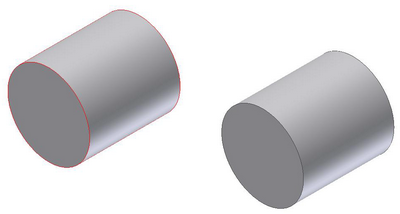
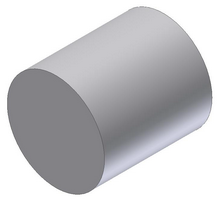
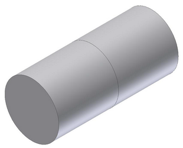

# Assembling Parts

### Introduction to parts in an assembly

Modeling in Autodesk Inventor is more than creating part features from sketch profiles. Typically, a library of part files is created and these parts are assembled together to create a composite model - an assembly. Assemblies themselves can be treated as discrete components, as subassemblies within a larger assembly. Autodesk Inventor has an extensive user interface for working with parts in the assembly environment, including positioning tools and assembly constraints for defining relationships between parts.

### The purpose of assembling parts

This method of gathering parts into an assembly has several advantages. It enables model components to be worked on independently, and it often means the model is considerably smaller in file size, especially when common parts are re-used. The concept it similar to blocks in AutoCAD.

### Assembly-level component occurrences and definitions - Object Model Diagram



### Working with assembled parts through the API

The Autodesk Inventor API employs the concepts of component definitions and occurrences. These are somewhat analogous to AutoCAD block definitions and inserts. A component definition is also the base class for other component definition types - [PartComponentDefinition](PartComponentDefinition.html), [AssemblyComponentDefinition](Inventor~AssemblyComponentDefinition.html), [SheetMetalComponentDefinition](Inventor~SheetMetalComponentDefinition.html), [WeldmentComponentDefinition](Inventor~WeldmentComponentDefinition.html), and [WeldsComponentDefinition](../api-doc/WeldsComponentDefinition/WeldsComponentDefinition.md). These are used only when accessing functionality specific to these types.

Think of a component occurrence as an instance of a component definition. The component definition can be a subassembly or a part. The [ComponentDefinition](../api-doc/ComponentDefinition/ComponentDefinition.md) object is the base class for the AssemblyComponentDefinition object.

To insert parts into an assembly, add an occurrence to the [ComponentOccurrences](../api-doc/ComponentOccurrences/ComponentOccurrences.md) collection of the assembly document's AssemblyComponentDefinition object. The ComponentOccurrences collection supports several methods to add an occurrence - by file (the [Add](Inventor~ComponentOccurrences~Add.html) method) or by inserting another instance of an existing definition (the [AddByComponentDefinition](Inventor~ComponentOccurrences~AddByComponentDefinition.html) method). It also supports iParts and adding through iMates.

### Adding occurrences is the first step

Assembling parts also requires a means to specify their positions, and to define how the parts fit together. The add methods described previously support matrices, allowing ComponentOccurrences to be positioned within the assembly document. However, it is typically more convenient to define assembly constraints to indicate how parts should position themselves relative to each other. Creating an assembly of parts through the API is therefore a two-stage process, since it is through the UI. First, assemble the parts, and then fit them together. The following sample code demonstrates both processes.

This code assumes a part file named cylinder.ipt exists in a C:\Temp directory. Use Autodesk Inventor to create and save this part file (a sketched circle extruded to form a cylinder) before running this code. The code omits error checking for the sake of clarity and brevity. Always check that return values are of the expected type.

First, create a new assembly document:

```vb
Dim oApp As Inventor.Application
Set oApp = ThisApplication
Dim oAssyDoc As AssemblyDocument
Set oAssyDoc = oApp.Documents.Add(kAssemblyDocumentObject, _
oApp.GetTemplateFile(kAssemblyDocumentObject))
```

Inserting component occurrences requires a matrix, even if it does nothing, so create the matrix object.

```vb
Dim oPositionMatrix As Matrix
Set oPositionMatrix = oApp.TransientGeometry.CreateMatrix
```

Now create the component occurrence by calling the Add method of the ComponentOccurrences collection, referencing the part file previously created manually in Autodesk Inventor.

```vb
Dim sFileName As String
sFileName = "c:\temp\cylinder.ipt"
Dim oCylinder1 As ComponentOccurrence
Set oCylinder1 = oAssyDoc.ComponentDefinition.Occurrences.Add(sFileName, oPositionMatrix)
```

This created the first occurrence of the cylinder part in the assembly. Now add another, but this time, move it to one side. Otherwise it occupies the same space as the first one and is not visible. Use the matrix object to adjust its insertion position slightly. Here, the matrix also reverses the direction of the cyclinder.

```vb
Dim oTrans As Vector
Set oTrans = oApp.TransientGeometry.CreateVector(2, 0, -1)
oPositionMatrix.SetTranslation oTrans
```

Now add the second occurrence of the cylinder component.

|  |
| --- |
| **Note:** The reference to the part file is no longer needed when inserting the second cylinder, since there is already an instance of the part in the assembly. Simply reference the same ComponentDefinition, in this case that of the previously inserted ComponentOccurrence. |

```vb
Dim oCylinder2 As ComponentOccurrence
Set oCylinder2 = oAssyDoc.ComponentDefinition.Occurrences.AddByComponentDefinition _
(oCylinder1.Definition, oPositionMatrix)
```

In Autodesk Inventor, the preceding code results in two cylinders in the assembly, looking something like the following figure.



The intention is to get these cylinders to line up and butt together, and for Autodesk Inventor to ensure they stay that way despite future recomputes of the assembly model. Use assembly constraints to achieve this, in much the same way geometric constraints can define the shape of a sketch. Apply mate constraints to remove two degrees of freedom, aligning the cylinders to each other, and then mating the ends of the cylinders together. The AssemblyComponentDefinition maintains a collection of constraints to apply to the component occurrences, so add the mate constraints to this collection. First, obtain the assembly component definition.

```vb
Dim oAxisDef As AssemblyComponentDefinition
Set oAxisDef = oApp.ActiveDocument.ComponentDefinition
```

The first constraint will be applied between the curved faces of the two cylinders, to align them. One way to obtain these faces is by iterating through all the faces that make up the surface body of each component occurrence, checking for a cylindrical surface. For more information on faces and surface bodies, refer to the Boundary Representation ([BRep](Brep_Overview.md)) sections of the Autodesk Inventor API documentation.

```vb
Dim oCylAxis1 As Face
Dim oCylAxis2 As Face
Dim oFace As Face
For Each oFace In oCylinder1.SurfaceBodies(1).Faces
    If oFace.SurfaceType = kCylinderSurface Then
        Set oCylAxis1 = oFace
    End If
Next
For Each oFace In oCylinder2.SurfaceBodies(1).Faces
    If oFace.SurfaceType = kCylinderSurface Then
        Set oCylAxis2 = oFace
    End If
Next
```

So now oCylAxis1 and oCylAxis2 contain the curved cylinder faces, and can be passed to the [AddMateConstraint](../api-doc/AssemblyConstraints/AssemblyConstraints_AddMateConstraint.md) method of the assembly component definition's [AssemblyConstraints](AssemblyConstraints.html) collection.

```vb
Dim oConstr As AssemblyConstraint
Set oConstr = oAxisDef.Constraints.AddMateConstraint(oCylAxis1, oCylAxis2, 0, kInferredLine, kInferredLine)
```

The result of this constraint is shown in the following figure. The two cylinders now occupy the same space, and are indistinguishable from each other. Another constraint is required on the end faces to have the two cylinders butt against each other to form one long cylinder.



Again, iterate through the faces of the surface bodies, this time looking for planar faces. In this case, it is safe to select the face on the same end of each cylinder as the position of the second cylinder was reversed by its insertion matrix (the two cylinder component occurrences were inserted in opposite directions).

```vb
Dim oCylFace1 As Face
Dim oCylFace2 As Face
For Each oFace In oCylinder1.SurfaceBodies(1).Faces
    If oFace.SurfaceType = kPlaneSurface Then
        Set oCylFace1 = oFace
    End If
Next
For Each oFace In oCylinder2.SurfaceBodies(1).Faces
    If oFace.SurfaceType = kPlaneSurface Then
        Set oCylFace2 = oFace
    End If
Next
```

Now add a mate constraint for these two faces to the [AssemblyConstraints](../api-doc/AssemblyConstraints/AssemblyConstraints.md) collection.

```vb
Set oConstr = oAxisDef.Constraints.AddMateConstraint _
(oCylFace1, oCylFace2, 0, kNoInference, kNoInference)
```

This results in the following figure with the intended relationship between the two cylinders.



The preceding example demonstrates insertion of parts into the assembly environment, and subsequent manipulation of those parts. The resulting assembly can be saved to file, and itself used as a component occurrence in a new assembly with other parts and subassemblies.

### Summary

To insert a part into an assembly, a ComponentOccurrence object is added to the ComponentOccurrences collection of the assembly document's AssemblyComponentDefinition object. The position of the occurrence can be manipulated during insertion. Final positioning is typically achieved through assembly constraints, which define how parts and subassemblies relate to each other. Multiple instances of the same ComponentOccurrence should reference the same ComponentDefinition.

### Also consider -

Autodesk Inventor supports the concept of patterns, which is a uniform (circular or rectangular) or nonuniform (feature-based) repetition of parts. The API supports such patterns too, though the [RectangularOccurrencePattern](../api-doc/RectangularOccurrencePattern/RectangularOccurrencePattern.md), [CircularOccurrencePattern](Inventor~CircularOccurrencePattern.html) and [FeatureBasedOccurrencePattern](Inventor~FeatureBasedOccurrencePattern.html) objects. These contain collections of [OccurrencePatternElement](Inventor~OccurrencePatternElement.html) objects that provide access to the list of ComponentOccurrences comprising that pattern.

Parts in the assembly environment are actually considered proxies. This only really matters when working with a part in the assembly context rather than the part definition context. For more information, refer to the [Proxies](Proxies_Overview.md) overview.