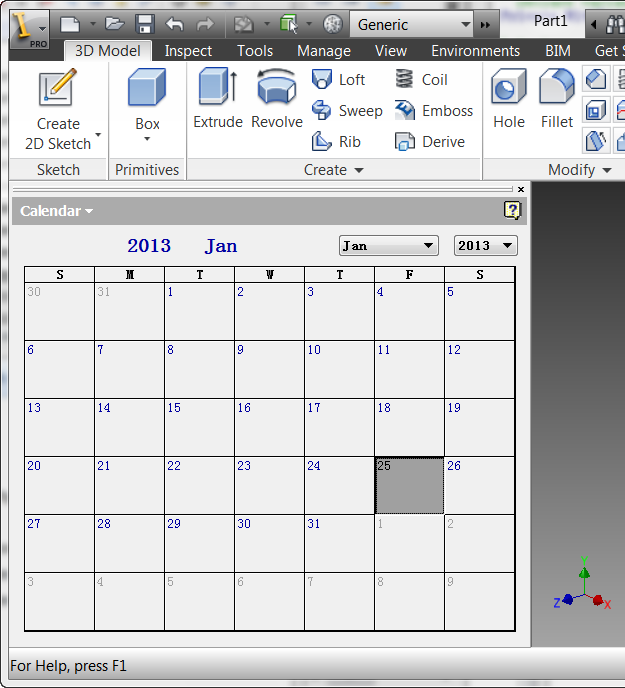
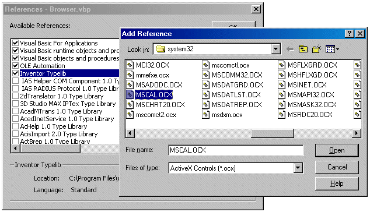

# Browser

### Browser Integration

The browser in Autodesk Inventor is a critical element of the user interface. Autodesk Inventor uses it to display a hierarchical representation of the contents of the current document. While this information is useful, there are cases when it is desirable to use this portion of the screen to display other types of information. For example, a finite element application might choose to show a representation of the constraints and loads currently defined on the model.

The Autodesk Inventor API allows you to define and interact with the contents of the browser window. The API supports the ability to create additional panes within the browser. You can also add a tree hierarchy of iconic nodes - see the [browser nodes](BrowserNodes_Overview.md) overview.

Only one pane is visible at a time, but the user can switch between panes and you can activate different panes using the API. To create new panes, Autodesk Inventor uses an approach that is both very simple and extremely powerful. The additional panes that you can add are just ActiveX control containers. From the API you create a new pane and specify which ActiveX control to display within the pane. What makes this powerful is the fact that an ActiveX control can contain any type of information and can even consist of other ActiveX controls. There are a huge number of existing ActiveX controls and it is relatively easy to construct new custom ActiveX controls.

Below is some sample code that illustrates the process of creating and interacting with a new browser pane. This sample creates a new pane and places Microsoft's ActiveX calendar control within it. (This control was chosen for the sample because it's relatively simple and should already be available on your system.) It responds to events from the control by displaying the current date as the user clicks on new days within the control. The picture below displays the result after the pane has been created.



For this sample, all of the following code is contained within a form module. This is not intended to show the only approach to creating a browser pane. Often this would be done in a class module so you can have a single object that handles all of the browser pane information that is unique to each document. This sample was written this way to make it easier to focus on the browser pane portion of the code without the complication of other issues. To make the sample, create a new ActiveX EXE project and copy this code into the form module.

```vb
' Declare variable for the calendar control.
Private WithEvents oCal As MSACAL.Calendar
' Declare global variables for the Inventor document and Application.
Private WithEvents oDocEvents As DocumentEvents
Private oPane As BrowserPane
Private oApp As Inventor.Application
Private Sub Form_Load()
    '
    Set a reference to a running instance of Inventor.
    ' This expects Inventor to be running.
    Set oApp = GetObject(, "Inventor.Application")
    ' Get the active document.  This assumes a document is open.
    Dim oDoc As Inventor.Document
    Set oDoc = oApp.ActiveDocument
    ' Connect to the documents events.  Used to
    ' listen for when the document is closed.
    Set oDocEvents = oDoc.DocumentEvents
    ' Create a new browser pane using the Microsoft calendar control.
    Set oPane = oDoc.BrowserPanes.Add("Calendar", "MSCAL.Calendar")
    '
    Set a reference to the calendar control
    ' that was created on the pane.
    Set oCal = oPane.Control
    '
    Set the calendar to today's date.
    oCal.Today
    ' Make the new pane the active pane.
    oPane.Activate
End Sub
```

The first line is declaring a variable to be the type of the control. This is declared using the WithEvents keyword, so you'll be able to capture events from the control. There's one thing to be aware of at this point: in order to declare a variable of this type you must reference the control into your project. You typically think of referencing controls using the Components command within Visual Basic. However, because of what appears to be a bug in Visual Basic, if you reference the control this way, you'll get a "Run-time error 13: Type mismatch" error on the line:

```

Set oCal = oPane.Control
```

To reference the control so you can use it in a browser pane you must use the References command. The control won't be displayed in the list so you need to click the Browse?button on the References dialog. The control used in this sample is found in the System32 directory. By default, .ocx files are not displayed in the file list, so you need to select "ActiveX Controls (\*.ocx)" in the "Files of type" list. This control is "MSCAL.OCX."



Let's look at some of the more interesting portions of the code. The first few lines handle connecting to Autodesk Inventor, getting the active document, and connecting to the document's events. None of this is specific to creating a new browser pane. The next few lines are where it gets interesting. The BrowserPanes.Add method creates the new pane. It only has two arguments. The first is the name of the pane. This is the name that the user sees in the list when selecting panes and what is displayed at the top of the browser when that pane is active. You can see in the previous picture that "Calendar" is displayed as the browser's title. The second argument specifies which ActiveX control to place into the new pane. The control can be specified using either the ProgID, as is done in this sample, or the GUID of the control. If a GUID is specified it is as a string with the enclosing braces. For example, "{8E27C92B-1264-101C-8A2F-040224009C02}" would also work in this case.

Just creating the pane and adding the ActiveX control is usually not enough. Typically you'll need to interact with the control to populate data within it and keep the information up-to-date. The next line uses the Control property of the BrowserPane object to set a reference to the ActiveX control that was added to the pane. You now have complete access to the control through whatever methods, properties, and events it exposes. In the sample it calls the Today method of the control to set the calendar to today's date. Finally, it activates that pane to make it visible to the user.

The variable that is used to reference the control was declared using the WithEvents keyword to enable receiving events from the control. The code below is executed whenever the user clicks a date on the calendar. If the user selects January 1, 2000, it will cause the form to be unloaded. The code for the Form\_Unload event is listed later.

```vb
' Event fired when the calendar is clicked
Private Sub oCal_Click()
    ' Display the new date in the Inventor status bar.
    oApp.StatusBarText = "Selected new date: " & _
    Format(oCal.Value, "mmmm dd, yyyy")
        ' Check for January 1, 2000 and unload the form.
        If oCal.Value = #1/1/2000# Then
            Unload Me
        End If
    End Sub
```

The code below is executed when the document is closed. It causes the form to be unloaded.

```vb
Private Sub oDocEvents_OnClose( _
    ByVal BeforeOrAfter As Inventor.EventTimingEnum, _
    ByVal Context As Inventor.NameValueMap, _
    HandlingCode As Inventor.HandlingCodeEnum)
    If BeforeOrAfter = kBefore Then
        Unload Me
    End If
End Sub
```

The code below is executed when the form is unloaded. It releases all references and deletes the pane.

```vb
Private Sub Form_Unload(Cancel As Integer)
    Set oCal = Nothing
    Set oDocEvents = Nothing
    Set oApp = Nothing
    oPane.Delete
End Sub
```

The browser is a document-centric object. The contents of the browser are unique for each document. When adding panes, they must be added to each document you want the pane to be visible within. Each pane will have its own instance of the ActiveX control, so each one must be managed independently. The browser information is not persisted between sessions by Autodesk Inventor. If you need the data between sessions you'll need to persist the data yourself, create a new pane, and restore the data the next time the document is opened.