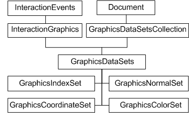
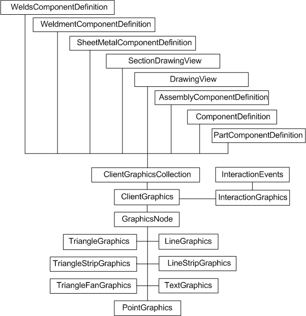
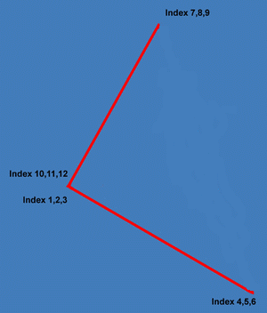

# Client Graphics

### Introduction to Client Graphics

The Autodesk Inventor API provides the means to place certain graphic primitives on components or in drawing views. These primitives (points, lines, triangles, text) collectively referred to as ClientGraphics, will be maintained and transformed by Autodesk Inventor for the duration of the session only. ClientGraphics are transient in nature, unlike parts and assemblies. AutoCAD users will note a similar intent to the "grdraw" and "grvecs" AutoLISP functions, which draw display-only vectors in an AutoCAD viewport. However, ClientGraphics are not destroyed by a screen refresh.

An interesting feature of ClientGraphics is that they will be transformed along with everything else during view changes, zooms, pans, and so on. However, it is possible to specify that they be front facing. So that as the viewpoint changes, the graphics location appears to change too but its planar appearance does not - important for text to remain readable.

### The purpose of Client Graphics

Client Graphics allow the developer to provide visual cues. Autodesk Inventor does this itself in many commands. When the user extrudes a sketch, a preview of the extruded part is displayed, proving a visual cue to how the part would appear (see InteractionGraphics, below). A developer can provide similar visual cues for their own application. A common example is a cutting application, where it is desirable to show the cutting path prior to executing the cut.

Autodesk Inventor recently introduced a new object - InteractionGraphics. This operates in a similar manner to regular ClientGraphics, except that it's in the context of InteractionEvents only. ClientGraphics via InteractionGraphics are much faster and so are well suited to real-time feedback during a command. InteractionGraphics are automatically removed once the associated InteractionEvents object stops.

### Custom Graphics Object Model Diagram - Data Sets



### Custom Graphics Object Model Diagram - Client Graphics



### Working with Custom Graphics via the API

Creating Client Graphics can be considered a two stage process. There are two separate object models, indicated by the preceding diagrams. The first stage is to set up the data - most importantly, the list of coordinates your graphics will be based upon. The second stage is to set up the graphics primitives that will use that data.

This separation of data from graphics allows a single set of data to be referenced by many primitives. In addition, it allows Autodesk Inventor to easily transform graphics by transforming a single set of data only. All graphics referencing that data will be updated automatically. A way is needed then to map a subset of the point data to your required graphics primitives. This is done through the GraphicsIndexSet object. This contains an indexed list of indices to a data set, essentially creating a new list of coordinates to be passed to the graphics set.

### Creating a data set

As indicated by the object diagram, the GraphicsDataSetsCollection object is owned by the document. For the purposes of this code sample, the document may be either a part document or an assembly document. The first step is to add a new GraphicsDataSets object, here named 'CG\_Test', to the GraphicsDataSetsCollection. From there you can create the GraphicsCoordinateSet object.

```vb
Dim oDoc As Document
Set oDoc = ThisApplication.ActiveDocument
Dim oDataSets As GraphicsDataSets
Set oDataSets = oDoc.GraphicsDataSetsCollection.Add("CG_Test")
Dim oCoordSet As GraphicsCoordinateSet
Set oCoordSet = oDataSets.CreateCoordinateSet(1)
```

This code and the code that follows does not perform error checking, for the sake of clarity and brevity. Your code should always check that return values are as expected, and that you are not attempting to create objects that already exist.

Now create a one dimensional array, and add your list of coordinates. Here they are added individually for clarity; in reality you would likely read them from file, generate them mathematically, or infer from other geometry. Once all the points have been added to the array, pass the array to the GraphicsCoordinateSet object.

### Creating graphics primitives

As indicated by the object model diagram, ClientGraphics can be associated with a number of persistent objects in Autodesk Inventor (ComponentDefinition, DrawingView, and so on). This sample code uses a ComponentDefinition.

```vb
Dim oCompDef As ComponentDefinition
Set oCompDef = oDoc.ComponentDefinition
Dim oClientGraphics As ClientGraphics
Set oClientGraphics = oCompDef.ClientGraphicsCollection.Add("CG_Test")
```

The preceding code obtains the ComponentDefinition (in this case from the document object). Then a new ClientGraphics object is added, also named 'CG\_Test', to its ClientGraphicsCollection.

Autodesk Inventor client graphics uses the concept of nodes. A node is a logical grouping of graphics, typically grouped for the purpose of selection or transformation.

The next step is to create a new node, and determine what primitives to add to it. A number of different graphics primitives are supported. Referring to the object model diagram, you can see that these include lines, strips of lines, triangles, strips of triangles, and so on. Grouping of primitives into strips allows for more efficient use of point data where line endpoints are coincident. However, for demonstration purposes, this example will create a triangle of three lines as LineGraphics, rather than creating a single TriangleGraphics object. The following code creates a new node and adds a LineGraphics object to it.

```vb
Dim oLineNode As GraphicsNode
Set oLineNode = oClientGraphics.AddNode(1)
Dim oLineSet As LineGraphics
Set oLineSet = oLineNode.AddLineGraphics
```

Now to define the relationship between the point data (the GraphicsCoordinateSet) and the points required as endpoints of lines. To do this, create a GraphicsIndexSet object and add the indices of each X Y Z point required.

|  |
| --- |
| **Note:** The points are added to the GraphicsIndexSet object as indices to the original data set, not as coordinates. In this example, the GraphicsCoordinateSet data set only contains three points, but to create a LineSet of three lines requires four points. To create a triangle, the last point is the same as the starting point. |

To define a triangle, the GraphicsIndexSet must reference the first coordinate in the data set twice, so the GraphicsIndexSet will contain four points. The following code adds all four points to the GraphicsIndexSet, as indices to the coordinate points in the GraphicsCoordinateSet object.

```vb
Dim oIndex As GraphicsIndexSet
Set oIndex = oDataSets.CreateIndexSet(1)
Call oIndex.Add(1, 1)
' Line from point 1
Call oIndex.Add(2, 2)
' to point 2
Call oIndex.Add(3, 3)
' to point 3
Call oIndex.Add(4, 1)
' to point 1
```

When creating graphics, typically some control over color is required. The object model diagram refers to the GraphicsColorSet object. Use this to assign a color to a group of graphics primitives.

The GraphicsColorSet is an indexed list of color definitions. Add a color definition to the GraphicsColorSet object, and pass the object to the LineSet object in order to determine the color of the resulting graphics. The example below assigns the RGB values for the color red (255,0,0)

```vb
Dim oColorSet As GraphicsColorSet
Set oColorSet = oDataSets.CreateColorSet(1)
Call oColorSet.Add(1, 255, 0, 0)
oLineSet.ColorSet = oColorSet
```

Now all that remains is to apply the coordinates, or more specifically the GraphicsIndexSet indices, to the LineSet object, and then update the active view.

```vb
oLineSet.CoordinateSet = oCoordSet
oLineSet.CoordinateIndexSet = oIndex
ThisApplication.ActiveView.Update
```

This will result in something like the red triangle in the following figure. This triangle will be transformed along with any other parts or assemblies when the Autodesk Inventor rotate tool is invoked. To erase the graphics, call the delete method of the 'CG\_Test' ClientGraphics object.



### Advanced uses for Client Graphics - InteractionGraphics

Autodesk Inventor recently introduced the InteractionGraphics object. This enables association of client graphics with user interaction. A typical use would be to provide some visual feedback during a custom command.

Interaction client graphics are set up in much the same way as previously, except now the GraphicsDataSets object is obtained from the InteractionGraphics object, which is obtained from the InteractionEvents object. As the client graphics are happening in the context of an InteractionEvents object, they are at liberty to take advantage of mouse movement information, selection information, and so on - any events supported by the InteractionEvents objects.

The developer is still responsible for creating and transforming the client graphics, but now can do this based on user input. InteractionGraphics are not transacted. This greatly improves performance, and leaves the developer free to commit an operation once the user responds to appropriate visual cues.

InteractionGraphics can be of type preview, which equate to regular ClientGraphics, or they can be of type overlay. Overlay InteractionGraphics can be rendered to a single view, and can be updated independently through use of the UpdateOverlayGraphics method.

The following sample code demonstrates client graphics transformed by mouse movement. Create a blank form in VBA, with no controls, and add this code to the form.

```vb
Private WithEvents oInteraction As InteractionEvents
Private WithEvents oMouseEvents As MouseEvents
Private oPointCoords(1 To 6) As Double
Private oCoordSet As GraphicsCoordinateSet
Private oLineNode As GraphicsNode
Private oLineSet As LineGraphics
Private oClientGraphics As ClientGraphics
Private oIG As InteractionGraphics
Private oDataSets As GraphicsDataSets
Sub UserForm_Initialize()
    Set oInteraction = ThisApplication. _
    CommandManager.CreateInteractionEvents
    oInteraction.SelectionActive = False
    Set oMouseEvents = oInteraction.MouseEvents
    oMouseEvents.MouseMoveEnabled = True
    Set oIG = oInteraction.InteractionGraphics
    Set oDataSets = oIG.GraphicsDataSets
    Set oCoordSet = oDataSets.CreateCoordinateSet(1)
    oPointCoords(1) = 0
    oPointCoords(2) = 0
    oPointCoords(3) = 0
    oPointCoords(4) = 6
    oPointCoords(5) = 0
    oPointCoords(6) = 0
    Call oCoordSet.PutCoordinates(oPointCoords)
    Set oClientGraphics = oIG.OverlayClientGraphics
    Set oLineNode = oClientGraphics.AddNode(1)
    Set oLineSet = oLineNode.AddLineGraphics
    oLineSet.CoordinateSet = oCoordSet
    oIG.UpdateOverlayGraphics ThisApplication.ActiveView
    oInteraction.Start
End Sub
Private Sub oMouseEvents_OnMouseMove(ByVal Button As MouseButtonEnum, _
    ByVal ShiftKeys As ShiftStateEnum, ByVal ModelPosition As Point, _
    ByVal ViewPosition As Point2d, ByVal view As view)
    oPointCoords(4) = ModelPosition.X
    oPointCoords(5) = ModelPosition.Y
    oPointCoords(6) = ModelPosition.Z
    Call oCoordSet.PutCoordinates(oPointCoords)
    oIG.UpdateOverlayGraphics ThisApplication.ActiveView
End Sub
Private Sub UserForm_Terminate()
    oInteraction.Stop
    Set oMouseEvents = Nothing
    Set oInteraction = Nothing
End Sub
```

Now add the following code to the Modules section of the project. Running this MouseIG macro will cause a custom graphics line to follow the mouse cursor in Autodesk Inventor. One end of the line will be at 0,0,0, the other end will be governed by the coordinates returned by the mouse movement event.

```vb
Public Sub MouseIG()
    frmMouseTest.Show vbModeless
End Sub
```

The above sample demonstrates the similarities between interaction graphics and regular client graphics. However, graphics implemented through interaction graphics are not transacted, and so are not subject to the performance overhead imposed by the transaction and undo mechanisms. Interaction graphics are designed for interactive, real-time visual feedback.

### Summary

Client graphics are not a substitute for sketches or drawings - they are intended for use as transient visual cues in the modeling environment. A limited set of graphics primitives are provided. Circles, arcs and so on are not supported and should be approximated with short line segment constructs. Efficiencies are provided in that many primitives can use subsets of a common pool of point data - hence the separation of data and graphic objects in the API. Graphics will appear to be transformed by standard Autodesk Inventor pan and zoom operations. Client graphics can be associated with input events, providing for immediate visual feedback of user interaction.

### Also consider

When client graphics are based at least in part on an existing model, it is possible to obtain a coordinate data set from the existing surface body. Call the SurfaceBody.CalculateStrokes method to get the list of coordinate points. Determine the tolerance (the number of points you need) by first calling SurfaceBody.GetExistingStrokeTolerances. You may need to do this multiple times in order to assess the average tolerance for the model. Similarly, obtain facets by calling SurfaceBody.CalculateFacets.