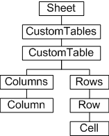
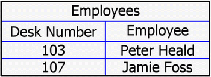

# Custom Tables

### Introduction to Custom Tables

Tables in Autodesk Inventor are typically associated with automated parts lists and bubble annotation. However, tables can also be considered general annotation, distinct from parts lists. Tables can be created with custom content. Also, custom tables can be assigned colors and specific line weights and text styles, and can be positioned anywhere on a drawing sheet.

Custom tables are designed so the developer can present and maintain tabulated data as annotation in a drawing document.

### Custom Tables Object Model Diagram



### Working with Custom Tables through the API

Custom tables are defined by specifying a number of rows and columns. Columns have header names which can optionally be part of the table. The following sample code adds a new table to the current sheet of an open drawing. The table will appear as follows.



### Creating a Custom Table

The table is added to the active sheet, so first get this sheet from the active document. Note that this code omits error checking for the sake of clarity and brevity. Always check that return values are of the expected type.

```vb
Public Sub CreateTable()
    Dim oDrawDoc As DrawingDocument
    Set oDrawDoc = ThisApplication.ActiveDocument
    Dim oSheet As Sheet
    Set oSheet = oDrawDoc.ActiveSheet
```

Set up a string array to contain the column titles (headers). This table has two columns, so the array contains two strings.

```vb
Dim oTitles(1 To 2) As String
oTitles(1) = "Desk Number"
oTitles(2) = "Employee"
```

Now add the content by setting up an array for the two rows and two columns ( 2 x 2 = 4, so the array contains four strings). The table cell order is left-to-right, top-to-bottom.

|  |
| --- |
| **Note:** An empty table can be constructed by not passing content to the CustomTables.Add method, but if an array *is* passed, it must contain string entries for *all* cells, otherwise an error occurs. |

```vb
Dim oContents(1 To 4) As String
oContents(1) = "103"
oContents(2) = "Peter Heald"
oContents(3) = "107"
oContents(4) = "Jamie Foss"
```

The column width can be left at its default, to fit the content, but here the width is set a little wider for a neater appearance.

```vb
Dim oColumnWidths(1 To 2) As Double
oColumnWidths(1) = 3
oColumnWidths(2) = 3
```

For this example the table is placed in an arbitrary position, at x=15 y=15.

```vb
Dim InsP As Point2d
Set InsP = ThisApplication.TransientGeometry.CreatePoint2d(15, 15)
```

Add the table to the sheet through the CustomTables.Add method, specifying a two-row, two-column table named "Employees". Pass the values defined previously.

```vb
Dim oCustomTable As CustomTable
Set oCustomTable = oSheet.CustomTables.Add("Employees", InsP, 2, 2, oTitles, oContents, oColumnWidths)
```

At this point the table appears on the sheet. However, we can continue to make changes to its appearance. The following code changes the justification of the second column to center-justified.

```vb
oCustomTable.Columns.Item(2).ValueHorizontalJustification = kAlignTextCenter
```

To make format changes, set up a TableFormat object that can then be applied to the table.

```vb
Dim oFormat As TableFormat
Set oFormat = oSheet.CustomTables.CreateTableFormat
```

Change some properties of the TableFormat object (for example, the color of the inside grid lines, and the line weight of the inside and outside grid lines).

```vb
oFormat.InsideLineColor = ThisApplication.TransientObjects.CreateColor(0, 0, 255)
oFormat.InsideLineWeight = 0.1
oFormat.OutsideLineWeight = 0.2
```

Apply the new format to the table. The line weights and color are updated.

```vb
oCustomTable.OverrideFormat = oFormat
```

The following code demonstrates the ability to access values of individual cells based on their row and column intersection. Note that the column can be specified by its name.

```vb
Dim oCell As Cell
Set oCell = oCustomTable.Rows.Item(2).Item("Employee")
Debug.Print oCell.Value
End Sub
```

The cell value "Jamie Foss" prints to the VBA "immediate" debug screen, if enabled.

### Summary

The Custom Tables API allows tabulated data to be added to drawing sheets, complete with column headers and table formatting. Table grid line colors and weights can be specified, and cell contents can be accessed and modified.

### Also consider

Autodesk Inventor has the ability to link to other documents through OLE. Add links to other documents through the Add method of the Document.ReferencedOLEFileDescriptors collection object. This gives developers the ability to add (for example) a Microsoft Excel file link to a drawing document.

Standard drawing sheet constructs such as a border and title block can be added to a sheet through the AddBorder, AddDefaultBorder and AddTitleBlock methods of the Sheet object.