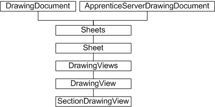
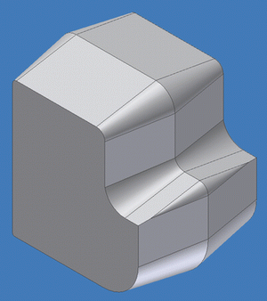
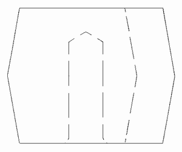
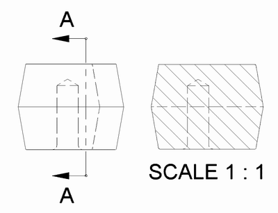

# Drawing Views

### Introduction to drawing views

The Autodesk Inventor user interface allows placement of drawing views on a drawing sheet. These views are 2D representations of the 3D model, and can be orthographic, isometric, or they can have an arbitrary view angle. They can be scaled views to show fine detail, or they can be section views. The API provides the same functionality through the collection of DrawingView objects.

### The purpose of the drawing views API

The drawing view API enables code to create, place and manipulate drawing views, including base views, on drawing sheets. View types supported include projected, section, and draft views. Additionally, the API supports the OnViewUpdate event, provided through the DrawingViewEvents object, allowing application code to be notified if an associated draft view is updated due to a change to the model.

### Drawing views object model diagram



### Working with drawing views through the API

The DrawingViews collection is obtained from the Sheet object. The Sheets collection is obtained from the DrawingDocument object, or if Apprentice Server is being used, from the ApprenticeServerDrawingDocument. The latter hierarchy provides read-only access to the drawing views.

The various types of drawing views are represented by the DrawingView object, with the exception of section views, which are of type SectionDrawingView. Section, draft, and associated draft views can only be created on the active sheet.

The DrawingView and SectionDrawingView objects provide a number of transformation methods designed to translate points between drawing view, model, and sheet spaces. These methods include DrawingViewToModelSpace, DrawingViewToSheetSpace, ModelToDrawingViewSpace, ModelToSheetSpace, SheetToModelSpace, and SheetToDrawingViewSpace.

### Creating a drawing view

The following code assumes a drawing document is open in Autodesk Inventor, and that the source part file (part.ipt) is located in the root of the C: drive. This file reference can be changed to suit. Here is the part used for this example.



This sample and the following code omit error checking for the sake of clarity and brevity. Always check that return values are of the expected type.

The first step is to obtain the sheet object, in order to place a view. The location of the view is provided by a 2D point. The following code uses transient geometry to define a 2D point at X=5, Y=5.

```vb
Dim oDrawingDoc As DrawingDocument
Set oDrawingDoc = ThisApplication.ActiveDocument
Dim oSheet As Sheet
Set oSheet = oDrawingDoc.Sheets.Item(1)
Dim oPoint1 As Point2d
Set oPoint1 = ThisApplication.TransientGeometry.CreatePoint2d(5#, 5#)
```

This sample places a regular drawing view of a model part. The following code uses an arbitrary hard-coded part file reference that should be changed as appropriate.

|  |
| --- |
| **Note:** The False argument to the document Open method indicates the part file is to be opened invisibly. In this context, there is no need to see the part in Autodesk Inventor. It is simply the source for the drawing view. Close the part file afterwards. |

The new hidden line DrawingView object is added to the DrawingViews collection using a bottom view of the opened part file, at point 5,5, at a scale of 1:1. Immediately afterwards, the part file is closed. It is good practice to keep file references open no longer that necessary.

```vb
Dim oPartDoc As PartDocument
Set oPartDoc = ThisApplication.Documents.Open("c:\testpart.ipt", False)
Dim oView1 As DrawingView
Set oView1 = oSheet.DrawingViews.AddBaseView(oPartDoc, _
oPoint1, 1#, kBottomViewOrientation, kHiddenLineDrawingViewStyle)
Call oPartDoc.Close(True)
```

The following is an example of how this appears on the sheet.



### Creating a section drawing view

The previous example placed a drawing view of a part. The following code places a new section drawing view through the previously placed view. Section views require that a section line be defined. This is the line through which the part is to be cut. However, unlike section lines created through the user interface, section lines created through the API are not constrained to the model, and therefore do not automatically update to reflect changes to the model.

The first task is to indicate the section line, either using existing geometry, or by creating a sketch containing a sketch line, as in the following code.

```vb
Dim oPoint2 As Point2d
Set oPoint2 = ThisApplication.TransientGeometry.CreatePoint2d(15#, 40#)
Dim oDrawingSketch As DrawingSketch
Set oDrawingSketch = oView1.Sketches.Add
oDrawingSketch.Edit
Dim oSketchLine As SketchLine
Set oSketchLine = oDrawingSketch.SketchLines.AddByTwoPoints(oPoint1, _
oPoint2)
oDrawingSketch.ExitEdit
```

For simplicity, this code reuses the view placement points to define the ends of the sketch line. In reality, this sketch line would be placed at a specific point relative to the base view. Now to add the section view by calling AddSectionView.

```vb
Dim oView2 As SectionDrawingView
Set oView2 = oSheet.DrawingViews.AddSectionView(oView1, _
oDrawingSketch, oPoint2, kHiddenLineRemovedDrawingViewStyle)
oDrawingSketch.Visible = False
```

Note the absence of a part file reference in the preceding code. Unlike base view creation, the previously created view is passed as an argument, together with the sketch line indicating the cut line. The two views now look something like the following illustration.



The arrows and notation in the preceding figures were generated automatically.

### Summary

The drawing view API functionality is equivalent to much of the drawing view functionality available through the user interface. It allows for the placement of different types of views on a drawing sheet. These views may be blank draft views, projected views, or section views. The API also provides a means of notification if the underlying model is subject to change.

### Also consider

Other drawing view API functionality includes the ability to edit drawing dimensions on a sheet through the DrawingDimension object. Sheet title blocks and templates can be edited through the use of drawing text (the TextBox object and associated styles) and drawing sketches.