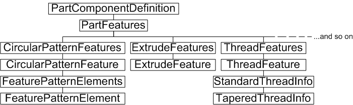
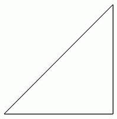
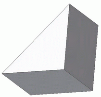
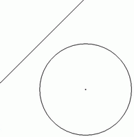
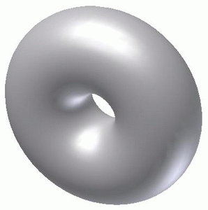

# Features

### Introduction to Features

The term *feature* can be confusing to those new to parametric modeling. In common language, it might mean a distinguishing characteristic of some kind. In 3D parametric modeling, it refers to each of the mathematical processes used to build the model, hence the term feature-based modeling.

The model represents the result of applying a sequence of features and other changes. Interestingly, due to the hierarchical nature of the computations, a change to a feature, especially one early in the sequence, often results in changes to parts of the model that might have other features applied to them. So application or modification of a simple feature can have far-reaching effects, perhaps causing significant changes in the appearance of the model.

A common example of a feature is an extrusion. Imagine a sketched circle. It is 2D with no thickness. Apply an extrusion feature to this circle (actually to a profile based on the circle), specify an extrusion thickness, and a 3D model is generated. Depending on the thickness, it might look thin like a coin, or long like a cylinder. You can apply further features, such as a fillet feature to round off the edges of the cylinder.

### The purpose of Features

The extrusion feature described previously is often the first feature used in building a model, but there are many more feature types; some that generate solids from sketches or profiles, some that modify existing solids. Autodesk Inventor maintains the list of features (and their respective parameters) so they can easily be changed. Imagine if this were not so. You complete a complex model, only to find some minor fillet or chamfer applied early in the process was wrong. In feature-based modelers, such as Autodesk Inventor, you can go to that earlier feature, make your change, and let the entire model be recomputed incorporating the change.

### Features Object Model Diagram



The following is a list of current API feature objects. Not all are available at the same time - it depends on the document or environment type. For example, the FlangeFeature object only has meaning in the context of a sheet metal part.

|  |  |  |
| --- | --- | --- |
| BendFeature | BoundaryPatchFeature | ChamferFeature |
| CircularPatternFeature | CoilFeature | ContourFlangeFeature |
| CornerChamferFeature | CornerFeature | CornerRoundFeature |
| CutFeature | DecalFeature | DeleteFaceFeature |
| EmbossFeature | ExtrudeFeature | FaceDraftFeature |
| FaceFeature | FeatureBasedOccurrencePattern | FeaturePatternElement |
| FeaturePatternElements | FilletFeature | FlangeFeature |
| FoldFeature | HemFeature | HoleFeature |
| KnitFeature | LoftFeature | MirrorFeature |
| MoveFaceFeature | NonParametricBaseFeature | PartFeature |
| PartFeatureExtent | PunchToolFeature | RectangularPatternFeature |
| ReferenceFeature | ReplaceFaceFeature | RevolveFeature |
| RibFeature | ShellFeature | SplitFeature |
| SweepFeature | ThickenFeature | ThreadFeature |

### Working with Features through the API

A part component definition provides access to the collection of features to be applied to that part. This PartFeatures object is a collection of other part feature collection types. For example, the ExtrudeFeatures object is a collection of ExtrudeFeature objects. Creating an extrude feature is as simple as adding it to this collection. However, most features require some further input, perhaps in the form of mirror or rotation axes, sketches or profile objects, or radius dimensions, to help define the appropriate result.

### Creating an extruded feature from scratch

This sample code steps through the process of creating a solid from an extruded sketch. A new part document is created, a sketch and profile is added, and the profile is extruded to form a 3D solid.

|  |
| --- |
| **Note:** Extruding a sketch through the Autodesk Inventor user interface does not require creation of a profile. This step is hidden from the user. However, the API does require a Profile object (actually a collection of ProfilePath objects) to create some features. |

The code omits error checking for the sake of clarity and brevity. Always check that return values are of the expected type. First, add a new part document to the documents collection:

```vb
Dim oApp As Inventor.Application
Set oApp = ThisApplication
Dim oPartDoc As PartDocument
Set oPartDoc = oApp.Documents.Add(kPartDocumentObject, oApp.GetTemplateFile(kPartDocumentObject))
```

Now add a new sketch to the sketches collection of this document's component definition. Here, the third item in the WorkPlanes collection indicates the XY plane, so that is the plane for the new sketch. For more information on WorkPlanes and other work features, refer to the [Work Features](WorkFeatures_Overview.md) overview.

```vb
Dim oSketch As PlanarSketch
Set oSketch = oPartDoc.ComponentDefinition.Sketches.Add(oPartDoc.ComponentDefinition.WorkPlanes.Item(3))
```

Some transient point objects are required when creating sketch lines, so obtain the TransientGeometry object.

```vb
Dim oTG As TransientGeometry
Set oTG = oApp.TransientGeometry
```

Add three points to the SketchPoints collection of the new sketch. These become the endpoints of three sketch lines forming a triangle. The false argument indicates that these points are not intended as hole feature center points.

```vb
Dim oSkPnts As SketchPoints
Set oSkPnts = oSketch.SketchPoints
Call oSkPnts.Add(oTG.CreatePoint2d(0, 0), False)
Call oSkPnts.Add(oTG.CreatePoint2d(1, 0), False)
Call oSkPnts.Add(oTG.CreatePoint2d(1, 1), False)
```

When the user draws sketch lines through the Autodesk Inventor user interface, sketch points are not required as they are inferred automatically. This is not the case with the API. Sketch points are required to add sketch lines. Use the preceding sketch points to add three sketch lines to the sketch.

```vb
Dim oLines As SketchLines
Set oLines = oSketch.SketchLines
Dim oLine(1 To 3) As SketchLine
Set oLine(1) = oLines.AddByTwoPoints(oSkPnts(1), oSkPnts(2))
Set oLine(2) = oLines.AddByTwoPoints(oSkPnts(2), oSkPnts(3))
Set oLine(3) = oLines.AddByTwoPoints(oSkPnts(3), oSkPnts(1))
```

The code thus far creates a new part document containing the following sketch:



Extrude features require a profile object, so create a profile from this sketch. The AddForSolid method has optional arguments (not used here) that can be used to further manipulate the ProfilePaths within the Profile.

```vb
Dim oProfile As Profile
Set oProfile = oSketch.Profiles.AddForSolid
```

Now, add an ExtrudeFeature to the Features collection of the document's component definition. Here the AddByDistanceExtent method is used, which requires a distance for the extrude - in this case, 1.0. The other arguments are also similar to the user interface, indicating the extrude should occur in both positive and negative directions, and that a join Boolean operation should be performed.

```vb
Dim oExtFeature As ExtrudeFeature
Set oExtFeature = oPartDoc.ComponentDefinition.Features.ExtrudeFeatures.AddByDistanceExtent _
(oProfile, 1.0, kSymmetricExtentDirection, kJoinOperation)
oApp.ActiveView.Fit
```

The code results in a 3D solid appearing as follows:



This sample demonstrated a simple extrude of a sketch to form a 3D solid. The following sample demonstrates creation of a 3D solid by revolving a sketch around an axis. Again, start a new part document and create some sketch points:

```vb
Dim oApp As Inventor.Application
Set oApp = ThisApplication
Dim oPartDoc As PartDocument
Set oPartDoc = oApp.Documents.Add(kPartDocumentObject, oApp.GetTemplateFile(kPartDocumentObject))
Dim oSketch As PlanarSketch
Set oSketch = oPartDoc.ComponentDefinition.Sketches.Add(oPartDoc.ComponentDefinition.WorkPlanes.Item(3))
Dim oTG As TransientGeometry
Set oTG = oApp.TransientGeometry
Dim oSkPnts As SketchPoints
Set oSkPnts = oSketch.SketchPoints
Call oSkPnts.Add(oTG.CreatePoint2d(0, 0), False)
Call oSkPnts.Add(oTG.CreatePoint2d(1, 1), False)
Call oSkPnts.Add(oTG.CreatePoint2d(1, 0), False)
```

Three sketch points have been created. Use two of them to create a sketch line, and the third to locate a sketch circle with a radius of 0.5:

```vb
Dim oLines As SketchLines
Set oLines = oSketch.SketchLines
Dim oLine As SketchLine
Set oLine = oLines.AddByTwoPoints(oSkPnts(1), oSkPnts(2))
Dim oCircs As SketchCircles
Set oCircs = oSketch.SketchCircles
Dim oCirc As SketchCircle
Set oCirc = oCircs.AddByCenterRadius(oSkPnts(3), 0.5)
```

The new sketch appears as follows:



The intention here is to rotate, or revolve, the circle around the axis formed by the sketch line, thus forming a doughnut shape. The next step is to form a profile from the circle sketch. Note that the AddForSolid method is used again. The only contiguous closed loop in the sketch is the circle, which is the only object that will be used in the resultant profile.

```vb
Dim oProfile As Profile
Set oProfile = oSketch.Profiles.AddForSolid
```

The only remaining step is to add the RevolveFeature to the RevolveFeatures collection. Here the AddFull method is used, indicating that the revolve should rotate through a full 360 degrees. The alternative is the AddByAngle method. The sketch line is used as the rotation axis.

```vb
Dim oRevFeature As RevolveFeature
Set oRevFeature = oPartDoc.ComponentDefinition.Features.RevolveFeatures.AddFull _
(oProfile, oLine, kJoinOperation)
oApp.ActiveView.Fit
```

This RevolveFeature sample code results in a 3D solid appearing as follows:



### Intelligent features - iFeatures

The Autodesk Inventor user interface supports insertion of iFeatures. iFeatures are features that you repeatedly use in your work, where some, but not all, parameters tend to change. An iFeature is stored as an .IDE file, and may prompt for required parameters during insertion. The base sketch is incorporated into the iFeature and usually has parameters and constraints applied. When an iFeature is inserted onto a model face, for example, the variable parameters are prompted for and the iFeature shape and placement modified appropriately. In most other respects, Autodesk Inventor treats iFeatures as regular features. The following is a list of current iFeature objects.

|  |  |  |
| --- | --- | --- |
| iFeatureComponent | iFeatureComponents | iFeatureDefinition |
| iFeatureEntityInput | iFeatureInput | iFeatureInputs |
| iFeatureParameterInput | iFeatureTemplateDescriptor | iFeatureTemplateDescriptors |
| iFeatureVectorInput | iFeatureWorkPlaneInput |

The following code extract shows how an iFeature, named MyiFeature.ide, might be added to a face of a part in an assembly (here the previously selected face object is passed as oFace).

As this sample assumes an assembly context, the face is also in the assembly context, so it gets the part component definition of the face in its part context using the Parent property of the native object. In other words, the face in its part context, not in its assembly context. For more information, see the [Proxies](Proxies_Overview.md) overview.

```vb
Dim oPartCompDef As PartComponentDefinition
Set oPartCompDef = oFace.NativeObject.Parent.Parent
```

Using the part component definition, add a new iFeature component definition to its ReferenceComponents collection. In this case, the code references an iFeature file named MyiFeature.ide.

```vb
Dim iFeatDef As iFeatureDefinition
Set iFeatDef = oPartCompDef.ReferenceComponents. _
iFeatureComponents.CreateDefinition("c:\MyiFeature.ide")
```

The previously prepared iFeature is added to specified face of the part in the assembly. Use the iFeatureSketchPlaneInput object if additional control is required; for example, over the orientation of the iFeature.

### Summary

Features are the building blocks of Autodesk Inventor's parametric feature-based modeler. Features represent a mathematical construct or modification of the model. Autodesk Inventor maintains a sequential list of features and their parameters, any of which can be changed, with the potential to cause the entire model to be recomputed. iFeatures takes this a step further, allowing parametric sketch-based features to be stored as .ide file. The API can add iFeatures to the model.

### Also consider

Autodesk Inventor's iFeatures can take advantage of complex constraints, parameters and equations to change or maintain their size and shape. Refer to parameters for more information.

This type of intelligent application of features extends to other workflows too; refer to iMates, iParts, and iProperties.

The Autodesk Inventor user interface can be used to apply assembly features. These are features that apply to a part only in the assembly context. The API can currently query assembly features, but cannot yet create them.