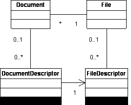

# File and Document References

### Files and Documents

A **File** object represents a storage in the file system (i.e. a file on disk). A **Document** object represents
an instance of a model or drawing in memory. A Document can only have a single associated File object. However, since
it is possible to have multiple instances (or model states) of a file in memory that are persisted
in the same storage on the file system, multiple Document objects may be associated with the same File object.

### File and Document References

A **FileDescriptor** object describes the reference from a File to another File. A **DocumentDescriptor** describes
the reference from a Document to another Document. A descriptor contains all the information needed to find
the referenced file/document as well as the state of the reference (healthy, unresolved, replaced, etc.). The
File and FileDescriptor objects represent the consolidated view of all of the representations of a Document. The
figure below shows the relationships between the FileDescriptor, File, DocumentDescriptor and Document objects.



Figure 1 : The File References API Model

### Relevant API Properties

**Note**: The Document interface is replaced by ApprenticeServerDocument in Apprentice. All the property names remain the same.

**File** Object

|  |  |  |
| --- | --- | --- |
| **Property** | **Returned objects** | **Description** |
| AvailableDocuments | Document objects | Documents currently in memory. |
| AllReferencedFiles | File objects | All the files referenced by this file (including recursively nested references). |
| ReferencingFiles | File objects | All the files in memory that directly reference this file. |
| ReferencedFiles | File objects | All the files directly referenced by this file. Unresolved & suppressed references are skipped. |
| ReferencedFileDescriptors | FileDescriptor objects | A collection describing all the direct references held by this file. This is a consolidated view of all the document references. Includes unresolved and suppressed references. Also includes foreign file references (xls, bmp, etc.) |

**Document** (and **ApprenticeServerDocument**) Object

|  |  |  |
| --- | --- | --- |
| **Property** | **Return type** | **Description** |
| File | File object | The associated File object. |
| AllReferencedDocuments | Document objects | All the documents referenced by this document (including recursively nested references). |
| ReferencingDocuments | Document objects | All the documents in memory that directly reference this document. |
| ReferencedDocuments | Document objects | All the documents directly referenced by this document. Unresolved & suppressed references are skipped. |
| ReferencedDocumentDescriptors | DocumentDescriptor objects | A collection describing all the direct references held by this document. Includes unresolved and suppressed references. |
| ReferencedOLEFileDescriptors | ReferencedOLEFileDescriptor objects | A collection describing all the direct foreign file references held by this document. Includes unresolved references. |
| ReferencedOpaqueFileDescriptors | ReferencedOpaqueFileDescriptor objects | A collection describing all the in-direct foreign file references held by this document. Includes missing references. |

**FileDescriptor** Object

|  |  |  |
| --- | --- | --- |
| **Property** | **Return type** | **Description** |
| FullFileName | String | Full path of the referenced file. |
| ReferencedFile | File object | The referenced file. Returns Null if reference is missing (unresolved or suppressed). |
| ReferenceMissing | Boolean | Whether the reference is missing for any reason and will the ReferencedFile property return a File object. |

**DocumentDescriptor** Object

|  |  |  |
| --- | --- | --- |
| **Property** | **Return type** | **Description** |
| FullDocumentName | String | Full path of the referenced document. |
| ReferencedDocument | Document object | The referenced document. Returns Null if reference is missing (unresolved or suppressed). |
| ReferenceMissing | Boolean | Whether the reference is missing for any reason and will the ReferencedDocument property return a File object. |
| ReferenceSuppressed | Boolean | Whether the reference is suppressed. |

The following code sample demonstrates the file references traversal and prints the file names of all the files referenced by the active document.

```vb
Public Sub FileReferenceSample()
    Dim oFile As File
    Set oFile = ThisApplication.ActiveDocument.File
    Call ProcessReferences(oFile)
End Sub
Private Sub ProcessReferences ( ByVal oFile As File )
    Dim oFileDescriptor As FileDescriptor
    For Each oFileDescriptor In oFile.ReferencedFileDescriptors
        Debug.Print oFileDescriptor.FullFileName
        If Not oFileDescriptor.ReferenceMissing Then
            ' Since the ReferenceMissing has returned False, the ReferencedFile will return a File
            ' Recurse unless this is a foreign file reference
            If Not oFileDescriptor.ReferencedFileType = kForeignFileType Then
                Call ProcessReferences(oFileDescriptor.ReferencedFile)
            End If
        End If
    Next
End Sub
```

### Also consider

If you are working with very large assemblies, also refer to the Large Assembly Management (LAM) overview.