# Getting Started with Inventor's API

## What is an API?

For those of you who are new to customizing applications by writing programs, the first question might be: what is an API? API, or Application Programming Interface, is a term used to describe the functionality exposed by an application that allows it to be used through a program. For example, you can use Inventor's API to write a program that will perform the same types of operations you can perform when using Inventor interactively.

Having an API is important because it allows you to add functionality to Inventor that is specific to your needs. Inventor, by necessity, is a general CAD system, meaning that it's not aimed at any specific industry or used to model only certain types of products. By providing an API, Inventor allows you to add additional functionality and optimize repetitive operations to make it more productive for your individual needs.

By providing an API, Inventor also provides you the ability to better integrate Inventor into your overall Enterprise process. For example, you might write a program that interfaces with your company's inventory database to obtain the current price for components so that the price shown in a part list is always up-to-date. You might also write a program that extracts data from assemblies to provide MRP systems with their required information. All of this can be done manually, but by automating it using a program you're able to significantly increase productivity and minimize errors.

An API is also important for the reason that it allows third-party applications to integrate with Inventor. It's through the API that products for PDM, NC, and FEM are able to interact with Inventor.

|  |
| --- |
| **Please Note:** Developers are strongly cautioned against using any Inventor API object, method, property, event or constant that is marked as hidden, unsupported or for internal use only. These objects have been created or maintained for Autodesk's internal use, and there is no guarantee that they will continue to exist (or to function similarly) from release to release. |

## How Do I Access the API?

Inventor's API is exposed using technology from Microsoft called "Automation." (This was previously referred to by Microsoft as "OLE Automation.") Automation interfaces are common among applications written for Windows. For example, Microsoft Word and Excel expose Automation interfaces to allow you to customize them. AutoCAD and Mechanical Desktop also expose Automation interfaces. (They refer to them as ActiveX interfaces.)

There are some significant advantages to providing an API through an Automation interface. First, it allows you to use almost any of the currently popular programming languages: Visual Basic, Visual C++, C#, Delphi, Python, Java, etc. Second, if designed correctly, it exposes the functionality using standard concepts. This means that if you already have experience programming a well-designed Automation interface like Word or Excel, you already understand many of the concepts that are used by the Inventor API. Finally, it exposes the application's functionality in an object-oriented manner. Once the general concepts of how an object-oriented API works are understood, this type of API is easier to learn and use than function-oriented APIs.

Inventor exposes functionality through its API, and there are different ways to access the API. All of them are useful in certain cases, so it's important to have a basic understanding of the ways to connect to the API so you can make the best decision about how to write your program. The diagram below illustrates the different ways of accessing Inventor's API. A brief overview of each of the methods follows. Detailed information about these is provided in sections devoted to each method: [VBA](VBA_Overview.md), [Add-Ins](CreatingAnAddIn_Overview.md), and [Apprentice Server](Apprentice_Overview.md).

First, a quick explanation of the figure below. The white boxes represent components that provide access to Inventor's API. These are Inventor and *Apprentice Server*. We'll talk about Apprentice more in a minute. The blue cylinder at the bottom represents the Inventor data you're accessing, i.e. your .ipt and .iam files. All of the yellow boxes represent programs that you write. When one box encloses another box this indicates that the enclosed box is running in the same process as the box enclosing it. For example, VBA runs in the same process as Inventor. An "in-process" program will run faster than a program running out of process.

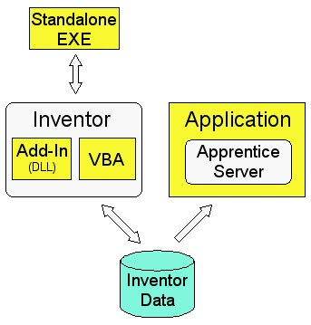

### VBA

VBA, or Visual Basic for Applications, is a programming environment that is accessed from within Inventor. Programs written using VBA are frequently referred to as "macros." VBA is typically used by end-users to write small programs to automate repetitive tasks, although it is certainly not limited to this. A VBA program has the same access to all of the features of the API as any of the other methods of accessing the API (with the exception of Add-Ins, which we'll discuss later).

When deciding which method to use when programming Inventor, there are a few advantages to consider when using VBA. First, VBA is delivered with Inventor and does not require you to purchase an additional programming language. Second, you are able to embed programs within Inventor documents. If you have a program that is data-specific, this is a convenient way to keep the program with the data it is designed to use. (You're not forced to save your programs in Inventor documents. You can also save programs in separate files so they can be shared among users and documents.) Third, VBA runs in the same process as Inventor so you gain the performance advantages of being in the same process. Fourth, VBA was designed to work with Automation types of API's and is the most user-friendly environment for learning Inventor's API.

### Add-Ins

Add-Ins are a special type of Inventor program. An Add-In is able to do one thing that none of the other methods of accessing the API is able to do; Inventor starts the Add-In automatically whenever Inventor is run. This has a huge advantage in that the add-in is able to insert itself into Inventor's user-interface and connect to events to be able to watch for and respond to activity within Inventor. This allows add-in functionality to appear the same as built-in Inventor functionality. Add-ins also have a distinct advantage over VBA in delivering your program to users and managing your source code.

Add-Ins can be written using any language that supports the creation of ActiveX DLLs, such as Visual Basic, C#, and Visual C++. Add-Ins cannot be created with VBA.

### Standalone EXE

A standalone EXE is a program that runs on its own and connects to Inventor. This type of program is typically used in the case where you have a program that has its own interface and doesn't require the user to interactively work with Inventor. For example a batch plotting utility can be an EXE that runs independently of Inventor. It might monitor a database watching for new records to be added which describe documents that need to be plotted. When a new record is created in the database, the standalone EXE starts Inventor, if it's not already running, opens the desired document and plots it, all without any user interaction.

Standalone EXEs run out-of-process to Inventor, so there is some performance penalty, but since they are not usually used for interactive processes it's rarely an issue. Even in the case where performance is an issue it's possible to combine the use of an add-in and an exe. You can have an add-in that does the majority of the work and an exe that calls the add-in.

You also run in a standalone EXE mode when you write programs within another application's VBA. For example, if you write a program using Excel's VBA that connects to Inventor, your VBA program is running in the process space of Excel and is communicating with Inventor out of process.

### Apprentice Server

Apprentice is an ActiveX server that can be used by other applications to get access to Inventor data. Apprentice is essentially a subset of Inventor that runs in-process to the application using it. Apprentice doesn't have a user interface and the only way to interact with it is through its API. Apprentice provides access to a limited set of full Inventor functionality with the primary areas being assembly structure, B-Rep, geometry, and iProperties. Most access to information through Apprentice is read-only; (a couple of exceptions to this are iProperties and file references).

Apprentice is useful in any standalone application that needs access to information contained within Inventor documents. The alternative is to use Inventor. Using Apprentice is much more efficient than using Inventor to perform the same operations because Apprentice is able to run in the same process as your application and because it doesn't have a user interface it can perform many operations faster.

Another advantage of Apprentice Server is that it's available at no cost and is available on the public [Autodesk website](https://www.autodesk.com/support/technical/product/inventor) as a standalone application by searching it from the website. More detailed information about Apprentice can be found in the [Apprentice Server](Apprentice_Overview.md) section.

## Automation Programming Basics

### Object Oriented Programming Concepts

A COM Automation interface exposes it functions through a set of objects. A programming object has many similarities to real-world objects. Let’s look at a simple example to understand how object oriented programming terminology can be used to describe it. A company that sells chairs might allow a customer to design their own chair by filling out an order form, like the one shown below.

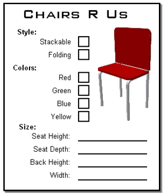

The options on the order form define the various properties of the desired chair. By setting the properties to the desired values the customer is able to describe the specific chair they want.

In addition to properties, objects also support methods. Methods are basically instructions that the object understands. In the real world, these are actions you would perform with the chair. For example, you could move the chair, cause it to fold up, or throw it in the trash. In the programming world the objects are smarter and instead of you performing the action you tell the object to perform the action itself; move, fold, and delete.

A third aspect of objects is that they can support events. In the real-world events are equivalent to installing sensors on an object to track when certain things happen to the object. For example, you can attach a sensor to the seat of the chair to be notified whenever anyone sits on it. In the programming world you can use events to be notified when certain things happen within Inventor.
One final concept of object-oriented programming is that of a class. Going back to the chair object, you can think of the class as the order form the customer fills out to describe the specific chair they want. A class isn’t the object itself but the template that defines all the properties, methods, and events of a particular type of object. The order form represents the class and the resulting chair is the object, or an instance of the class.

One final concept of object-oriented programming is that of a class. Going back to the chair object, you can think of the class as the order form the customer fills out to describe the specific chair they want. A class isn’t the object itself but the template that defines all the properties, methods, and events of a particular type of object. The order form represents the class and the resulting chair is the object, or an instance of the class.

### Objects and Inventor

The objects exposed by Inventor’s programming interface represent the things in Inventor that you're already familiar with. For example, look at the extrude feature shown below. For each extrude feature that you create in a part, there is an *ExtrudeFeature* programming object that represents it. The ExtrudeFeature object supports various properties and methods that allow you to query and edit the extrusion. These properties and methods provide equivalent functionality to what you specify when creating and editing an extrude feature the user interface. For example, the ExtrudeFeature object supports the Name property. This is the name of the feature that is displayed in the object browser. You can get the value of this property to see the current name of the feature and you can set the value of this property to change the name of the feature. The ExtrudeFeature object also supports the properties ExtentType, Operation, Profile, and others. The ExtentType property specifies that this is a distance extent. The Operation specifies that this is a "new solid" operation. The Profile returns the sketch information that defines the shape of the feature. These are the API equivalent of the options provided in the mini dialog shown below.

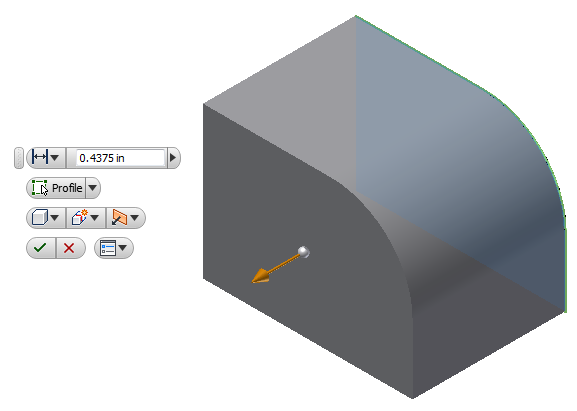

An important point to emphasize here is that most of the API is just another way besides the user-interface, of accessing Inventor’s functionality. Because the API allows you to do the same things you can do through the user-interface there are strong similarities between the two. Having a good understanding of Inventor from the standpoint of an end-user will make the API easier to understand and use.

### Accessing Objects

As discussed above, Inventor’s API is exposed as a set of objects. By gaining access to these objects through the API you can use their various methods, properties, and events to control and react to Inventor. Let’s look at how you access these objects. The first concept to understand before going further is the object model. The full Inventor object model is shown below. You can see that there are a lot of objects, but most programs will use only a small portion of them.

[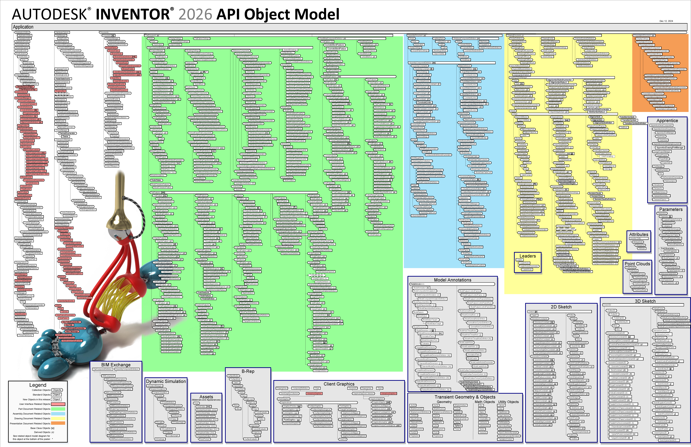](../images/FullObjectModel.png)

The object model is a hierarchical diagram that illustrates the relationships between objects. One of the most important objects in this hierarchy is the *Application* object. The Application object represents the Inventor application and is the top-most object in the hierarchy. The Application object supports methods and properties that let you control Inventor but most important, it supports properties that return other Inventor objects. Because of this, once you have the Application object you can access any other object in the hiearchy. The object model picture is useful as a tool because it illustrates how to get from one object to another. You just need to understand how to traverse the hierarchy to get to the specific object you want. The diagram below illustrates the portion of the object model that is needed to access the part extrude feature, (ExtrudeFeature object).

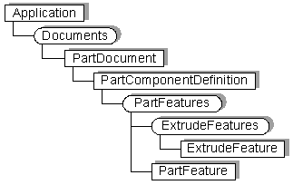

The code below illustrates using the relationships indicated in the object model diagram above to access the extrude feature named “Extrusion1”.

```vb
Public Sub GetExtrudeFeature()
    Dim partDoc as PartDocument
    Set partDoc = ThisApplication.ActiveDocument
    Dim extrude As ExtrudeFeature
    Set extrude = partDoc.ComponentDefinition.Features.ExtrudeFeatures.Item(1)
    MsgBox "Extrusion " & extrude.Name & " is suppressed: " & extrude.Suppressed
End Sub
```

Examining the code above, there are a lot of basic concepts used that many people struggle with when first starting to use Inventor’s API. These concepts are: obtaining the Application object, traversing the object model, collection objects, and derived objects. The following looks at each of these.

### Obtaining the Application Object

The first thing illustrated in the sample is accessing the Application object. In Inventor’s VBA you can use the ThisApplication global property to get the Application object, which is what the sample does. When writing an add-in, when Inventor starts the add-in it passes it the Application object. When writing an exe you need to use other API's to get the Application object. In this case you can choose to either get the Application object from a running instance of Inventor or to start Inventor and get the Application object from it. Below is some VB.Net exe code that is the equivalent the VBA code above. The first portion of the code uses the .Net GetActiveObject method to get the Inventor application object. This is wrapped within a Try Catch statement to handle the case where Inventor isn't running. The remaining code is almost identical to the VBA sample.

```vb
Imports Inventor
Imports System.Runtime.InteropServices
------
Public Sub GetExtrudeFeature()
    ' Get the Inventor Application object.
    Dim inventorApp As Inventor.Application = Nothing
    Try
    inventorApp = Marshal.GetActiveObject("Inventor.Application")
    Catch ex As Exception
    MessageBox.Show("Cannot connect to Inventor")
    Exit Sub
End Try
Dim partDoc As PartDocument
partDoc = inventorApp.ActiveDocument
Dim extrude As ExtrudeFeature
extrude = partDoc.ComponentDefinition.Features.ExtrudeFeatures.Item(1)
MessageBox.Show("Extrusion " & extrude.Name & " is suppressed: " & extrude.Suppressed)
End Sub
```

Here's the same example in C#.

```csharp
using Inventor;
 using System.Runtime.InteropServices;
 ------
 
 private void GetExtrudeFeature()
 {
     Inventor.Application inventorApp = null;
     try 
     {
        // Attempt to get a reference to a running instance of Inventor.
        inventorApp =(Inventor.Application)Marshal.GetActiveObject("Inventor.Application");
     }
     catch 
     {
        MessageBox.Show("Unable to connect to Inventor.");
        return;
     }
 
     PartDocument partDoc = null;
     partDoc = (PartDocument)inventorApp.ActiveDocument;
 
     ExtrudeFeature extrude = null;
     extrude = partDoc.ComponentDefinition.Features.ExtrudeFeatures[1];
 
     MessageBox.Show("Extrusion " + extrude.Name + " is suppressed: " + extrude.Suppressed);
 }
```

### Traversing the Object Model

Once you have the Application object, the first step in getting a specific feature is to get the document the feature is contained within. In the sample above there’s a slight discrepancy between the object model diagram and the sample code. Notice that the diagram shows that the Documents object is the next step from the Application object, but the sample program does not do this. The reason for this is that there are many cases in the API where short cuts are provided that make it easier to access specific objects. In this case the ActiveDocument property of the Application object is used which returns the Document object currently being worked on by the end-user, allowing us to bypass the Documents object.

After getting the PartDocument object the rest of the code illustrates traversing the object model to get down to the desired feature. The ComponentDefinition property of the PartDocument object is called which returns a PartComponentDefinition object. The Features property of the PartComponentDefinition object is called which returns a PartFeatures object. The ExtrudeFeatures property of the PartFeatures object is called which returns an ExtrudeFeatures object. Finally, the Item property of the ExtrudeFeatures object is called which returns the ExtrudeFeature object that has the specified name. Hopefully you can see that the code is using the relationships defined in the object hierarchy to traverse the object model to the desired object.

### Collection Objects

Collection objects are a special type of utility object in the API. A collection object doesn’t represent a particular entity within Inventor but instead provides access to a group of related objects. A collection object also supports the methods that allow you to create new objects. The portion of the object model to access the extrude feature is shown below. The rectangular boxes represent standard objects whereas the boxes with rounded corners represent collection objects. Collection objects can also be identified by their plural names. In this example the collection objects are the Documents, PartFeatures, and ExtrudeFeatures objects.


The primary difference between collection objects and other objects is the concept that they provide access to a set of objects. They do this by supporting the Count and Item properties. All collection objects support these two properties. The Count property returns the number of objects currently in the collection. For example, if you call the Count property of the ExtrudeFeatures collection object it will return the number of extrude features in that document. The Item property returns a specific object within the collection. Typically, when using the Item property you specify the index of the item you want from the collection. For example, the code below prints out the names of all of the ExtrudeFeature objects in the document by going through the contents of the collection one by one by using the Count and Item properties of the ExtrudeFeatures collection object.

```vb
Public Sub ShowExtrudeFeature()
    ' Get the active document.  This assumes it is a part document.
    Dim partDoc as PartDocument
    Set partDoc = ThisApplication.ActiveDocument
    ' Get the ExtrudeFeatures collection object.
    Dim extrudeFeatures As ExtrudeFeatures
    Set extrudeFeatures = partDoc.ComponentDefinition.Features.ExtrudeFeatures
    ' Iterate through the contents of the ExtrudeFeatures collection.
    Dim i As Integer
    For i = 1 to extrudeFeatures.Count
        ' Get a specific item from the ExtrudeFeatures collection.
        Dim extrude As ExtrudeFeature
        Set extrude = extrudeFeatures.Item(i)
        Debug.Print extrude.Name
    Next
End Sub
```

When the Item property is used with a value indicating the index of the item, the first item in the collection is 1 and the last item is the value returned by the collection’s Count property. For some collections the Item property also supports specifying the name of the item you want. Instead of providing the index of the item you can supply a String that specifies the name. The code below demonstrates how to get the extrude feature named "My Extrude". The call will fail if there's not an extrusion with that name. The online help and the object browser (both are discussed below) can be used to determine if an Item supports indexing by name. All Item properties support indexing by value.

```vb
Dim extrude As ExtrudeFeature
Set extrude = extrudeFeatures.Item("My Extrude")
```

When iterating through the objects contained within a collection you can also use a For Each statement. The following does the same thing as the earlier sample but is more concise and will typically be faster.

```vb
' Iterate through the contents of the ExtrudeFeatures collection.
Dim extrude As ExtrudeFeature
For Each extrude In extrudeFeatures
    Debug.Print extrude.Name
Next
```

In addition to providing access to their contents through the Count and Item properties, many collections also support methods to allow you to create new objects within that collection. For example, the ExtrudeFeatures collection supports the Add method that lets you create new extrusions.

### Derived Objects

The idea of *derived* and *base class* objects is usually a new concept for most end-users wanting to use Inventor’s API. To help describe this concept let’s look at a close parallel that most people will be familiar with; animal taxonomy or classification. For example within the Animal kingdom you have insects, birds, mammals, etc. Within the mammal classification there are many different species but all of them share the same characteristics of a mammal; have hair, produce milk, etc. This same idea can be used to understand the concept of derived and base class objects.

If we were to write a program that represented the animal classification discussed above we would have the Animal, Insect, Bird, and Mammal objects. The Animal object is a base class for the Insect, Bird, and Mammal objects. The base class object is an object that supports methods and properties that are common to any of the objects derived from it. The Animal object can represent any animal regardless of whether it is actually an insect, a bird, or a mammal. The Animal object also supports methods and properties that are applicable to any animal, i.e. weight, name, etc.

The Insect, Bird, and Mammal objects are derived from the Animal object, so they inherit all of the functionality of the Animal object. In addition they support methods and properties that are unique to that particular group. If we continued the classification further we might add the Human and Dog objects. The Mammal object will be the base class for these objects and they inherit all of the functionality of the Mammal object. This concept is useful in programs where you are working with a mixed set of objects but those object share some functionality. For example, if you’re going to iterate over all of the animals in a zoo and get their names you can use the Animal object because it can represent any animal and supports the Name property.

Let’s look at how this concept applies to Inventor. Inventor has base class objects and derived objects. An example is the Document, PartDocument, AssemblyDocument, and DrawingDocument objects. The base class object is the Document object. This object can represent any type of document. The specific document type objects are derived from the Document object. They support everything the Document object supports plus they support additional methods and properties that are specific to that document type. For example, from the Document object you can get the filename, referenced documents, and iProperty information. From a PartDocument object you can get all of that, plus you can get sketches, features, and parameters. Another example is the PartFeature object. This is the base class object for all features. Again, it can represent any part feature and supports the functions that are common to all features. The code below illustrates this concept in use. It checks every feature in the active part and unsuppresses any suppressed feature.

```vb
Public Sub SuppressOff()
    ' Get the active part document.  Assumes a part is active.
    Dim partDoc As PartDocument
    Set partDoc = ThisApplication.ActiveDocument
    ' Iterate through all of the features.
    Dim feature As PartFeature
    For Each feature In partDoc.ComponentDefinition.Features
        ' Check to see if the feature is suppressed.
        If feature.Suppressed Then
            ' Unsuppress the feature.
            feature.Suppressed = False
        End If
    Next
End Sub
```

In the sample above the variable feature is declared as PartFeature type. This is the base class object for all features. It then iterates through all of the features in the part. All features can be suppressed so the Suppressed property is supported by the base class PartFeature. This sample checks the suppression state of each feature and unsuppresses any suppressed features by setting the Suppressed property to False.

If the PartFeature base class did not exist then to accomplish the same thing you would have to write a similar loop for every feature type. As new features are added in releases you would have to update your code to take these into account. Having a base class that represents any feature type is allows your program to be much simpler.

If you need specific information about a particular type of feature then you use the specific feature type. For example if you need to get the depth of an extrusion you use the ExtrudedFeature object, which provides the additional information that is specific to extruded features.

Unfortunately, a listing of what are the base and derived classes is an area of the API that is not documented very well. Ideally another chart, in addition to the object hierarchy chart, would exist that shows this class categorization. The best documentation currently available that describes these relationships is the object model diagram.

## Programming Tools

There are tools available to help you when working with Inventor’s API. The following describes each of these.

### Object Browser

This is a tool you'll want to take advantage of when working with Inventor’s API. You access it from the VBA programming environment by pressing the F2 key, the toolbar button , or selecting Object Browser from the View menu. The Object Browser is shown below.

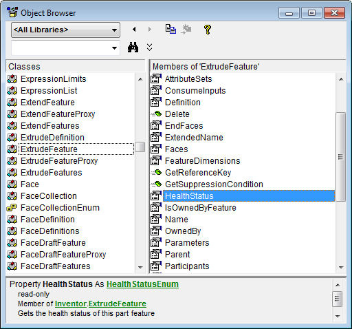

The left column of the browser, titled “Classes”, contains a list of all the objects available in the libraries currently attached. In the drop-down list at the top-left of the browser, “” in the example above, you can specify a specific library to limit the list to only the objects in that library. In this example, the ExtrudeFeature class has been selected.

The right column displays a list of the methods, properties, and events supported by the selected class. Selecting one of these will display information about that function at the bottom of the object browser. In the example above the HealthStatus property has been selected. At the bottom of the dialog we learn that this property returns a HealthStatusEnum value. (Enum values are lists of values that are also defined in Inventor’s type library.) We also learn that this property is read-only, meaning that we can get the value but we can’t change it. A brief description of the selected function is also displayed at the bottom of the browser. The online help is useful in conjunction with the browser because it is context sensitive. Pressing F1 at this point will bring up the help page for the HealthStatus property.

Here are more examples of the information that’s displayed at the bottom of the object browser and how to interpret this information. In the example below, the Name property of the ExtrudeFeature object is selected. The property returns a String. Notice that unlike the previous example, it does not say that it is read-only so this property is read-write. Using this property you can get the name of the feature and you can also assign a String to this property to set the name of the feature.

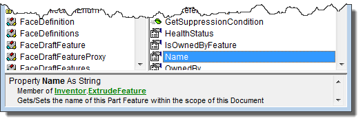

The Item property of a collection object was discussed earlier. Remember that you can always use a value as the index to get a specific item and sometimes you can also use the name of the item. The two examples below show one technique to determine if using a name is supported. The first example is for the ExtrudeFeatures collection. It shows that the Item property has one argument called index. Notice that it doesn’t say what type this argument is. Whenever the type is not specified that means it is a Variant. A Variant is a special type that can represent any variable type. In this case index is a Variant to allow you to provide either a Long or a String. Often, as in this case, this is also indicated in the description and in the online help. In the second example, index is specified to be a Long value. In this case you can only supply a value. Supplying a String will cause a failure.

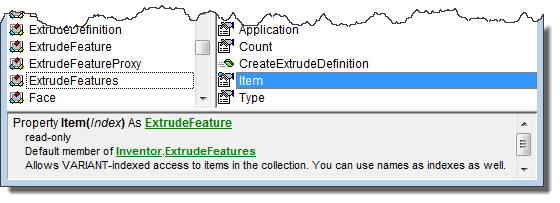

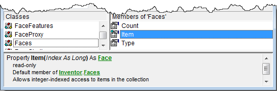

Here's a more complicated signature and more about what can be learned by looking at the signature in the object browser. We’ll use the AddSpiral method of the CoilFeatures collection object. This method has several arguments. The first is called Profile and requires a Profile object as input. The second called AxisEntity doesn't have a specific type but will take any object. What this means is that this particular method will take more than one type of object for this argument so a specific type can't be specified. In this example it can be a sketch line or work axis. The Pitch argument does not have a type displayed because it is a Variant. In this case you can use either a Double specifying the pitch in centimeters or you can use a String and specify an equation which can include parameter values. The same is true for the Revolution argument; it can be a Double or a String. The Operation argument expect a value from an enum list. The last two arguments are optional. In this case they both happen to be Boolean arguments and both default to False if not provided. For more details about all functions and their arguments you can use the API help. You can easily access the help for a particular object or function by pressing F1 when using the object browser.

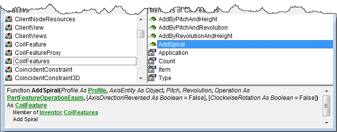

### Using the VBA Debugger

Another very useful tool when working with Inventor’s API is the VBA debugger. In this case we’re not using it to debug a program but using some features of the debugger to better understand Inventor’s object model. To use the debugger we need to be running a program. Fortunately we don’t need much of a program to enable access to the Inventor objects. The specific steps to use the debugger are listed below.

1. Within any code module, create a sub, like the sub Test shown below.
2. Click the mouse anywhere within the sub and press F8 to step into the code. You’re now running the sub one line at a time.
3. Click anywhere within the word “ThisApplication”.
4. Run the Quick Watch command from the Debug menu and click “Add” in the Quick Watch dialog.
5. The debug window will appear and ThisApplication will appear within the debug window. This represents a live view of the Inventor Application object. You can click on the “+” sign next to ThisApplication to expand it and view its properties and their values. Properties that return other objects will also have the “+” sign next to them allowing you to continue to expand the objects and view their properties. This provides a live view of the object model.

   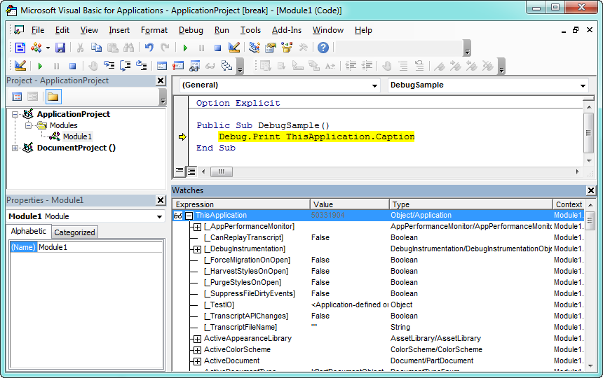