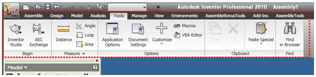
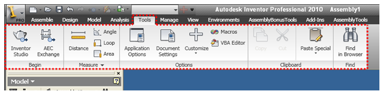
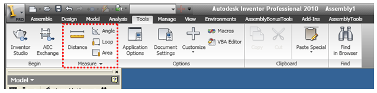
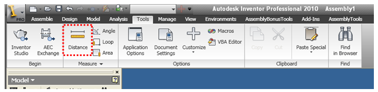
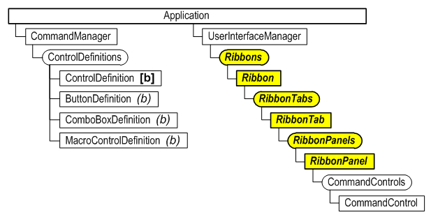
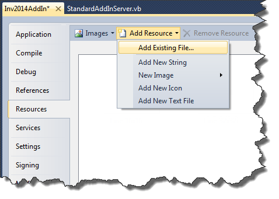
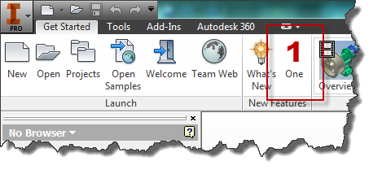
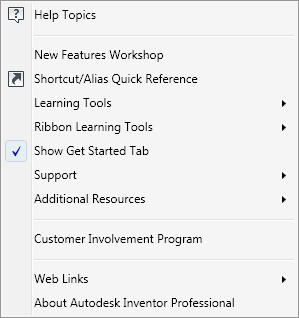
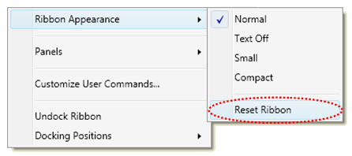

# Customizing the Ribbon using the API

## Ribbon Terminology and the API

Here’s a high level look at the components of the ribbon and the corresponding API objects.

### Ribbon

The ribbon is the entire area highlighted below and is represented by the Ribbon API object.



Internally there are seven different ribbons, primarily one for each document type. You can’t create or delete ribbons but you can edit the seven existing ribbons by adding and removing elements from them. You typically access a specific ribbon through the API using the ribbon’s internal name. The internal names for the ribbons are:

* ZeroDoc (Displayed when there aren’t any documents open)
* Part
* Assembly
* Drawing
* Presentation
* iFeatures
* UnknownDocument (Used for notebook and drawing view orientation environments.)

### Ribbon Tab

Each ribbon consists of a set of tabs. The Tools tab of the Assembly ribbon is highlighted below. These are represented in the API by the RibbonTab object. There can be any number of tabs, although there’s a practical limit to what will fit on the screen. Tabs can be visible or not. Each tab also has an internal name that can be used to find it.



### Ribbon Panel

Each tab consists of a set of panels. The Measure panel of the Tools tab is highlighted below. These are represented in the API by the RibbonPanel object. There can be any number of panels in a tab, again with a practical limit, and they can be visible or not. Each panel also has an internal name that can be used to find it.



### Command Control

Each tab contains a set of controls. The button control for the Distance command is highlighted below. All controls are represented in the API by the CommandControl object. Each control also has an internal name that can be used to find it; however their internal name isn’t explicitly defined but is inherited from the ControlDefinition object it references.



### Ribbon API Object Hierarchy

Below is the object hierarchy for the portion of Inventor’s API that works with the ribbon. The highlighted items are the objects specific to the ribbon. The others are objects that are also used in other areas of the API.



## Determining Where to Add Your Buttons

The first step in supporting the ribbon is deciding where you want to insert your add-in’s buttons into the ribbon. A suggestion is to try and put yourself in the position of the user of your add-in and imagine where they will most likely look for your commands. For example, if your add-in has a command that draws a custom slot shape in a sketch you would probably want to insert your button on the Draw panel of the Sketch tab of the Part, Assembly, and Drawing ribbons. If your command is unique from the rest of Inventor’s commands and doesn’t really fit in you might want to create a new tab or a panel to logically separate it from the rest of Inventor’s commands. In addition to the ribbon you can also add your commands to the Application and Help menus and the QAT (Quick Access Toolbar). The main objective is to have your button located where users will intuitively look for it.

Another factor that you need to consider when positioning your commands is the overall layout of the ribbon once your command is added. The reality is that there is a limited width to the screen and each button takes some space. Some ribbons are fuller than others so if logically your button could go in more than one location you might want to choose the one that has the most room available.

## Getting the Internal Names of the Ribbon Components

It was previously mentioned that the various components of the ribbon have internal names that can be used to find specific ribbon components. How do you know what the internal names are? The best answer to this question is one of the [sample programs](../sample-programs/DumpRibbons_Sample.md) that generates a list of the contents of all of the ribbons. This provides and always up to date listing of the names of all the components in the current configuration of the ribbon.

## Creating Your Icons

The ribbon supports two sizes of icons; the small icons are16x16 pixels and the large icons are 32x32 pixels. You have different options for creating your icons. Probably the best format is png because it supports transparency and is supported by most image editing applications. You can also use .ico files, which also support transparency, or even use .bmp files.

Your images can be added as resources to your add-in project using the Resources tab in the Properties dialog for your project, as shown below. Choose the “Add Existing File…” option in the “Add Resource” dropdown to select your files and add them as resources.



## Adding Ribbon Support to Your Add-In

The first thing you need to do is create the control definitions for the controls you want to add to the ribbon. Typically these are buttons. Below is some typical code from the Activate method of an add-in that creates the control definitions. It’s good to remember that the control definitions aren’t the visible controls themselves but define all of the information that’s needed besides the location to create a control. The code within the CreateUserInterface function creates the visible controls using the control definitions. The CreateUserInterface function is only called when the FirstTime flag is True. Currently with the ribbon user-interface it will always be true.

For the following code to work you’ll need to add references to the .Net stdole and System.Windows.Forms libraries.

```vb
Private m_InventorApplication As Inventor.Application = Nothing
Private WithEvents m_buttonDef As ButtonDefinition = Nothing
Private WithEvents m_uiEvents As UserInterfaceEvents = Nothing
Private m_clientID As String = "{311a4c02-49df-4947-a01c-47765ec06b27}"
Public Sub Activate(...) Implements Inventor.ApplicationAddInServer.Activate
    ' Save reference to the Application object in member variable.
    m_inventorApplication = addInSiteObject.Application
    ' Get a reference to the UserInterfaceManager object.
    Dim UIManager As Inventor.UserInterfaceManager = _
    m_inventorApplication.UserInterfaceManager
    ' Get a reference to the ControlDefinitions object.
    Dim controlDefs As ControlDefinitions = _
    m_inventorApplication.CommandManager.ControlDefinitions
    ' Get the images from the resources.  They are stored as .Net images and the
    ' PictureConverter class is used to convert them to IPictureDisp objects, which
    ' the Inventor API requires.
    Dim smallPicture As stdole.IPictureDisp = _
    PictureConverter.ImageToPictureDisp(My.Resources.MySmallImage)
    Dim largePicture As stdole.IPictureDisp = _
    PictureConverter.ImageToPictureDisp(My.Resources.MyLargeImage)
    ' Create the button definition.
    m_buttonDef = controlDefs.AddButtonDefinition("One", "UIRibbonSampleOne", _
    CommandTypesEnum.kNonShapeEditCmdType, _
    m_clientID, , , smallPicture, largePicture)
    '
    Call the function to add information to the user-interface.
    If firstTime Then
        CreateUserInterface()
    End If
    ' Connect to UI events to be able to handle a UI reset.
    m_uiEvents = m_InventorApplication.UserInterfaceManager.UserInterfaceEvents
End Sub
' Creates the add-in’s UI in the ribbon.
Private Sub CreateUserInterface()
    ' Get a reference to the UserInterfaceManager object.
    Dim UIManager As Inventor.UserInterfaceManager = _
    m_inventorApplication.UserInterfaceManager
    ' Get the zero doc ribbon.
    Dim zeroRibbon As Inventor.Ribbon = UIManager.Ribbons.Item("ZeroDoc")
    ' Get the getting started tab.
    Dim startedTab As Inventor.RibbonTab = zeroRibbon.RibbonTabs.Item("id_GetStarted")
    ' Get the new features panel.
    Dim newFeaturesPanel As Inventor.RibbonPanel
    newFeaturesPanel = startedTab.RibbonPanels.Item("id_Panel_GetStartedWhatsNew")
    ' Add a button to the panel, using the previously created button definition.
    newFeaturesPanel.CommandControls.AddButton(m_buttonDef, True)
End Sub
```

Outside of the StandardAddInServer class, add the class below. This class wraps some functionality available in one of the .Net classes that’s not typically exposed that allows you to convert a .Net Image object to an IPictureDisp object, which is what Inventor requires when working with images.

```xml
<System.ComponentModel.DesignerCategory("")> _
 Friend Class PictureConverter
     Inherits System.Windows.Forms.AxHost
 
     Private Sub New()
         MyBase.New(String.Empty)
     End Sub
 
     Public Shared Function ImageToPictureDisp( _
                            ByVal image As System.Drawing.Image) As stdole.IPictureDisp
         Return CType(GetIPictureDispFromPicture(image), stdole.IPictureDisp)
     End Function
 End Class
```

The result of loading this add-in is shown below.



## Separators

Separators are also supported by the ribbon although they’re not as common since the panels serve the same purpose of grouping commands. They’re most common in the Application and Help menus. The picture below shows the help menu in the ribbon with its three separators. To create a separator you use the AddSeparator method of the CommandControls object.



## Handling Resets in the Ribbon Interface

The user can reset the ribbon interface to restore it to its original state. This has the side effect of removing any customization that add-ins have done. Most users will expect a reset to take Inventor back to its initial interface plus any customization that add-ins have done to add their buttons. To accomplish this, an add-in needs to react to a reset by recreating whatever customization it did. An add-in does this by listening to events.
In the ribbon interface the user can use the Reset Ribbon command to reset the entire ribbon interface back to its initial state. The Reset Ribbon command is invoked through the ribbon’s context menu as shown below.



For an add-in to handle the Reset Ribbon command it needs to listen to the OnResetRibbonInterface event. All you need to do in response to this event is exactly what you did when the add-in was executed for the first time. The code below illustrates this by calling the same function that was called in the Activate method of the add-in.

```vb
Private Sub m_uiEvents_OnResetRibbonInterface(...) Handles m_uiEvents.OnResetRibbonInterface
    CreateUserInterface()
End Sub
```