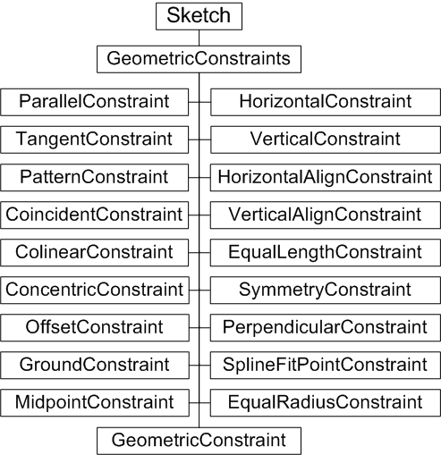
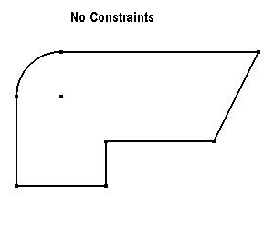
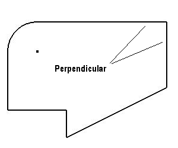
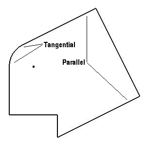
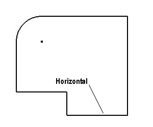

# Sketch Constraints

### Introduction to sketch constraints

Objects in Autodesk Inventor often relate to each other. The relationship may be as simple as being adjacent to each other, but it may be more complex, such as a combined tangential and vertical alignment. These relationships constrain objects and geometry together, so that any changes to the model cause the constraints to be recomputed and reapplied. If something changes sufficiently to prevent a constraint from being resolved, Autodesk Inventor flags that constraint.

### The purpose of sketch constraints

Sketches are the base geometry in Autodesk Inventor - they are the building blocks for parts. Placing geometric constraints on sketches enables and ensures that basic rules for the design and shape of the sketch are enforced. Consequently, the resultant profiles with which part features may be defined follow the same rules. Think of constraints as rules that govern the position, slope, tangency, dimensions, and relationships among sketch geometry. Geometric constraints control the shapes and relationships among sketch elements, effectively removing successive degrees of freedom. The Autodesk Inventor API has a suite of constraint objects, and their proxies, that can be applied to sketches.

There are other types of constraints not covered by this overview, but they perform a similar function. Geometric constraints can also be applied to assembly components, defining relationships between parts in an assembly. See the  [Assembling Parts](AssemblingParts_Overview.md) overview for more information on working with parts in the assembly environment.

Dimensional constraints in sketches control size, for example, the radius of an arc or the width of a part. All these types of constraints are resolved sequentially during a model compute to achieve the final model structure.

### Sketch Constraints Object Model Diagram



### Working with sketch constraints through the API

The API has objects for each type of constraint. The GeometricConstraints collection has add methods corresponding to each constraint object type. For example, to create a tangent constraint, call GeometricConstraints.AddTangent. These add methods accept SketchLines, SketchArcs, and SketchPoints as appropriate to their type. For example, a Tangent constraint accepts a SketchLine and SketchArc.

### A sample - the effects of constraining a sketch

The following code creates a sketch in a new part document. It defines a number of sketch points within a SketchPoints collection, and then creates SketchLine objects and an arc based on those sketch points. The code omits error checking for the sake of clarity and brevity. Always check that return values are of the expected type.

First, create the new part document, and then add a new sketch:

```vb
Dim oApp As Inventor.Application
Set oApp = ThisApplication
Dim oPartDoc As PartDocument
Set oPartDoc = oApp.Documents.Add(kPartDocumentObject, _
oApp.GetTemplateFile(kPartDocumentObject))
Dim oSketch As PlanarSketch
Set oSketch = oPartDoc.ComponentDefinition.Sketches.Add _
(oPartDoc.ComponentDefinition.WorkPlanes.Item(3))
```

The code creates a number of arbitrary 2D points, using transient geometry to create the points, so create the transient geometry object.

```vb
Dim oTG As TransientGeometry
Set oTG = oApp.TransientGeometry
```

Now get the SketchPoints collection for the new sketch, and add some points.

```vb
Dim oSkPnts As SketchPoints
Set oSkPnts = oSketch.SketchPoints
Call oSkPnts.Add(oTG.CreatePoint2d(0, 0), False)
Call oSkPnts.Add(oTG.CreatePoint2d(1.0, 0), False)
Call oSkPnts.Add(oTG.CreatePoint2d(1.0, 0.5), False)
Call oSkPnts.Add(oTG.CreatePoint2d(2.2, 0.5), False)
Call oSkPnts.Add(oTG.CreatePoint2d(0.5, 1.5), False)
Call oSkPnts.Add(oTG.CreatePoint2d(0, 1.0), False)
Call oSkPnts.Add(oTG.CreatePoint2d(2.7, 1.5), False)
Call oSkPnts.Add(oTG.CreatePoint2d(0.5, 1.0), False)
```

Using the previously defined sketch points, add some lines to the SketchLines collection. Here the SketchLine objects are added to an array for easy reference later.

```vb
Dim oLines As SketchLines
Set oLines = oSketch.SketchLines
Dim oLine(1 To 6) As SketchLine
Set oLine(1) = oLines.AddByTwoPoints(oSkPnts(1), oSkPnts(2))
Set oLine(2) = oLines.AddByTwoPoints(oSkPnts(2), oSkPnts(3))
Set oLine(3) = oLines.AddByTwoPoints(oSkPnts(3), oSkPnts(4))
Set oLine(4) = oLines.AddByTwoPoints(oSkPnts(4), oSkPnts(7))
Set oLine(5) = oLines.AddByTwoPoints(oSkPnts(7), oSkPnts(5))
Set oLine(6) = oLines.AddByTwoPoints(oSkPnts(6), oSkPnts(1))
```

Add an arc to the SketchArcs collection.

```vb
Dim oArc As SketchArc
Dim oArcs As SketchArcs
Set oArcs = oSketch.SketchArcs
Set oArc = oArcs.AddByCenterStartEndPoint(oSkPnts(8), oSkPnts(5), oSkPnts(6))
```

The code to this point creates a sketch with no constraints, appearing as follows:



Now add some constraints. First, add a perpendicular constraint between two lines.

```vb
Call oSketch.GeometricConstraints.AddPerpendicular(oLine(4), oLine(5))
oApp.ActiveView.Update
```

The preceding code modifies the appearance of the sketch as follows:



Add tangent constraints to the two lines that join to both ends of the arc.

```vb
Call oSketch.GeometricConstraints.AddTangent(oLine(5), oArc)
Call oSketch.GeometricConstraints.AddTangent(oLine(6), oArc)
oApp.ActiveView.Update
```

This has no apparent effect - yet - since the lines and arc are already tangential. To see the effect of the tangent constraints, add a parallel constraint between two lines:

```vb
Call oSketch.GeometricConstraints.AddParallel(oLine(3), oLine(5))
oApp.ActiveView.Update
```

The cumulative effect of these tangential and parallel constraints is as follows:



Now constrain the lower angled line to always be horizontal.

```vb
Call oSketch.GeometricConstraints.AddHorizontal(oLine(5))
oApp.ActiveView.Update
```

The horizontal constraint results in the following change to the sketch:



Add breakpoints or comment out some of the preceding constraint code to see the effect of different constraints, including the effect of changing the order in which they are applied. The sketch points, unless grounded with a GroundConstraint, are not fixed despite the preceding code having supplied absolute coordinate points. The shape of the sketch is governed by the constraints.

### API versus the User Interface

There are some situations, typically involving sketch points, where applying a constraint through the UI works, but the same constraint applied through the API apparently fails. This is not an error, but a reflection of the fact that the UI hides some of the complexities of constraints from the user, while the API does not. For example, creating a coincident constraint between two sketch line endpoints through the API may fail, while the same operation through the UI succeeds. The UI lets you apply a coincident constraint between these two points, but if you look at the results, there is no coincident constraint. In fact, Autodesk Inventor deleted one sketch point and changed both lines to share the remaining point. The API does not hide this from the user since the API expects to return the coincident constraint object, but cannot do that if none were really created. To emulate the UI, merge the sketch points using SketchPoint.Merge.

### Summary

Sketch constraints remove successive degrees of freedom in how the sketch is evaluated. It is possible to overconstrain a sketch, so that constraints conflict and cannot be resolved. The UI provides a dialog box to resolve the conflict, while the corresponding API call fails. Sketches can also have dimensional (size) constraints applied to them.

### Also consider -

The Autodesk Inventor user interface automatically highlights those parts of a sketch that are appropriate for creating a part feature, such as an extrusion. The API has a specific object to define what constitutes the input for feature creation - the [Profile](../api-doc/Profile/Profile.md) object.