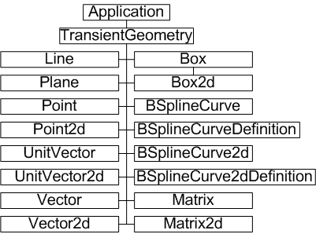
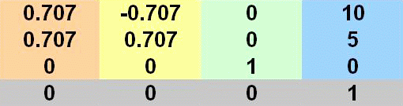

# Transient Geometry

### Introduction to Transient Geometry objects

The term transient geometry object can be interpreted many ways, even in the context of Autodesk Inventor. For the purposes of this overview, this topic covers those utility constructs required to accomplish many mathematical tasks, specifically geometric tasks, through the API. For example, point objects, vectors and matrices.

### The purpose of Transient Geometry

These transient objects, created through the appropriate method provided by the TransientGeometry object, are used extensively throughout Autodesk Inventor application code. Unlike most other API geometry objects, they are invisible mathematical representations with no graphical component. They are typically the means through which graphical objects are manipulated, as they provide a convenient way to create 2D and 2D points (not workpoints or sketchpoints), create matrices for object transformations, and so on.

### Transient Geometry Object Model Diagram



### Working with Transient Geometry Objects - the Point and Matrix objects

An important point to remember about these transient geometry objects is that they do not represent the boundaries of actual graphical objects. For example - the Line object is infinite in extent, unlike a SketchLine object. The Line object has a direction, represented by a UnitVector. Similarly, the Plane object is not bounded like a face - it too is infinite in extent.

This overview will look at some of the most commonly used transient objects - the Point, Point2d and Matrix objects.

### Using a Point2d object

The Point object is a list of three coordinates, representing the X Y and Z of a point in space. Similarly, the Point2d object represents the X and Y of a point on a plane. These objects also support properties giving access to their coordinates, and to methods that perform functions such as equality testing or transformation of the point.

Point2d objects are frequently used when working with 2D sketches. To create a SketchPoint object on a sketch, use the Add method of that sketches SketchPoints collection. You might expect code similar to the following.

```vb
Dim oSkPnts As SketchPoints
Call oSkPnts.Add(10, 20)
' This is wrong
```

The Add method needs to know the location to create the SketchPoint object, but this point may be the result of any number of transformations or translations, or it may be provided by another object. Therefore the Add method expects a Point2D object. The correct code is as follows. The code omits error checking for the sake of clarity and brevity. Always check that return values are of the expected type.

```vb
Dim oApp As Inventor.Application
Set oApp = ThisApplication
Dim oPartDoc As PartDocument
Set oPartDoc = oApp.Documents.Add(kPartDocumentObject, _
oApp.GetTemplateFile(kPartDocumentObject))
Dim oSketch As PlanarSketch
Set oSketch = oPartDoc.ComponentDefinition.Sketches.Add _
(oPartDoc.ComponentDefinition.WorkPlanes.Item(3))
Dim oTG As TransientGeometry
Set oTG = oApp.TransientGeometry
Dim oSkPnts As SketchPoints
Set oSkPnts = oSketch.SketchPoints
Call oSkPnts.Add(oTG.CreatePoint2d(10, 20), False)
```

The preceding code will create a sketch with a single sketchpoint at X=10, Y=20. The last argument of the Add method is a boolean value, indicating whether the SketchPoint will form the center point of a hole feature. The main difference is that the graphical representation of the resulting SketchPoint will differ slightly.

SketchPoints in a SketchPoints collection are always 2D, and are typically provided by the CreatePoint2D method. SketchPoint3D objects in a 3D sketch are contained within a SketchPoints3D collection.

### Using the Matrix object

The Matrix object is one of the least understood objects in the Autodesk Inventor API, but its use in most common situations is fairly straightforward. This overview will focus on the Matrix object used for 3D space, though Autodesk Inventor also supports the Matrix2d object for 2D space.

The Matrix object is typically used either to place an object with a specific orientation, such as when inserting an instance of a part into an assembly. In other words it is used to define a coordinate system. Also, it is used to move, or transform, an object from one location to another. The Matrix object provides a convenient means of manipulating a set of coordinates in 3D space. It has a set of useful methods to set the matrix data or to act on that data.

For example, suppose you have two planes, and you plan to move objects from one plane to the other. Ideally, you would use a matrix to perform these translations most efficiently. The Matrix object provides the SetToAlighCoordinateSystems method that accepts the coordinates system (origin, X, Y and Z) of the source plane and the coordinate system (origin, X, Y and Z) of the target plane. Thus the matrix rows and columns are set to the required values and the matrix can be used repeatedly to translate any objects from the old plane to the new. The Matrix object provides a number of methods and properties designed to shield the user from many of the complexities of matrix math.

### A matrix as a coordinate system

Let's first look at a matrix as a coordinate system definition. The default Autodesk Inventor coordinate system follows the conventional rectangular Cartesian system with the positive X direction to the right, the positive Y direction upwards, and the positive Z direction towards you. We'll set a matrix to represent a similar system, but one that is rotated 45 degrees about the Z axis, and with the origin at 10,5,0.

Imagine a vector pointing along the required X axis. Remember we now want this to be at 45 degrees, so this can be thought of as pointing at 1,1,0. However, it's often convenient to use the UnitVector object, which always has a unit length of 1. So the direction vector actually points to 0.707, 0.707, 0. The Z axis does not change, but the origin becomes 10,5,0. A 3D matrix to represent this would appear as follows. Reading the columns left to right, they are X Y Z, and origin.



Using the previously noted SetCoordinateSystem method, the following code calculates and sets a matrix object to the above values. Autodesk Inventor internal units are centimeters and radians.

```vb
Dim oTG As TransientGeometry
Set oTG = ThisApplication.TransientGeometry
Dim dPi As Double
dPi = Atn(1) * 4
' Define the origin point.
Dim oOrigin As Point
Set oOrigin = oTG.CreatePoint(10, 5, 0)
' Define the axis vectors.  Pi/4 is 45 degrees in radians.
Dim oXAxis As UnitVector
Dim oYAxis As UnitVector
Dim oZAxis As UnitVector
Set oXAxis = oTG.CreateUnitVector(Cos(dPi / 4), Sin(dPi / 4), 0)
Set oYAxis = oTG.CreateUnitVector(-Cos(dPi / 4), Sin(dPi / 4), 0)
Set oZAxis = oTG.CreateUnitVector(0, 0, 1)
' Create the matrix and define the desired coordinate system.
Dim oMatrix As Matrix
Set oMatrix = oTG.CreateMatrix
Call oMatrix.SetCoordinateSystem(oOrigin, oXAxis.AsVector, oYAxis.AsVector, oZAxis.AsVector)
```

A typical use for such a matrix definition would be placement of parts within an assembly. You can construct a matrix that, when referenced by the Transformation property of a part occurrence, determines exactly where the part should be placed.

|  |
| --- |
| **Note:** Individual matrix cells can be accessed directly through the Cell method of the Matrix object. |

### Using a matrix for transformation

The use of a matrix to move an object is a little different than using a matrix to define a coordinate system for object placement. The example shown previously defines a static coordinate system. To move objects from one location to another implies a difference in location coordinates. In other words, a delta - the difference between one coordinate system definition and another. This delta can be represented by a matrix.

The matrix defined in the preceding code, when referenced by the TransformBy method of a second matrix object, results in the second matrix being recalculated to reflect the new location. The referenced matrix acts as a delta matrix for the transformation. In other words, a new matrix definition is created from a source matrix and a delta matrix.

In this case, the delta is a 45 degree rotation about the Z axis. All we need to do is change the call to SetCoordinateSystem, as we no longer wish to change the origin, as follows.

```vb
Call oMatrix.SetCoordinateSystem(oTG.CreatePoint, oXAxis.AsVector, oYAxis.AsVector, oZAxis.AsVector)
```

Thereafter, to rotatee an object such as a part occurrence about its Z axis, obtain its location matrix through its Transformation property, then modify the matrix by calling its TransformBy method, referencing the delta matrix. Then reapply the updated location matrix to the occurrence, again through its Transformation property. The occurrence will move to its new location.

The matrix object supports a set of methods intended to help with many common tasks, as follows.

|  |  |  |
| --- | --- | --- |
| GetCoordinateSystem | Invert | PostMultiplyBy |
| PutMatrixData | SetToAlignCoordinateSystems | SetToRotateTo |
| SetTranslation | GetMatrixData | IsEqualTo |
| PreMultiplyBy | SetCoordinateSystem | SetToIdentity |
| SetToRotation | TransformBy |

### Summary

The TransientGeometry object allows the creation of a number of transient geometry objects. These objects do not represent actual graphical geometry. Transient geometry objects are used for mathematical calculations. Two of the most commonly used objects include points and matrix objects. Matrices allow accurate placement and movement of components.

### Also consider

TransientGeometry objects are not limited to point, line or planar objects. For example, the Box object can expand to incorporate specified points, or can check for interference with another box, or can check if a specified point is contained within the box.