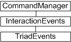
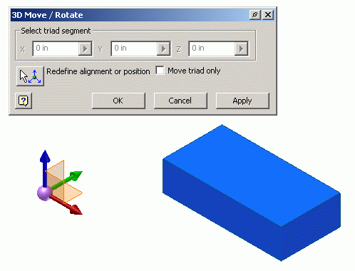

# Triad Events

### Introduction to TriadEvents - the 3D move and rotate tool

The Autodesk Inventor user interface has a 3D move and rotate tool, available when you create or edit a grounded work point in a part or 3D sketch. A triad symbol is displayed. Select or drag a triad segment to indicate the type of transform required, or click it to open a dialog box. In the dialog box, you can enter coordinates to precisely position a grounded work point. In addition to entering coordinates, you can drag the triad along the X, Y, and Z coordinates to dynamically update the dialog box. Movement is not limited to the part axes. The 3D Move/Rotate tool can be rotated about any axis to realign the direction of subsequent moves.

The Autodesk Inventor API supports the 3D Move/Rotate tool through the TriadEvents object.

### The purpose of TriadEvents

The ability of the developer to control the triad affords many advantages to the user. An example is the routing of piping. As each segment is placed, the triad can be positioned at the end of the pipe so the user can indicate, graphically but precisely, the axis of the next segment. The user can do this using the triad tool - something already familiar through the user interface. In addition to programmatically positioning the triad, the developer can receive notification of a number of triad events - for example, if the user interactively moves the triad.

### TriadEvents Object Model Diagram



### Working with the TriadEvents API

The TriadEvents object is used in a similar manner to other interaction events such as mouse and keyboard events. It is obtained through the TriadEvents property of the InteractionEvents object.

Selection and other interaction events cannot be active while triad events are enabled. Start the InteractionEvents object and set its InteractionDisabled property to True to start receiving triad events.

You can position the triad by calling the Reposition method of the TriadEvent object.

You can register a number of triad events, including the following:

|  |
| --- |
| **OnActivate** - Fires when the triad is activated. |
| **OnEndSequence** - Fires when the user ends a move sequence of the triad. |
| **OnStartSequence** - Fires when the user starts a move sequence of the triad. |
| **OnMove** - Fires when the triad moves as a result of a drag, reposition or if the user enters values for translation and rotation. |
| **OnMoveTriadOnlyToggle** - Fires when the Move Triad Only option is toggled. |
| **OnStartMove** - Fires when the triad begins to move as a result of a drag, reposition or if the user enters values for translation and rotation. |
| **OnEndMove** - Fires when the user ends an intermediate move of the triad. |
| **OnTerminate** - Fires when the triad is terminated. |
| **OnSegmentSelectionChange** - Fires every time a segment of a triad is selected. |
|  |

### Using the TriadEvents object

This example provides skeletal code demonstrating how to set up triad interaction events. It enables the triad and implements the triad move event. The code omits error checking for the sake of clarity and brevity. Always check that return values are of the expected type.

Start a new VBA project and add a blank form (here named UserForm1). Add the following code to the form, starting with declarations of the interaction and triad event objects:

```vb
Private WithEvents oInteraction As InteractionEvents
Private WithEvents oTriadEvents As TriadEvents
```

Add a subroutine to be called when the form is initialized. Obtain the InteractionEvents object from the CommandManager object, and turn of selection and interaction. This means that the triad can still be manipulated by the user.

```vb
Sub UserForm_Initialize()
    Set oInteraction = ThisApplication.CommandManager.CreateInteractionEvents
    oInteraction.SelectionActive = False
    oInteraction.InteractionDisabled = True
```

Obtain the TriadEvents object from the InteractionEvents object, and then set its Repeat and Enabled properties to True. The Repeat property indicates that triad events should continue after a move sequence completes.

```vb
Set oTriadEvents = oInteraction.TriadEvents
oTriadEvents.Repeat = True
oTriadEvents.Enabled = True
```

Now start interaction events, and call DoEvents so the process can be terminated when required.

```vb
oInteraction.Start
While UserForm1.Enabled = True
    DoEvents
    Wend
End Sub
```

Add another subroutine, this time the OnMove event of the TriadEvents object. When the user moves the triad through the user interface, this code is called. This code prints a message, but other more significant actions can take place depending on context.

```vb
Private Sub oTriadEvents_OnMove(ByVal SelectedTriadSegment _
    As TriadSegmentEnum, _
    ByVal ShiftKeys As ShiftStateEnum, _
    ByVal CoordinateSystem As Matrix, _
    ByVal Context As NameValueMap, _
    HandlingCode As HandlingCodeEnum)
    Debug.Print "3D move / rotate tool has been moved."
End Sub
```

The last subroutine to add to the form cleans up once the form is closed, and it stops the InteractionEvents object.

```vb
Private Sub UserForm1_Terminate()
    oInteraction.Stop
    Set oTriadEvents = Nothing
    Set oInteraction = Nothing
End Sub
```

Finally, add the following code to a code module (not the form). To run the sample code, run this TriadEventsTest subroutine.

```vb
Public Sub TriadEventsTest()
    UserForm1.Show vbModeless
End Sub
```

When this sample is run in an open part document, the 3D Move/Rotate triad tool and dialog is displayed as follows:



When the triad tool is moved by the user, the OnMove event is called and the code prints a short message to the VBA debug screen (the 'immeadiate' window, if open).

### Summary

The TriadEvents object and API provide a convenient means of obtaining location and transformation data in a fashion already familiar to the user. The triad can be activated and controlled through the API, and also provides a set of events to respond to changes to the triad made through the user interface.

### Also consider

The InteractionEvents object provides selection, mouse and keyboard event callbacks, but also exposes the InteractionGraphics API. Like the ClientGraphics API, this API can be used to display transient geometry as visual cues. Used with TriadEvents, a lot of contextual information can be provided to the user in the form of visual cues and guidance.