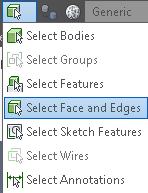
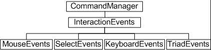
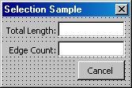
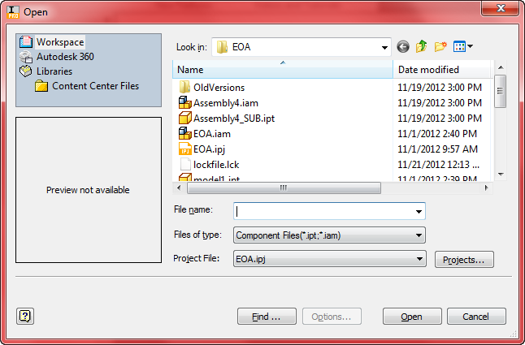
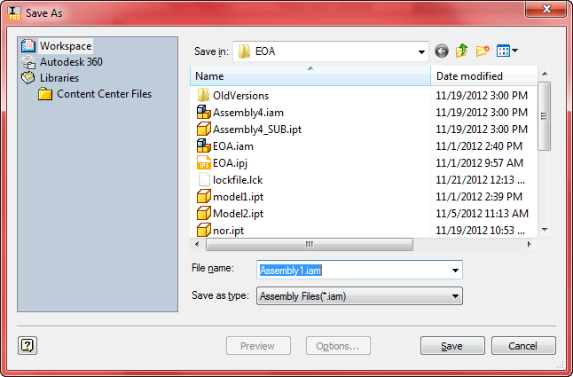
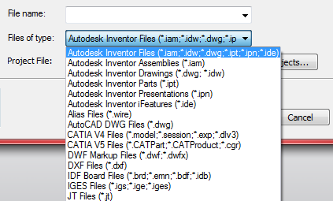

# User Interaction

## Introduction

An important requirement of many programs is the ability to interact with the end user. There are several types of user interaction that your program might need to do. The first, which is independent of Autodesk Inventor, is interaction through a dialog that you create. For example, an NC Application might display a dialog to allow the user to define tool information. This dialog is created and controlled using whatever dialog creation tools are provided by the programming language you've chosen. This section discusses the other types of user interaction that are Autodesk Inventor specific, including selecting entities, mouse input, displaying messages, and highlighting graphics.

One of the most common requirements regarding user interaction is the ability to have the user select an entity. Autodesk Inventor supports two techniques for entity selection: the select set and interactive selection. Each method is useful for certain cases and in many programs both methods will be used. Both methods are described in more detail in the rest of this section.

## The Select Set

Using the select set is the easiest but also the least flexible method of selection. The select set is the current set of entities the user has selected using Autodesk Inventor's Select command. The Select command is the command that is active in Autodesk Inventor when no other command is running. It can be explicitly started by the end-user by clicking the "Select" button on the Command Bar, as shown below. The drop-down list for the Select command allows the end-user to set the priority filter for what type of entities will be selected first.



Use of the Select command by the user is entirely independent of the API. As a programmer, you're able to use the API to look at current contents of the select set to see what the user has already selected. Commands that use the select set work in an object-action manner. This means that the user first selects appropriate objects and then runs the command that utilizes what's in the select set. Some of Autodesk Inventor's commands behave like this. The Delete command is one example. You first select the entities you want to delete and then run the Delete command. The Fillet command is another example. If you have any edges selected when you run the Fillet command the fillet dialog will initialize with those edges already selected.

Use of the select set from the programmer's point of view is extremely easy since you're not involved in the selection process itself. During the selection process it's left up to the user to understand what needs to be selected before running your command or program. Your program just looks at the results, checks to see if any valid entities have been selected, and uses them if they are valid. The SelectSet object is available from all documents via the SelectSet property. The sample below illustrates a program that checks to see if a single face has been selected and displays its surface area.

```vb
Public Sub ShowSurfaceArea()
    '
    Set a reference to the select set of the active document.
    Dim oSelectSet As SelectSet
    Set oSelectSet = ThisApplication.ActiveDocument.SelectSet
    ' Check to make sure a single item was selected.
    If oSelectSet.Count = 1 Then
        ' Check to make sure a face was selected.
        If TypeOf oSelectSet.Item(1) Is Face Then
            '
            Set a reference to the selected face.
            Dim oFace As Face
            Set oFace = oSelectSet.Item(1)
            ' Display the area of the selected face.
            MsgBox "Surface area: " & oFace.Evaluator.Area & " cm^2"
            Exit Sub
        Else
            MsgBox "You must select a single face."
            Exit Sub
        End If
    Else
        MsgBox "You must select a single face."
        Exit Sub
    End If
End Sub
```

In addition to providing access to the objects the user has selected, the SelectSet object also supports methods that allow you to add and remove objects from the select set.

Besides being the method of choice for programs that need to have object-action behavior, the select set is often used for other programs because it's relatively easy to implement. However, you're trading ease of use on the programming side for a usually harder to use interface for the end-user. For example, in the previous sample the select set isn't necessarily the best method for having the end-user select a face, since they have to know before they run your command what's needed. Because there is no control, end-users can also select invalid entities. Using interactive selection, which is discussed next, you can control the selection so only valid items are selected. Even though the select set isn't the optimal choice in many cases, it is useful in many cases and its speed of implementation can often offset its limitations. It is extremely useful when writing small test programs that need to obtain a specific entity.

## Interactive Selection

Many commands are easier to use if the selection process is more controlled than what is possible when using the select set. Autodesk Inventor supports another method of entity selection that provides you with extensive control over the selection process. This capability is exposed through the InteractionEvents object. This object not only supports selection, but also mouse and keyboard events. We'll focus this discussion initially on the selection capabilities of the InteractionEvents object.

What makes the interactive selection capability so powerful is that it allows you to participate in the selection process. It does this by providing a series of events to notify you about what's currently happening and allows you to control what the user sees. If you look at the behavior of Autodesk Inventor commands you'll notice that they each have unique selection behavior that helps the user in selecting only those entities appropriate for the current task. For example, when the Fillet command is initially invoked you can only select edges of the model; other entities (faces, work features, etc.) are not selectable. Another thing to notice about the Fillet command is that when selecting edges, any edges that are tangentially connected to the selected edge are also automatically selected.

Here's a brief overview of the objects and the steps required to make use of the interaction events functionality. Following the overview, we'll look at an example using the InteractionEvents object that duplicates the Fillet command behavior described earlier.

The InteractionEvents portion of the object hierarchy is shown below. For selection, the objects used are the InteractionEvents and SelectEvents objects.



This section does not cover TriadEvents. Please refer to the [TriadEvents](TriadEvents_Overview.md) overview.

The following is a brief overview of the steps to use the interactive selection functionality.

* Create an InteractionEvents object* Define its behavior by setting properties* Connect to events supported by the InteractionEvents object* Connect to events supported by the associated SelectEvents object* Start the interaction process and respond to the events.

Let's look at the steps involved in implementing edge-picking behavior that is similar to that used in the Fillet command. This simple command will allow you to prompt the user to select edges and will show the length of the edge as it is selected. The first step is to create an InteractionEvents object using the CreateInteractionEvents method of the CommandManager object. The next step is to set up the various objects by connecting to the events of interest and set the various properties to get the desired behavior. There are events on the InteractionEvents object and also for the SelectEvents, MouseEvents, and KeyboardEvents objects that are obtained from the InteractionEvents object.

Once the behavior has been defined using the events and methods of the various objects you launch the selection process by calling the Start method of the InteractionEvents object. An important concept to understand is that when the InteractionEvents object is started it causes the same side effect as Autodesk Inventor commands do: it will terminate the command that is currently running. This also implies that if an Autodesk Inventor command is started when the InteractionEvents object is running, the InteractionEvents object will be terminated. The exception to this is when view commands are run. They don't terminate the current command but temporarily suspend it until the view command is finished. We'll see later how the InteractionEvents object provides the information you need to handle these situations correctly.

For this example, we'll assume you're using VBA, although the implementation in VB would be almost identical. To create a running version of this example, create a new form module within any VBA project, as shown below.



The form consists of five controls: two text boxes, two labels, and a command control. The form is named frmSelection. The text box for the length is named txtLength, the text box for the edge count is named txtEdgeCount, and the command control is named cmdCancel. The names of the label controls don't matter. The following are the global declarations within the form module and the code from the Initialize event of the form that obtains the necessary objects and sets them up for the selection process.

```vb
Private WithEvents oInteraction As InteractionEvents
Private WithEvents oSelect As SelectEvents
Private Sub UserForm_Initialize()
    ' Create a new InteractionEvents object.
    Set oInteraction = ThisApplication.CommandManager.CreateInteractionEvents
    '
    Set the prompt.
    oInteraction.StatusBarText = "Select an edge."
    ' Connect to the associated select events.
    Set oSelect = oInteraction.SelectEvents
    ' Define that all part edges should be selectable.
    oSelect.AddSelectionFilter kPartEdgeFilter
    ' Enable single selection.
    oSelect.SingleSelectEnabled = True
    ' Start the selection process.
    oInteraction.Start
End Sub
```

Notice that the global variables for the InteractionEvents and SelectEvents objects use the WithEvents keyword. This allows us to set up event handlers that will receive the events associated with these objects. Variables that are declared using the WithEvents keyword now show up in the Object List (the pull-down at the top-left of the code window). When you select one of the objects in this list, the associated events are listed in the Events List (the pull-down at the top-right of the code window).

In this sample, the Initialize event of the form is used to trigger the setup and start of the selection process. Two of the more interesting lines of code are the ones calling the AddSelectionFilter and Start methods. The AddSelectionFilter method can be called multiple times, specifying a single filter each time. Each filter specifies a type of entity that you want to allow for selection. The filters are pre-defined by Autodesk Inventor and are fairly broad in the types of entities they describe. As we'll see later you can use the events fired by the SelectEvents object to perform runtime filtering using any criteria you choose. Setting the SingleSelectEnabled property sets the behavior so that only a single entity can be selected at a time. If an entity is already selected it will be unselected when you select another entity. Calling the Start method causes any current Autodesk Inventor command to be aborted and your selection within Autodesk Inventor to begin.

To use this code, we need the form to be displayed in a modeless manner, so you can leave the form displayed and still interact with Autodesk Inventor to do the selection. The following function should be added to a standard code module to display the form. It's this function that you'll run to start this sample program.

```vb
Public Sub SelectionSample()
    frmSelection.Show vbModeless
End Sub
```

You can run the program now by executing the SelectionSample sub. First, make sure you have a part document open that contains a model. When you run the SelectionSample sub, the current Autodesk Inventor command will be aborted and you will be able to select edges of the model. Any other entities, such as faces, work geometry, sketches, etc., are not selectable. Because of the SingleSelectEnabled property, as you continue to select edges the previously selected edge is unselected. This demonstrates that you can control the filtering and initiate the selection process, but it isn't very useful because we're not getting or doing anything with the selected entities. We'll add code now to get the entities just selected and display their length. To do this we need to implement OnSelect event of the SelectEvents object, as shown below.

```vb
Private Sub oSelect_OnSelect(ByVal JustSelectedEntities As ObjectsEnumerator, _
    ByVal SelectionDevice As SelectionDeviceEnum, _
    ByVal ModelPosition As Point, _
    ByVal ViewPosition As Point2d, _
    ByVal View As View)
    ' Calculate the length of the edge(s) selected.
    Dim i As Long
    Dim dLength As Double
    For i = 1 To JustSelectedEntities.Count
        ' Since we set the filter to only select edges it's safe to assign
        ' the returned entities to an Edge object.
        Dim oEdge As Edge
        Set oEdge = JustSelectedEntities.Item(i)
        ' Determine the length of the current edge.
        Dim dMin As Double
        Dim dMax As Double
        Call oEdge.Evaluator.GetParamExtents(dMin, dMax)
        Dim dSingleLength As Double
        Call oEdge.Evaluator.GetLengthAtParam(dMin, dMax, dSingleLength)
        ' Add up the length of all the edges in this set.
        dLength = dLength + dSingleLength
    Next
    ' Display the length and number of the edges.
    txtLength.Text = Format(dLength, "0.0000 cm")
    txtEdgeCount.Text = JustSelectedEntities.Count
End Sub
```

Autodesk Inventor fires the OnSelect whenever the user selects an entity. The entity selected is provided in the JustSelectedEntities argument. This argument is an ObjectEnumerator but in our sample the returned ObjectsEnumerator object will always contain a single entity. We'll see in a minute a case when this contains multiple entities. The other arguments provide additional information about the selection. If you run the program now you should see the length displayed for the single selected edge.

Now, let's add an enhancement to the program so that edges that are tangentially connected will be selected as one. This demonstrates a powerful feature of the SelectEvents, which is the ability to programmatically control the entities available for selection. This is how you can define your own filters and group entities together for selection. The primary component in this is the OnPreSelect event of the SelectEvents object.

When selecting entities in Autodesk Inventor, entities that are valid for selection change to the highlight color as the mouse passes over them to indicate they're available to be selected. When the user actually selects an entity, it changes to the select color. The OnPreSelect event is fired whenever the user moves the mouse over an entity that meets the filter criteria we defined using the AddSelectionFilter method. The important point here is that the entity has not been highlighted yet. You now have the ability to examine the entity and determine if it should be made available for selection or not. In addition to determining if the current entity is selectable, you can add additional entities to the selection so the entire group will highlight in the pre-select color and be selected should the user click the mouse.

The following code takes the input edge and checks to see if there are any tangentially connected edges. If so, it adds these edges to the set to be highlighted. When you run the sample after adding this code, any tangentially connected edges will highlight and select together. In this case, the ObjectCollection passed in through the JustSelectedEntities argument of the OnSelect event will contain all of the edges selected.

```vb
Private Sub oSelect_OnPreSelect(PreSelectEntity As Object, _
    DoHighlight As Boolean, _
        MorePreSelectEntities As ObjectCollection, _
        ByVal SelectionDevice As SelectionDeviceEnum, _
        ByVal ModelPosition As Point, _
        ByVal ViewPosition As Point2d, _
        ByVal View As View)
        '
        Set a reference to the object the mouse is currently over.
        ' We know it's an edge because of the filtering previously defined.
        Dim oEdge As Edge
        Set oEdge = PreSelectEntity
        ' Determine if there are any tangentially connected edges.
        Dim oEdges As EdgeCollection
        Set oEdges = oEdge.TangentiallyConnectedEdges
        If oEdges.Count > 1 Then
            ' Build up the object collection containing the additional edges.
            Set MorePreSelectEntities = _
            ThisApplication.TransientObjects.CreateObjectCollection
            Dim i As Long
            For i = 1 To oEdges.Count
                If Not oEdges.Item(i) Is PreSelectEntity Then
                    MorePreSelectEntities.Add oEdges.Item(i)
                End If
            Next
        End If
    End Sub
```

The basic behavior of the SelectEvents object is to remain in selection mode, allowing the user to continue selecting entities until it is explicitly stopped. It can be stopped by your program telling it to stop, or by the user aborting it by pressing the escape key or running another Autodesk Inventor command. For example, if you have a command that requires the user to select faces and then performs some operation with all of the selected faces, you might start your command with the select enabled and filtered to select only faces. Your dialog can contain some method for users to specify when they're finished selecting faces so you can perform the desired operation.

In our example, the Cancel button is the signal to stop selection. In this sample, in addition to stopping the selection it also terminates the command and dismisses the dialog. Another action that can cause our command to stop is when the user runs another command or presses the escape key. In this case Autodesk Inventor fires the OnTerminate event to notify you that your interaction event is being terminated. Both of these are handled in the code below.

```vb
Private Sub cmdCancel_Click()
    ' Stop the selection and release any global references.
    oInteraction.Stop
    Set oSelect = Nothing
    Set oInteraction = Nothing
    ' Unload the form.
    Unload Me
End Sub
Private Sub oInteraction_OnTerminate()
    ' Release any global references.
    Set oSelect = Nothing
    Set oInteraction = Nothing
    ' Unload the form.
    Unload Me
End Sub
```

In the previous discussion we've seen how the SelectEvents object supports the selection of a single entity at a time when the SingleSelectEnabled property is set to True. There are also many cases when you want the user to select multiple entities. Setting the SingleSelectEnabled to False will allow this. There are two things to be aware of in this case. First, you may want to implement the OnUnselect event to handle the case where the user unselects a previously selected entity. Second, the JustSelectedEntities argument of the OnSelect event will only contain the entity(s) just selected. To obtain all of the entities currently selected you can use the SelectedEntities property of the SelectEvents object.

```vb
' Clear the current selection.
oSelect.ResetSelections
```

There are also several other events supported by the SelectEvents object that weren't used in this sample. The OnPreSelectMouseMove fires events as the user moves the mouse over an entity that is valid for selection. The primary use of this event is to capture the current position of the mouse relative to the selected entity as the mouse moves across it. For example, a Finite Element Modeling system might have a command that allows the user to position a load on a face. Using this event you can track the mouse and dynamically show the load on the face as it follows the mouse.

The OnStopPreSelect event works in conjunction with the OnPreSelectMouseMove. This event notifies you when the user moves the mouse off off the model and into space. This way you know when to stop displaying any preview graphics.

The OnUnSelect event notifies you when the user has unselected an entity that was already selected. They can do this by holding down the Shift or Control key while selecting entities.

The InteractionEvents object also supports some events that we didn't use here. They are the OnActivate, OnSuspend, and OnResume events. The OnActivate event is fired whenever the Start method of the InteractionEvents object if called. This is useful in cases where you may be storing information about the selection. The OnActivate event is a convenient location to initialize your private set of data. The OnSuspend and OnResume events are used in conjunction to notify you when a stackable Autodesk Inventor command has been started. Stackable commands are commands that don't require your command to terminate, but can temporarily take over and then allow your command to resume. Commands of this type do not change the contents of the file. The most they can do is change the view orientation. Currently the only stackable commands are the various view commands: Zoom All, Pan, Rotate, etc. The OnSuspend event notifies you that a stackable command has been executed. You might choose to hide your dialog at his point. The OnResume notifies you that the stackable command is finished and you are now back in control.

So far we've seen the power of the SelectEvents, but we've also seen that it's not as easy to implement as the select set. A common task in many simple programs is to have the user select a single object. The code below wraps the functionality of the InteractionEvents and SelectEvents within a class module to make this fairly easy to implement within any VBA program. The sample below reproduces the face area sample that was used to illustrate the select set.

Below is the primary code. This can exist within a standard code module, a form, or another class. The only selection-related code here is the declaration and creation of an object of the clsSelect class and the call of this object's Pick method. The Pick method takes a single argument that defines the filter and returns the selected face. For the user this is easier to use than the previous select set sample because it enforces that only faces are selected.

```vb
Public Sub ShowSurfaceArea2()
    ' Declare a variable and create a new instance of the select class.
    Dim oSelect As New clsSelect
    '
    Call the Pick method of the clsSelect object and set
    ' the filter to pick any face.
    Dim oFace As Face
    Set oFace = oSelect.Pick(kPartFaceFilter)
    ' Check to make sure a face was selected.
    If Not oFace Is Nothing Then
        ' Display the area of the selected face.
        MsgBox "Surface area: " & oFace.Evaluator.Area & " cm^2"
    End If
End Sub
```

The code below does all of the work. To use this create a Class module named clsSelect and add the code to it.

```vb
' Declare the event objects
Private WithEvents oInteraction As InteractionEvents
Private WithEvents oSelect As SelectEvents
' Declare a flag that's used to determine when selection stops.
Private bStillSelecting As Boolean
Public Function Pick(filter As SelectionFilterEnum) As Object
    ' Initialize flag.
    bStillSelecting = True
    ' Create an InteractionEvents object.
    Set oInteraction = ThisApplication.CommandManager.CreateInteractionEvents
    ' Define that we want select events rather than mouse events.
    oInteraction.SelectionActive = True
    '
    Set a reference to the select events.
    Set oSelect = oInteraction.SelectEvents
    '
    Set the filter using the value passed in.
    oSelect.AddSelectionFilter filter
    ' The InteractionEvents object.
    oInteraction.Start
    '
Loop until a selection is made.
Do While bStillSelecting
    DoEvents
    Loop
    ' Get the selected item.
    If more than one thing was selected,
    ' just get the first item and ignore the rest.
    Dim oSelectedEnts As ObjectsEnumerator
    Set oSelectedEnts = oSelect.SelectedEntities
    If oSelectedEnts.Count > 0 Then
        Set Pick = oSelectedEnts.Item(1)
    Else
        Set Pick = Nothing
    End If
    ' Stop the InteractionEvents object.
    oInteraction.Stop
    ' Clean up.
    Set oSelect = Nothing
    Set oInteraction = Nothing
End Function
Private Sub oInteraction_OnTerminate()
    '
    Set the flag to indicate we're done.
    bStillSelecting = False
End Sub
Private Sub oSelect_OnSelect(ByVal JustSelectedEntities As ObjectsEnumerator, _
    ByVal SelectionDevice As SelectionDeviceEnum, _
    ByVal ModelPosition As Point, _
    ByVal ViewPosition As Point2d, _
    ByVal View As View)
    '
    Set the flag to indicate we're done.
    bStillSelecting = False
End Sub
```

## Mouse and Keyboard Events

### Mouse Events

As mentioned earlier, the InteractionEvents object provides access to mouse and keyboard events in addition to the select events. Listening to mouse events is very similar to listening to select events but instead of using the SelectEvents object and its related events you use the MouseEvents object and its events.

The events supported by the MouseEvents object are fairly straightforward and are very similar to the mouse events available for VB/VBA forms. Using these events you can receive notification that mouse moves or a button is clicked and the coordinates, both model and view, where this occurred.

Some properties of the MouseEvents object probably deserve a little more description. The MouseMoveEnabled property allows you to control whether the OnMouseMove event is fired or not. In some cases there may be certain times when you want the OnMouseMove event. When you don't need it, you can turn it off. Because this particular event is fired so frequently, turning it off when it's not needed can improve the performance of your application.

The PointInferenceEnabled and PointInferences properties of the MouseEvents object are used within the sketch environment. If you set the PointInferenceEnabled property to True, then as you move the mouse it will infer its position relative to existing entities in the sketch. This is the same type of inference you see when you create sketch entities within Autodesk Inventor. As you move the mouse so it is close to the end point of an entity, the cursor indicates this inference. As you move so the cursor is close to horizontal or vertical to a point or end of an entity it infers this relationship. The point inference of the MouseEvents object performs this same inference and then allows you to find out what inferences were implied by examining the contents of the PointInferenceEnumerator returned by the PointInferences property.

### Keyboard Events

The KeyboardEvents object is also obtained from the InteractionEvents object. Keyboard events can be listened to in conjunction with the mouse and select events. They're very similar to the keyboard events for VB/VBA forms and controls. The KeyboardEvents object supports the OnKeyDown, OnKeyUp, and OnKeyPress events and provides information about which key the event occurred for.

## Status Bar Text

The final user interaction capability in Autodesk Inventor is the ability to display prompts to the user in the status bar area. This is the area at the bottom of the Autodesk Inventor main window and the message area on the command bar. Support for this is provided by the StatusBarText property of the Application and the StatusBarText property of the InteractionEvents object. Both of these are read-write properties that allow you to get and set the text currently shown in the status bar. The StatusBarText property on the Application object can be accessed and set at anytime. However, you don't have any control over how long the text remains displayed. Usually as the user moves the mouse across the screen Inventor displays messages in this area and they would overwrite your message. The StatusBarText property of the Application object is typically used to display the status of a process that is running so the end-user isn't interacting with Inventor.

The StatusBarText property of the InteractionEvents object solves this problem. The text assigned to this property will be displayed within the status bar while your InteractionEvents object is running. The InteractionEvents object will maintain the display of the text even and the user moves the mouse around to other areas of the screen. In this case, the status bar text is typically used to provide instructions to the end user.

## File Dialogs

The File Dialogs portion of the API provides the functionality for developers to reuse the standard Autodesk Inventor Open and Save As dialogs as shown below. Using the API, the developer can define some of the behavior of the dialog and then displays the dialog to the user. The user interacts with the dialog to specify a file name to open or save. The developer is provided the selected file. The use of this API does not actually perform the Open or Save but only obtains a file name from the user. The developer can then use this file name in any way. This functionality is very similar to the Microsoft common file control.





The Files of type portion of the dialog is controllable through the API to allow the developer to set the filter for specific types of files.

