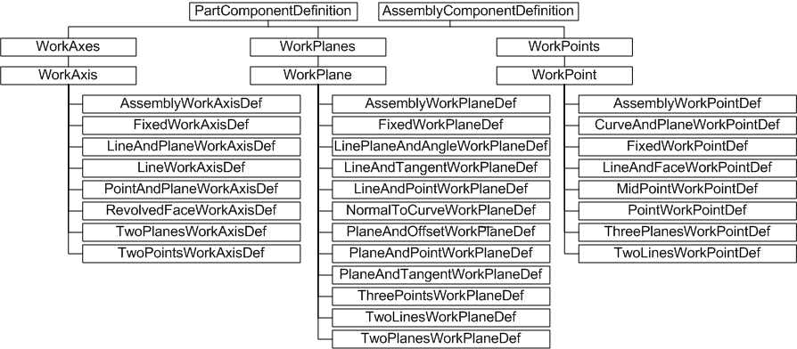
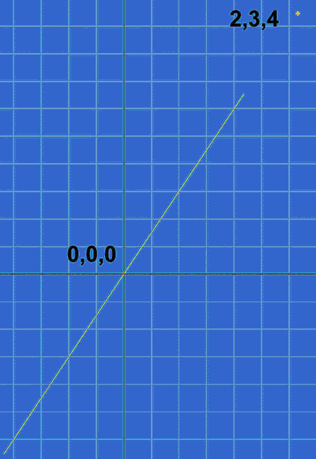
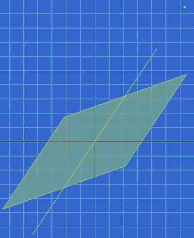

# Work Features

### Introduction to work features

As an Autodesk Inventor user, it is often necessary to place or manipulate features in 3D space. These features may be in relation to existing geometry, and often are the result of some potentially complex inference from a surface or plane. If existing model geometry is not sufficient to locate new features, some form of construction geometry is required to determine this inferred location. This may be as simple as the division of a line, to a sketch-like construction comprising points, lines and planes. Autodesk Inventor provides this abstract construction geometry in the form of work features, available both through the user interface and through the API. Autodesk Inventor work features provide a rich toolset for building your model, including the ability to constrain to work features, and to project work features onto sketches.

The user interface provides access to work planes, work axes, and work points. These work features can also be created and modified through the API.

### The purpose of API work features

Use work features to construct abstract geometry, avoiding the need for complex calculations to determine feature location. The three types of work features are reflected in the API with the WorkPoint, WorkAxis, and WorkPlane objects, and their corresponding collection objects.

When working with work features through the user interface, all the information needed to place the work feature is inferred from the objects selected, where they were selected, and the order in which they were selected. This isn't feasible through the API, therefore there are a number of work feature subtypes derived from the three base types. For example, to create a WorkPoint at the intersection of three planes, use the ThreePlanesWorkPointDef object. Create this type of WorkPoint object by calling the AddByThreePlanes method of the WorkPoints collection. This takes three planar objects as arguments. Note that typically such arguments are quite flexible. In this example, the planar objects can be sketches, faces, or WorkPlane objects, or any combination of these. In this manner it is possible to build complex construction geometry.

Work features can also be placed using regular, circular or mirror pattern features. To determine whether a work feature is part of a pattern, and cannot therefore be edited, use the IsPatternElement method of the WorkAxis, WorkPoint or WorkPlane.

|  |
| --- |
| **Note:** The work feature collection objects (WorkPoints, WorkAxes, WorkPlanes) are never empty. By default, each contains their base origin point, axes, or planes, respectively. For example, the WorkAxes collection object will always contain the three base axis objects X, Y, and Z, in that order. |

### Work Features Object Model Diagram



### Working with work features through the API

Many Autodesk Inventor API methods for sketch and feature placement accept work feature objects as input arguments. For example, the Add method of SketchSplines3D accepts WorkPoint objects to define the spline control points. Typically though, construction geometry is projected onto a sketch in order to for it to be consumed in feature generation. The nature of work features created through the user interface means they can be in-line, or nested. The API does not support in-line work features.

|  |
| --- |
| **Note:** To project work feature construction geometry on to a sketch, use the AddByProjectingEntity method of the sketch object. This method accepts work feature objects as arguments. |

### Creating a WorkPoint

As indicated by the preceding object diagram, the work feature collection objects are obtained from the PartComponentDefinition or AssemblyComponentDefinition objects.

The following example shows one way of creating a fixed WorkPoint object using the AddFixed method. Note the use of transient geometry to create a 3D point and then assign the X Y Z coordinates 2, 3, 4 to that point, before adding the WorkPoint to the WorkPoints collection.

```vb
Dim oPartDoc As PartDocument
Set oPartDoc = ThisApplication.ActiveDocument
Dim oPartCompDef As PartComponentDefinition
Set oPartCompDef = oPartDoc.ComponentDefinition
Dim oTrans As TransientGeometry
Set oTrans = ThisApplication.TransientGeometry
Dim oPnt As Point
Set oPnt = oTrans.CreatePoint(2, 3, 4)
Dim oWorkPoint1 As WorkPoint
Set oWorkPoint1 = oPartCompDef.WorkPoints.AddFixed(oPnt, False)
```

This sample and the following code omit error checking for the sake of clarity and brevity. Always check that return values are of the expected type.

The code adds a WorkPoint to the WorkPoints collection, obtained from the PartComponentDefinition of the PartDocument. This will succeed even if the PartDocument is empty.

The False argument to the AddFixed method indicates that the WorkPoint is not to be considered application-specific construction geometry. This means the WorkPoint is displayed in the browser in the same manner as user-generated work features.

|  |
| --- |
| **Note:** A value of True for this Construction argument indicates this WorkPoint should be considered application-specific construction geometry. It is not displayed in the browser, but it can still be manipulated from code. Thus an application can generate many work features without overloading the browser with WorkPoints, WorkAxes, and WorkPlanes that mean nothing to the user. |

### Creating a WorkAxis

The following code creates a WorkAxis and adds it to the WorkAxes collection. The AddByTwoPoints method is used, so another WorkPoint is defined with X Y Z values of 0, 0, 0. So the WorkAxis will be defined by two points; the previously created WorkPoint at 2, 3, 4, and a new one at 0, 0, 0.

```vb
Dim oWorkPoint2 As WorkPoint
Set oPnt = oTrans.CreatePoint(0, 0, 0)
Set oWorkPoint2 = oPartCompDef.WorkPoints.AddFixed(oPnt, False)
Dim oWorkAxis As WorkAxis
Set oWorkAxis = oPartCompDef.WorkAxes.AddByTwoPoints(oWorkPoint1, oWorkPoint2, False)
```

The AddByTwoPoints method creates the WorkAxis and adds it to the WorkAxes collection. Note the third argument again indicates that the newly created work feature should not be considered application-specific construction geometry. It is displayed on screen, appearing something like this:



### Creating a WorkPlane

With just two points, there is insufficient information to create a plane. There are a number of different methods to generate planes - for example, by using a third point, or through an axis, with the plane angle relative to another plane. The following example uses this latter method. Note that one of the predefined WorkPlane objects, the Y-Z plane, is used as a reference plane from which an angle of 45 degrees is measured.

|  |
| --- |
| **Note:** This code also demonstrates the ability to name work features. When dealing with a large number of objects, it is easier to reference them by name than by numerical index. The same applies to the base work feature objects. The name of the Y-Z plane, the first one in the WorkPlanes collection, is YZ Plane. This could be referenced as Item(1), but it is easier to read as Item("YZ Plane"). |

```vb
Dim oWorkPlane As WorkPlane
Set oWorkPlane = oPartCompDef.WorkPlanes.AddByLinePlaneAndAngle _
(oWorkAxis, oPartCompDef.WorkPlanes.Item("YZ Plane"), 45, False)
oWorkPlane.Name = "MyFirstWorkPlane"
```

The last line of code names the newly created WorkPlane object MyFirstWorkPlane. Other code can use this name to reference this work feature. The new name is also displayed in the Autodesk Inventor browser, provided the work feature is not application-specific construction geometry. It is displayed as follows:



### Summary

API work feature objects solve the same problem for the developer that work feature commands solve for the user. They provide the means to construct abstract geometry for the purpose of placing features, parts, sketches and so on. API work features cannot infer construction information from user object selection, so a number of methods are provided for specific input requirements. Objects of type WorkPoint, WorkAxis, or WorkPlane can be created and modified.

### Also consider

For creating geometry that is to form a part (for example, a profile to be extruded and perhaps shared) use the Sketch objects such as SketchEllipse, SketchCircle, SketchLine, SketchPoint, and so on.

For creating transient geometry that is intended only as a visual cue, use the ClientGraphics objects to create custom graphics.