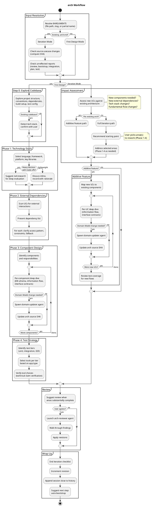

# arch

Designs system architecture through collaborative dialogue — technology stack, external dependencies, components, information flows, interface contracts, and test strategy. Works from use cases produced by usecase.

## Current Notes

- **Primary file:** `plugins/a4/skills/arch/SKILL.md`
- **Current behavior:** Collaborative architecture design skill. It supports both first-pass design and iteration on an existing `.arch.md`, with reviewer feedback when the user wants it.

## Workflow

