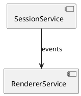
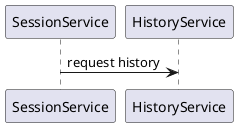

# Architecture Designer

Takes the use-case set in `a4/usecase/`, the domain model in `a4/domain.md`, and the actor roster in `a4/actors.md`, and designs the system architecture — technology stack, external dependencies, components, information flows, interface contracts, and test strategy — through collaborative dialogue. Writes the result to `a4/architecture.md` as a single wiki page.

## Workspace Layout

Reuse the `a4/` workspace resolved via `git rev-parse --show-toplevel`. Inputs live at:

- `a4/usecase/*.md` — one Use Case per file (from `usecase`).
- `a4/domain.md` — domain concepts, relationships, state transitions.
- `a4/actors.md` — actor roster.
- `a4/nfr.md` — non-functional requirements (optional).
- `a4/context.md` — problem framing / success criteria.

Output:

- `a4/architecture.md` — single wiki page covering overview, technology stack, external dependencies, components, information flows, interface contracts, test strategy.
- `a4/review/<id>-<slug>.md` — per-finding review items emitted by the wrap-up reviewer.
- `a4/research/<label>.md` — research reports from `api-researcher` (if invoked).

Derived views (consistency tables, UC×component coverage matrix, open-arch-findings dashboard) are **not files**; they are produced on demand by `compass` or by grep over frontmatter.

## Wiki Page Schema

```yaml
---
type: architecture
updated: 2026-04-24
---
```

No `revision`, `sources`, or `reflected_files` fields — wiki pages have no lifecycle. Cross-references to UCs / domain concepts / actors are expressed as standard markdown links (`[usecase/3-search-history](usecase/3-search-history.md)`) in body prose. The `<change-logs>` section tracks updates driven by issue changes, per the Wiki Update Protocol at `${CLAUDE_PLUGIN_ROOT}/references/body-conventions.md` (shared across `usecase`, `arch`, and `roadmap`).

## Id Allocation

When emitting review items, allocate ids via:

```bash
uv run "${CLAUDE_PLUGIN_ROOT}/scripts/allocate_id.py" "$(git rev-parse --show-toplevel)/a4"
```

## Modes

Determine the mode from the current `a4/` state:

- **First Design** — `a4/architecture.md` does not exist. Start from Phase 1 (Technology Stack) and follow the guided sequence.
- **Iteration** — `a4/architecture.md` exists. Run the Iteration Entry checks below.

### Iteration Entry

Mechanics (filter, backlog presentation, writer calls, footnote rules, discipline) follow [`references/iterate-mechanics.md`](${CLAUDE_PLUGIN_ROOT}/references/iterate-mechanics.md). This section adds only the architecture-specific work.

**Backlog filter:** `target: architecture` OR `architecture` in `wiki_impact`.

**Architecture-specific staleness signals (alongside the backlog):**
1. **New or changed UCs** — compare `architecture.md`'s `<change-logs>` entries against current UC files. UCs not yet cited in any change-log entry are "needs coverage" candidates.
2. **UC ↔ actor / domain drift** — quick pass: for each `<components>` Information Flow subsection in `architecture.md`, check that the referenced UCs and components still exist as current files / component sections.

**Architecture impact propagation rule** — when one area changes, check whether it affects others:
- Technology stack change → do components need restructuring? Do test tools need changing?
- Component change → do information flows still hold? Do interface contracts need updating?
- Test strategy change → does this affect how components are designed for testability?

Surface these cross-area impacts to the user; do not silently assume they're fine. Then recommend a starting point — backlog item, specific new UC, or phase to revisit.

## Session Task List

Use the task list as a live workflow map.

**Naming:** phase-level tasks use the phase name. Sub-tasks use `<phase prefix>: <detail>` and are created dynamically when entering a phase.

**First Design** — initial tasks at session start:
- `"Step 0: Explore codebase"` → `in_progress`
- `"Phase 1: Technology Stack"` → `pending`
- `"Phase 2: External Dependencies"` → `pending`
- `"Phase 3: Component Design"` → `pending`
- `"Phase 4: Test Strategy"` → `pending`
- `"Wrap Up: Reviewer validation"` → `pending`
- `"Wrap Up: Record review items"` → `pending`

**Iteration** — adjust based on the work backlog:
- `"Review open items and backlog"` → `in_progress`
- One task per selected item / area
- `"Wrap Up: Reviewer validation"` → `pending`
- `"Wrap Up: Record review items"` → `pending`

## Step 0: Explore the Codebase

Ground the architecture in reality — project structure, naming conventions, dependencies, build setup, existing test configuration. Reference findings detected during the interview. If a codebase already exists, record the detected technology stack and confirm with the user.

Mark "Step 0" completed when the survey is done.

## Architecture.md Structure

As the interview progresses, grow `a4/architecture.md` with these `<tag>` sections (per `body_schemas/architecture.xsd`; write on phase transitions, see File Writing Rules below):

````markdown
---
type: architecture
updated: <today>
---

<overview>

One-paragraph summary of the architectural approach and key decisions. Frames the buildable system for the use cases in [context](context.md), built against the actors in [actors](actors.md) and the concepts in [domain](domain.md).

</overview>

<technology-stack>

| Category | Choice | Rationale |
|----------|--------|-----------|
| Language | TypeScript | … |
| Framework | Next.js | … |

</technology-stack>

<external-dependencies>

| External System | Used By | Purpose | Access Pattern | Fallback |
|----------------|---------|---------|----------------|----------|
| OAuth Provider | [usecase/1-share-summary](usecase/1-share-summary.md), [usecase/2-search-history](usecase/2-search-history.md) | … | … | … |

</external-dependencies>

<component-diagram>



</component-diagram>

<components>

### SessionService

**Responsibility:** …

#### DB Schema *(only if data store: yes)*

```plantuml
@startuml
entity "Session" { *id : number | *userId : number | createdAt : datetime }
@enduml
```

#### Information Flow

##### [usecase/3-search-history](usecase/3-search-history.md)



#### Interface Contracts

| Operation | Direction | Request | Response | Notes |
|-----------|-----------|---------|----------|-------|
| createSession | client → SessionService | { userId, title } | { sessionId, status } | sync |

(Repeat per component.)

</components>

<test-strategy>

| Tier | Tool | Purpose | Rationale |
|------|------|---------|-----------|
| Unit | Vitest | Component-internal logic | … |
| Integration | @vscode/test-electron | Host environment APIs | … |
| E2E | WebdriverIO + wdio-vscode-service | Full UI interaction | … |

</test-strategy>

<change-logs>

- 2026-04-24 — [usecase/3-search-history](usecase/3-search-history.md)
- 2026-04-24 — [spec/8-caching-strategy](spec/8-caching-strategy.md)

</change-logs>
````

UC references in Information Flow subsections use standard markdown links — they resolve to `a4/usecase/<id>-<slug>.md` (relative path retained, `.md` retained). Component names and schema fields should use domain terms from `a4/domain.md`.

### Required vs Conditional Sections

**Required** (per the XSD): `<components>`, `<overview>`, `<technology-stack>`, `<test-strategy>`.

**Optional** (per the XSD): `<change-logs>`, `<component-diagram>`, `<external-dependencies>`. Convention:

- **`<external-dependencies>`** — populate when the system uses external services; omit otherwise.
- **`<component-diagram>`** — populate when the component graph is non-trivial.
- **DB Schema** (per component, inside `<components>`) — only when the component has its own data store.
- **Interface Contracts** (per component pair, inside `<components>`) — progressively filled as the architecture matures; expected once components are stable.
- **Information Flow** (per UC, inside `<components>`) — progressively filled; a mature architecture covers every UC in `a4/usecase/`.

## File Writing Rules

- **Create `a4/architecture.md`** at the end of Phase 1 with the frontmatter above, `<overview>` stub, and the confirmed `<technology-stack>` content.
- **Update** the file at each phase transition using the `Edit` tool where possible (preserves structure). Use `Write` only for full rewrites.
- **Change-log entries** — when a change is driven by a specific UC / spec / review item (new UC added, component split after review, etc.), append a dated bullet to the page's `<change-logs>` section with a markdown link to the causing issue. See `${CLAUDE_PLUGIN_ROOT}/references/body-conventions.md` for the full protocol (when to update, how to defer via a review item, close guard).
- **`updated:`** — bump on every phase transition or reflected resolution.

## Interview Phases

The architecture covers four areas. In **First Design**, start with Technology Stack and follow the guided sequence. In **Iteration**, start wherever the user wants. The user controls transitions.

### Phase 1: Technology Stack

Select language, framework, platform, and key libraries. For each choice, record the rationale. For lightweight choices — discuss inline and record with a brief rationale. For heavy choices (multiple viable options with significant trade-offs), ask the user: "This seems like a decision worth investigating more deeply. Would you like to run `/a4:research` on the candidates first, then record the conclusion via `/a4:spec` once we've converged?"

spec-trigger signals to watch for during the interview (multi-option enumeration, trade-off language, user uncertainty, prior-spec references) and the anti-patterns that suppress nudges are catalogued at [`references/spec-triggers.md`](${CLAUDE_PLUGIN_ROOT}/references/spec-triggers.md).

If a codebase already exists, detect the stack from project files and confirm. Write the initial `architecture.md` at the end of Phase 1.

### Phase 2: External Dependencies

1. **Scan UCs** for external interactions — any UC whose Flow or Outcome references third-party authentication, notifications, file storage, external data sources, etc.
2. **Present the list** with `Used By` (UC markdown links), `Purpose`, and ask for confirmation.
3. **For each confirmed dependency**, clarify:
   - What the system sends/receives (Access Pattern)
   - Constraints (rate limits, pricing tiers, specific provider)
   - Fallback behavior when unavailable
4. Record in `architecture.md`'s `<external-dependencies>` section. Append `<change-logs>` bullets keyed by the causing UCs.

### Phase 3: Component Design

Read `${CLAUDE_SKILL_DIR}/references/architecture-guide.md` for the detailed procedure (component identification, per-component deep dive, DB schema, information flow, interface contracts).

Component names, schema fields, and contract parameters must use `a4/domain.md` terminology.

**Domain Model modifications during arch work.** Cross-cutting domain authorship is `/a4:domain`'s job; arch's role is to flag mismatches and apply *simple* edits inline. The full workspace-wide authorship + cross-stage feedback policy is at [`references/wiki-authorship.md`](${CLAUDE_PLUGIN_ROOT}/references/wiki-authorship.md); the table below is the arch-specific b3 instance:

| Change shape | Owner | What arch does |
|---|---|---|
| New concept / new attribute on existing concept | arch | Edit `a4/domain.md` `<concepts>` directly. Append `<change-logs>` bullet pointing at `[architecture#<section>](architecture.md#<section>)`. Bump `updated:`. |
| 1:1 rename of an existing concept | arch | Edit `a4/domain.md` directly. Update every existing reference in the same file. Append `<change-logs>` bullet. Bump `updated:`. |
| Definition wording / clarification on an existing concept | arch | Edit `a4/domain.md` directly. Append `<change-logs>` bullet. Bump `updated:`. |
| Concept split / merge | `/a4:domain` | Allocate a review item: `kind: gap`, `target: domain`, `wiki_impact: [domain]`, `source: self`, body summarizes the proposed split/merge with arch's rationale. **Do not edit `domain.md`.** Continue arch using a placeholder term; the user will run `/a4:domain iterate` later to land the structural change. |
| Relationship add / remove / cardinality change | `/a4:domain` | Same as split/merge — emit a review item targeting `domain`; do not edit. |
| State or transition added / removed | `/a4:domain` | Same — emit a review item; do not edit. |

When emitting a review item under this table, allocate via `allocate_id.py` and write `a4/review/<id>-<slug>.md`. Place a markdown link to the new review item inline in the architecture section that surfaced the issue (e.g., `[review/12-domain-split](review/12-domain-split.md)`), so the user can find it during `/a4:domain iterate`.

The boundary is: *content changes* (add a concept, rename, clarify) are inline; *structural changes* (split, merge, relationship topology, state topology) require a focused cross-cutting pass that arch does not attempt mid-component-design.

### Phase 4: Test Strategy

Read `${CLAUDE_SKILL_DIR}/references/test-strategy-guide.md` for the detailed procedure.

1. **Identify test tiers** — unit (required), integration (architecture-dependent), E2E (UI-dependent).
2. **Select tools per tier** based on app type and tech stack. Use Technical Claim Verification for non-obvious compatibility.
3. **Record** the Test Strategy table with rationale per tier.

## Technical Claim Verification

When writing or confirming any technical claim (API support, library capability, framework constraint, compatibility), verify before recording. Focus on claims whose failure would break implementation.

### Procedure

1. **Check the codebase first** — for claims about the current project's stack, read the actual code, configs, or dependency files.
2. **Launch an `api-researcher` agent** — for external verification, spawn a background `Agent(subagent_type: "a4:api-researcher", run_in_background: true)`. Prompt it with the specific claim and ask it to verify against official documentation.
3. **Continue the interview** — keep working while waiting. Do not transition to the next phase until all pending research results have been received and reflected.
4. **On completion** — the agent writes results to `a4/research/<label>.md`. Read it and apply the verification outcome. Add an inline `(ref: [research/<label>](research/<label>.md))` where the claim is recorded.
5. **Flag uncertainty** — when official documentation is ambiguous, tell the user and ask whether to proceed as an assumption or investigate further.

Maintain the set of research reports under `a4/research/`. Derived indexes (which claims cite which report) come from grep over the body links, not a separately maintained index file.

## Wrapping Up

The architecture ends only when the user says so. When the user indicates they're done:

1. **Pre-flight consistency check** — read `architecture.md` end-to-end. Confirm: every Information Flow UC resolves to an existing UC file; every component's contracts align with its sequence diagrams; every schema field appears in `domain.md`. Resolve obvious gaps before launching the reviewer.

2. **Launch `arch-reviewer`** — spawn `Agent(subagent_type: "a4:arch-reviewer")`. Pass:
   - `a4/` absolute path
   - Prior-session open review items that target `architecture` (so the reviewer can skip duplicates)

   The reviewer emits one review item file per finding into `a4/review/<id>-<slug>.md` (using `allocate_id.py`) and returns a summary.

3. **Walk findings** — for each emitted review item (ordered by priority then id), present to the user and resolve or defer:
   - **Fix now** — edit `architecture.md` (and any cross-referenced file). Flip the review item `status: resolved` via `transition_status.py` (which appends the `<log>` entry), and add a dated `<change-logs>` bullet on each modified wiki page per the Wiki Update Protocol.
   - **Defer** — leave `status: open`. Capture the deferral reason in conversation notes / handoff (writer-managed `<log>` only updates on transitions).
   - **Discard** — set `status: discarded` via `scripts/transition_status.py`; the writer records the reason in `<log>`.

4. **Wiki close guard** — for each item that transitioned to `resolved` with non-empty `wiki_impact`, verify the referenced wiki pages contain a `<change-logs>` bullet whose markdown link points at the causing issue. Warn + allow override when missing.

5. **Report** — summarize to the user:
   - Phases completed this session
   - Components added / revised
   - Review items opened / resolved / still open
   - Suggested next step: `/a4:auto-bootstrap` to set up dev environment, or `/a4:roadmap` if bootstrap is already done

### Agent Usage

Context is passed via file paths, not agent memory.

- **`arch-reviewer`** — `Agent(subagent_type: "a4:arch-reviewer")`. Reads `a4/` workspace; writes per-finding review items.
- **`api-researcher`** — `Agent(subagent_type: "a4:api-researcher", run_in_background: true)`. Verifies a single technical claim against official docs; writes `a4/research/<label>.md`.

## Non-Goals

- Do not write a separate `design.md` wiki page. The spec explicitly rejects it — `architecture.md` covers design content (stack, components, interfaces, test strategy).
- Do not track per-UC / per-source SHAs in `architecture.md`. The wiki update protocol's footnote + drift-detector flow handles cross-reference consistency without SHA bookkeeping.
- Do not create a research-index file. Use grep over body links.
- Do not emit aggregated review reports. All findings are per-review-item files.
