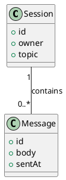
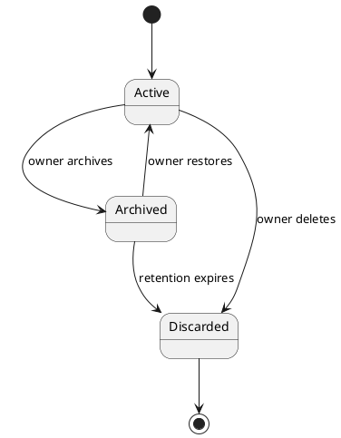

# Domain Model Designer

Takes the use-case set in `a4/usecase/`, the actor roster in `a4/actors.md`, and the problem framing in `a4/context.md`, and extracts the **cross-cutting Domain Model** — the shared vocabulary architecture and implementation will use. Writes the result to `a4/domain.md` as a single wiki page.

This skill exists separately from `/a4:usecase` because cross-cutting concept extraction requires a different reasoning mode from per-UC interview. UCs are captured one at a time inductively (actor / situation / flow); domain emerges as patterns across the set. Splitting them keeps each skill's task list and context focused.

## Workspace Layout

Reuse the `a4/` workspace resolved via `git rev-parse --show-toplevel`. Inputs live at:

- `a4/usecase/*.md` — every Use Case file. Domain concepts surface from cross-UC patterns.
- `a4/actors.md` — actor roster (actors are not domain concepts but inform their relationships).
- `a4/context.md` — problem framing.
- `a4/architecture.md` — *only when iterating after arch has run.* Component names may surface domain-term mismatches that this skill resolves.
- `a4/review/*.md` — open items with `target: domain` or `wiki_impact: [domain]` drive iteration.

Output:

- `a4/domain.md` — single wiki page covering Glossary, Relationships (PlantUML class diagram), State Transitions (PlantUML state diagrams).
- `a4/review/<id>-<slug>.md` — per-finding review items emitted by the wrap-up reviewer.

Derived views (concept-to-UC coverage matrix, open-domain-findings dashboard) are **not files**; they render via Obsidian dataview on demand.

## Wiki Page Schema

```yaml
---
kind: domain
updated: 2026-04-25
---
```

No `revision`, `sources`, or `reflected_files` fields — wiki pages have no lifecycle. Cross-references to UCs / actors / architecture sections are expressed as Obsidian wikilinks (`[[usecase/3-search-history]]`, `[[architecture#SessionService]]`) in body prose. Footnotes + `## Changes` section track updates driven by issue changes, per the Wiki Update Protocol at `${CLAUDE_PLUGIN_ROOT}/references/obsidian-conventions.md` (shared across `usecase`, `domain`, `arch`, `roadmap`).

## Id Allocation

When emitting review items, allocate ids via:

```bash
uv run "${CLAUDE_PLUGIN_ROOT}/scripts/allocate_id.py" "$(git rev-parse --show-toplevel)/a4"
```

## Modes

Determined by the workspace state:

- **First Extraction** — `a4/domain.md` does not exist. Run Phase 1 → 2 → 3 in order.
- **Iteration** — `a4/domain.md` exists OR the user said `iterate`. Run the Iteration Entry checks below.

`/a4:usecase` does not block on the absence of `domain.md` — it captures actors and per-UC bodies first; domain extraction happens here. Compass routes `UCs exist, domain.md missing → /a4:domain` (Layer 1).

### Iteration Entry

Mechanics (filter, backlog presentation, writer calls, footnote rules, discipline) follow [`references/iterate-mechanics.md`](../../../references/iterate-mechanics.md). This section adds only the domain-specific work.

**Backlog filter:** `target: domain` OR `domain` in `wiki_impact`.

**Domain-specific staleness signals (alongside the backlog):**
1. **New or changed UCs since last update** — compare `domain.md`'s `## Changes` footnotes against current UC files. UCs not yet reflected in any domain footnote are "needs concept review" candidates. The drift detector emits `kind: gap` review items for staleness.
2. **Stale concept signal** — if `a4/domain.md`'s `updated:` is older than the most recent UC file's `updated:` by ≥ 3 UC additions, surface this as a likely review trigger even when no review item exists.

**Domain impact propagation rule** — when one area changes, check whether it affects others:
- Concept added/renamed → do relationships still hold? Do any state diagrams use the old name?
- Relationship change → does the class diagram + body text still agree?
- State transition added → is the underlying concept's glossary entry still accurate?

Surface these cross-area impacts to the user; do not silently assume they're fine. Then recommend a starting point — backlog item, specific concept, or end-to-end phase rerun.

## Session Task List

Use the task list as a live workflow map. Phase-level tasks use the phase name. Sub-tasks use `<phase prefix>: <detail>` and are created dynamically when entering a phase.

**First Extraction** — initial tasks at session start:
- `"Step 0: Read sources"` → `in_progress`
- `"Phase 1: Concept Extraction"` → `pending`
- `"Phase 2: Relationship Mapping"` → `pending`
- `"Phase 3: State Transitions"` → `pending`
- `"Wrap Up: Reviewer validation"` → `pending`
- `"Wrap Up: Record review items"` → `pending`

**Iteration** — adjust based on the work backlog:
- `"Review open items and backlog"` → `in_progress`
- One task per selected item / concept
- `"Wrap Up: Reviewer validation"` → `pending`
- `"Wrap Up: Record review items"` → `pending`

## Step 0: Read Sources

Read up front:

- Every file in `a4/usecase/*.md` — domain concepts surface from cross-UC patterns. Use `Glob` to enumerate, then `Read` each.
- `a4/actors.md` — to distinguish actor vocabulary from domain vocabulary.
- `a4/context.md` — problem framing constrains the relevant concept scope.
- `a4/domain.md` (if exists) — preserve confirmed content during iteration.
- `a4/architecture.md` (if exists) — component names may flag domain-term mismatches.

Mark "Step 0" completed when the read pass is done.

## Domain.md Structure

As phases progress, grow `a4/domain.md` with these sections (write on phase transitions):

```markdown
---
kind: domain
updated: <today>
---

# Domain Model

> Cross-cutting vocabulary and structural relationships emerging from the use cases in [[context]], grounded in the actors of [[actors]].

## Glossary

| Concept | Definition | Key Attributes | Referenced By |
|---------|-----------|----------------|---------------|
| Session | A scoped working context bound to a single user and topic. | id, owner, topic, createdAt | [[usecase/1-share-summary]], [[usecase/3-search-history]] |
| Message | A single utterance recorded within a session. | id, sessionId, body, sentAt | [[usecase/2-render-preview]] |

## Relationships



Sessions own messages (1:N). A message cannot exist without an owning session. Message ordering within a session is by `sentAt`.

## State Transitions

### Session



`Active` is the default state on creation. Archive is reversible; discard is terminal.

## Changes

[^1]: 2026-04-25 — [[usecase/3-search-history]]
[^2]: 2026-04-25 — [[architecture#SessionService]]
```

Concept names in the Glossary become **canonical terms**. Architecture component names, schema fields, and contract parameters reuse them. UC bodies reference them via wikilinks where helpful.

### Required vs Conditional Sections

**Required** (present from First Extraction onwards): Glossary (at least one concept), Relationships (PlantUML diagram + text).

**Conditional:**
- **State Transitions** — only when at least one concept has state changes across UCs. A pure value/data model with no lifecycle has no state-transitions section.

## File Writing Rules

- **Create `a4/domain.md`** at the end of Phase 1 with the frontmatter above and the confirmed Glossary.
- **Update** at each phase transition using the `Edit` tool where possible (preserves structure). Use `Write` only for full rewrites.
- **Footnote markers** — when a change is driven by a specific UC / decision / review item / arch discussion, add `[^N]` inline in the modified section and append a `## Changes` entry with date + `[[causing-issue]]`. See `${CLAUDE_PLUGIN_ROOT}/references/obsidian-conventions.md` for the protocol (when to update, how to defer via a review item, close guard).
- **`updated:`** — bump on every phase transition or reflected resolution.

## Phases

Read `${CLAUDE_SKILL_DIR}/references/domain-model-guide.md` for the detailed procedure (concept identification heuristics, abstraction guardrails, diagram conventions).

The model covers three areas. In **First Extraction**, run them in order; in **Iteration**, start wherever the user wants.

### Phase 1: Concept Extraction

1. **Scan all UCs horizontally** for nouns appearing across multiple UCs — entities, value objects, configurations, signals.
2. **Filter** — drop:
   - Actor-shaped nouns (already in `actors.md`).
   - Implementation/UI nouns (button, screen, response). The Domain Model is "what exists", not "how it's presented".
   - One-off nouns appearing in only one UC unless they are clearly central to the domain.
3. **Present the candidate list** to the user. For each: confirm name, one-line definition, 1–2 key attributes, and the UCs that reference it.
4. **Write the Glossary table** to `a4/domain.md` after the list is confirmed.

Concepts use domain language, not implementation types. No `VARCHAR(255)`, `INT`, `string` — just attribute names. No API endpoints or serialization formats.

### Phase 2: Relationship Mapping

1. **Identify pairs** of concepts that interact across UCs — ownership, references, composition, association.
2. **Confirm cardinality** with the user (1, 0..1, 1..*, 0..*).
3. **Confirm direction** of dependency where it matters (which side cannot exist without the other).
4. **Write the PlantUML class diagram** to `a4/domain.md` showing only concept names and key attributes — no methods, no implementation types.
5. **Add text explanation** of each relationship under the diagram. Diagrams alone are not self-documenting.

If a relationship surfaces a **missing concept** that wasn't caught in Phase 1, return to Phase 1 (mark its task `in_progress` again) before continuing.

### Phase 3: State Transition Analysis

1. **Identify stateful concepts** — those whose UCs change their state implicitly or explicitly (created → published → archived; pending → confirmed → cancelled).
2. **For each stateful concept**, with the user:
   - Enumerate states.
   - Map transitions: source → target, with trigger and condition.
   - Distinguish reversible from terminal transitions.
3. **Write a PlantUML state diagram** per stateful concept under a `### <Concept>` subsection.
4. **Add text explanation** under each diagram naming default state, terminal states, and any constraints not visible in the diagram.

Stateless concepts (pure value/data) have no state diagram. Skip the section entirely if no concept is stateful.

## Wrapping Up

Domain extraction ends only when the user says so. When the user indicates they're done:

1. **Pre-flight consistency check** — read `domain.md` end-to-end. Confirm: every concept in Relationships exists in the Glossary; every State Transition concept exists in the Glossary; every UC referenced from `Referenced By` is an existing UC file. Resolve obvious gaps before launching the reviewer.

2. **Launch `domain-reviewer`** — spawn `Agent(subagent_type: "a4:domain-reviewer")`. Pass:
   - `a4/` absolute path
   - Prior-session open review items that target `domain` (so the reviewer can skip duplicates)

   The reviewer emits one review item file per finding into `a4/review/<id>-<slug>.md` (using `allocate_id.py`) and returns a summary.

3. **Walk findings** — for each emitted review item (ordered by priority then id), present to the user and resolve or defer:
   - **Fix now** — edit `domain.md` (and any cross-referenced file). Set the review item `status: resolved` via `transition_status.py`, append a `## Log` entry, and add a footnote marker on each modified wiki page per the Wiki Update Protocol.
   - **Defer** — leave `status: open`; add a `## Log` entry noting the deferral reason.
   - **Discard** — set `status: discarded` via `scripts/transition_status.py`.

4. **Wiki close guard** — for each item that transitioned to `resolved` with non-empty `wiki_impact`, verify the referenced wiki pages contain a footnote whose payload wikilinks the causing issue. Warn + allow override when missing.

5. **Report** — summarize to the user:
   - Phases completed this session
   - Concepts added / revised
   - Relationships added / revised
   - State diagrams added / revised
   - Review items opened / resolved / still open
   - Suggested next step: `/a4:arch` (or `/a4:arch iterate` if architecture exists and the domain change affects it).

## Domain Edits Originating Outside This Skill

`/a4:arch` Phase 3 may edit `a4/domain.md` directly for *simple* changes (concept addition, 1:1 rename, definition wording) without invoking this skill — those edits are committed inline with the arch session, and the footnote/`## Changes` entry cites the architecture section as the cause. *Structural* changes (concept split/merge, relationship change, state-transition change) flow through this skill via review items with `target: domain`. See `${CLAUDE_PLUGIN_ROOT}/skills/arch/SKILL.md` Phase 3 for the decision table; the workspace-wide authorship policy is at [`references/wiki-authorship.md`](../../references/wiki-authorship.md).

When iterating after arch has run, expect to see `## Changes` entries citing `[[architecture#<section>]]`. Treat them as authoritative — do not undo them; they reflect work already accepted by the user.

**Findings about other wiki pages.** If domain work surfaces an issue in another wiki (e.g., a rename invalidates a `architecture.md` component name), do not edit that wiki — emit a review item with the appropriate `target:`. Per the cross-stage feedback policy, this skill is **continue + review item** for upstream findings: finish domain wrap-up, leave the review item open for the owning skill's `iterate` mode.

## Agent Usage

Context is passed via file paths, not agent memory.

- **`domain-reviewer`** — `Agent(subagent_type: "a4:domain-reviewer")`. Reads `a4/domain.md`, UCs, actors, architecture (if present); writes per-finding review items.

## Non-Goals

- Do not author UCs. UC creation is `/a4:usecase`'s exclusive role.
- Do not edit `architecture.md`. Architectural decisions live there; this skill writes domain only.
- Do not maintain a `domain.history.md`. Per-issue `## Log` sections plus the `## Changes` footnote section + git history cover audit needs.
- Do not track per-source SHAs on `domain.md`. The wiki update protocol's footnote + drift-detector flow handles cross-reference consistency.
- Do not emit aggregated reviewer reports. All findings are per-review-item files.
