# roadmap

Takes an architecture document and authors the implementation roadmap and per-task files. Pairs with `/a4:run` for the agent-driven implement + test loop and with `/a4:task` for single-task authoring outside the batch.

## Current Notes

- **Primary file:** `plugins/a4/skills/roadmap/SKILL.md`
- **Current behavior:** Roadmap authoring (Phase 1 of the legacy `plan` skill). Phase 2 — agent loop, integration tests, ship-review — is being moved to `/a4:run`. Until that split lands the SKILL.md still bundles both phases; treat the diagram below as historical.

## Workflow

```plantuml
@startuml
title plan Workflow
skinparam conditionStyle inside

|#WhiteSmoke|tp| plan (orchestrator)
|#AliceBlue|ti| task-implementer subagent (sonnet)
|#Lavender|ts| test subagent (sonnet)
|#MistyRose|rv| roadmap-reviewer agent

|tp|
start

partition "Input Resolution" {
  :Resolve $ARGUMENTS
  (full path / partial / slug);
  if (Existing .roadmap.md?) then (yes)
    :Resume Mode;
    note right
      Extract phase, cycle, status
      Compare source SHAs
      Check bootstrap staleness
      Reflect unreflected reports
    end note
    :Continue from recorded
    phase / cycle;
  else (only .arch.md)
    :Fresh Mode;
  endif
}

partition "Phase 1 — Plan Generation + Verification" #LightCyan {

  :Step 1: Read Sources;
  note right
    .arch.md — tech stack,
    components, contracts
    .usecase.md — UCs, domain model
    bootstrap report — verified
    build/run/test commands
  end note

  :Step 2: Explore Codebase
  (structure, conventions,
  patterns, test setup);

  :Step 3: Generate Plan
  (enter plan mode);
  note right
    Strategy (component / feature / hybrid)
    Tasks with file mappings + unit test paths
    Dependency graph + implementation order
    Test file convention
    (L&V is owned by bootstrap.md; embed only)
  end note
  :Write .roadmap.md
  (phase: plan-review, revision: 1);
  :Commit: plan + history;

  partition "Step 4: Verification Loop" {
    repeat
      |rv|
      :Review plan;
      note left
        FR coverage
        Component/contract coverage
        Tech stack consistency
        Test plan completeness
        Dependency validity
        File mapping specificity
      end note
      :Write review report;

      |tp|
      :Read review report;
      if (Issue type?) then (plan)
        :Auto-reflect into plan;
        :Increment revision;
        :Commit: report + plan + history;
      elseif (arch / usecase) then (upstream)
        :Set status: blocked; <<#Pink>>
        :Report upstream issues to user;
        stop
      else (all pass)
        break
      endif
    backward :Next round;
    repeat while (Round <= 3?) is (yes) ->done;
  }

  :Set phase: implement, cycle: 1;
  :Commit;
}

partition "Phase 2 — Implement + Test Loop" #Honeydew {

  repeat

    partition "Step 5: Task Implementation" {
      |tp|
      repeat
        :Identify ready tasks
        (deps all ""done"", status ""pending"");

        |ti|
        fork
          :Implement code
          per task file mappings;
          :Write unit tests;
          :Run unit tests until pass;
          :Commit: code + tests;
          :Return: result + summary;
        fork again
          :Implement code
          per task file mappings;
          :Write unit tests;
          :Run unit tests until pass;
          :Commit: code + tests;
          :Return: result + summary;
        end fork
        note right
          Independent tasks
          run in parallel
        end note

        |tp|
        :Track task results;
        :pass -> status: **done**
        fail -> status: **failed**
        + record failure summary;

        if (Every 3 tasks?) then (checkpoint)
          :Update .roadmap.md statuses;
          :Commit;
        else (continue)
        endif

      repeat while (More ready tasks?) is (yes) ->all dispatched;
    }

    partition "Step 6: Integration + Smoke Test" {
      |ts|
      :Run integration test cases
      from plan's test plan;
      :Run smoke test cases
      from plan's test plan;
      :Write test report
      (factual results only);
      :Commit: test report;
    }

    partition "Step 7: Analyze Results" {
      |tp|
      :Read test report
      + task failure summaries;

      if (All tasks done +\nall tests pass?) then (yes)
        :Set status: complete; <<#LightGreen>>
        :Commit: plan + history;
        :Report success to user;
        stop
      else (failures)
      endif

      :Classify failures
      using plan + arch context;

      if (Root cause?) then (arch / usecase)
        :Set status: blocked; <<#Pink>>
        :Report upstream issues to user;
        :Commit: plan + history;
        stop
      else (plan issues)
      endif

      :Autonomous plan revision;
      note right
        Identify affected tasks
        Revise descriptions / file mappings /
        deps / acceptance criteria
        Check ripple effects on dependents
        Reset affected tasks to ""pending""
      end note
      :Add test report to reflected_files;
      :Increment revision;
      :Commit: plan + history;

      |rv|
      :Verify revised plan;
      :Write review report;

      |tp|
      if (Reviewer result?) then (plan issues)
        :Fix and re-verify
        (max 2 inner rounds);
      elseif (arch / usecase) then (upstream)
        :Set status: blocked; <<#Pink>>
        :Report to user;
        stop
      else (pass)
      endif

      :Increment cycle;
    }

  backward :Next cycle;
  repeat while (Cycle <= 3?) is (yes) ->max reached;

  :Set status: blocked; <<#Pink>>
  :Report remaining failures
  (task statuses, all test reports);
}

stop

@enduml
```

