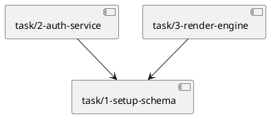

# Implementation Roadmap Builder

Takes the architecture in `a4/architecture.md` (plus the UCs in `a4/usecase/`, the domain model in `a4/domain.md`, and the actor roster in `a4/actors.md`) and authors the implementation roadmap plus per-task files. The agent-driven implement + test loop lives in `/a4:run`.

## Workspace Layout

Resolve `a4/` via `git rev-parse --show-toplevel`. Inputs:

- `a4/architecture.md` — the authoritative architecture wiki page.
- `a4/usecase/*.md` — Use Cases (task `implements:` references point here).
- `a4/domain.md`, `a4/actors.md`, `a4/nfr.md`, `a4/context.md` — supporting wiki pages.
- `a4/bootstrap.md` — bootstrap report (if auto-bootstrap has run). Verified build/launch/test commands live here.

Outputs:

- `a4/roadmap.md` — single wiki page: Overview, Implementation Strategy, Milestones, Dependency Graph snapshot, Shared Integration Points. The Launch & Verify section is an Obsidian embed of bootstrap.md, not authored content.
- `a4/task/<id>-<slug>.md` — one per executable unit of work (Jira-task semantics).
- `a4/review/<id>-<slug>.md` — findings from roadmap-reviewer.

Derived views (dependency graph, open-task dashboard, milestone progress) render via Obsidian dataview; no separate files.

## Roadmap Wiki Schema

```yaml
---
kind: roadmap
updated: 2026-04-24
---
```

No lifecycle, revision, or source SHA fields. Cross-references, footnote markers, and the Wiki Update Protocol follow the shared conventions at `${CLAUDE_PLUGIN_ROOT}/references/obsidian-conventions.md`.

## Task File Schema

```yaml
---
id: 5
title: Render markdown
kind: feature | spike | bug
status: open | pending | progress | complete | failing | discarded
implements: [usecase/3-search-history, usecase/4-render-preview]
depends_on: [task/4-parse-config]
adr: []
related: []
files: [src/render.ts, src/render.test.ts]
cycle: 1
labels: [renderer]
milestone: v1.0
created: 2026-04-22
updated: 2026-04-24
---
```

Body sections: `## Description`, `## Files` (action/path/change table), `## Unit Test Strategy` (scenarios + isolation + test files), `## Acceptance Criteria` (checklist), `## Interface Contracts` (the contracts this task consumes or provides, with wikilinks to `[[architecture]]` sections), `## Log` (append-only per cycle).

`kind:` is required and must be one of `feature | spike | bug`. The roadmap batch generator emits `kind: feature` for every UC-derived task; single ad-hoc spike / bug entries are authored via `/a4:task`.

`status` semantics:
- `open` — backlog (kanban "todo"); captured but not yet enqueued for `/a4:run`. `/a4:roadmap` does **not** emit this status — batch generation always writes `pending`. Authored by `/a4:task` when the user wants to defer scheduling.
- `pending` — in the work queue, awaiting a `task-implementer`. Default for `/a4:roadmap`-generated tasks.
- `progress` — a `task-implementer` agent is working or crashed mid-work (reset to `pending` on session resume by `/a4:run`).
- `complete` — implemented; unit tests pass.
- `failing` — implementation or unit tests failed after a task-implementer attempt.
- `discarded` — UC this task implements was discarded; cascade-flipped by `transition_status.py`.

All task status changes flow through `scripts/transition_status.py`. Cascades: when a UC goes `implementing → revising`, this script flips related `progress` / `failing` tasks back to `pending` (spec is being rewritten; re-implementation is required). When a UC goes to `discarded`, related tasks cascade to `discarded`.

`cycle:` starts at 1 and increments each retry. `updated:` bumps on every status change (written by the status writer).

### Acceptance Criteria source by kind

The `## Acceptance Criteria` section is required on every task body. The source convention (documentation only — validators do not enforce):

| Task kind / shape | AC source |
|---|---|
| `feature` + `implements: [usecase/...]` | UC `## Flow` / `## Validation` / `## Error handling` |
| `feature` + `adr: [adr/...]` (UC-less) | ADR `## Decision` + relevant `architecture.md` section |
| `spike` | hypothesis + expected result, the spike's own body |
| `bug` | reproduction scenario + fixed criteria |

## Id Allocation

Always allocate via the shared utility before creating a task or review item:

```bash
uv run "${CLAUDE_PLUGIN_ROOT}/scripts/allocate_id.py" "$(git rev-parse --show-toplevel)/a4"
```

## Modes

Determined by the workspace state, not by frontmatter flags:

- **Roadmap mode** — `a4/roadmap.md` absent OR `a4/task/` is empty. Run Step 1 onward.
- **Iterate mode** — open review items target `roadmap` or a task. See **Iteration Entry** below.

Mode detection at session start:

```bash
ls a4/task/*.md                                             # any tasks?
ls a4/review/*.md | xargs grep -l 'status: open\|target: roadmap\|target: task/'
```

If `a4/task/` already has the full set and the user's intent is to run the implement loop, redirect them to `/a4:run`.

### Iteration Entry

Mechanics (filter, backlog presentation, writer calls, footnote rules, discipline) follow [`references/iterate-mechanics.md`](${CLAUDE_PLUGIN_ROOT}/references/iterate-mechanics.md). This section adds only the roadmap-specific work.

**Backlog filter:** `target: roadmap` OR `target: task/*` OR same in `wiki_impact`.

**Roadmap-specific work** between writer calls:
- **Re-emit revised roadmap / task files** in place of hand-edits when the resolution restructures milestones, dependency graph, or task split.
- **Scoped roadmap-reviewer rerun** — after revising tasks for a finding, run `roadmap-reviewer` once over the revised subset (not the full roadmap) and only proceed if the scoped review passes. This is the inline review loop unique to roadmap.
- **Cascade awareness** — if a task's `depends_on` changes, downstream tasks may also need adjustments; surface those to the user before resolving.

---

## Step 1: Read Sources

Read these files up front:

- `a4/architecture.md` — technology stack, components, information flows, interface contracts, test strategy.
- `a4/usecase/*.md` — every UC (ids, actors, flows, acceptance criteria). Use `grep -l` to enumerate.
- `a4/domain.md`, `a4/actors.md`, `a4/nfr.md`, `a4/context.md` — supporting wiki pages.
- `a4/bootstrap.md` — **required**. Single source of truth for Launch & Verify (build / launch / test / smoke / isolation). The roadmap embeds this content rather than copying it; do not duplicate the verified commands into roadmap.md.

If `bootstrap.md` is absent, suggest `/a4:auto-bootstrap` first. Continue only if the user opts to proceed without it.

## Step 2: Explore the Codebase

Check project structure, conventions, test setup, build configuration. File paths in task frontmatter must be specific to this codebase (`src/render.ts`, not "a renderer file").

## Step 3: Generate Roadmap + Tasks

Enter plan mode (the `EnterPlanMode` Claude Code primitive). Design:

1. **Implementation strategy** (component-first / feature-first / hybrid) — read `${CLAUDE_SKILL_DIR}/references/planning-guide.md` for guidance.
2. **Milestones** — group tasks into named deliverable sets (`v1.0`, `beta`, `phase-1`). Milestones drive roadmap narrative sequencing.
3. **Tasks** (one per executable unit):
   - Derive from architecture components + UC flows.
   - Size: covers 1–5 related UCs, touches 1–3 components, independently testable, ≤ ~500 lines.
   - File mapping (source files + unit test files following the bootstrap/codebase convention).
   - Dependencies (`depends_on:` using task wikilink paths).
   - Unit test scenarios + isolation strategy.
   - Acceptance criteria derived from UC flows, validation, error handling (per the AC source table above).
   - Milestone assignment (`milestone:` field).
   - `kind: feature` (the batch generator emits feature for UC-derived work).
4. **Shared Integration Points** — identify any file appearing in 3+ tasks' file lists. Define the integration pattern.
5. **Launch & Verify** — *do not author content here*. `bootstrap.md` is the single source of truth (per [`references/wiki-authorship.md`](${CLAUDE_PLUGIN_ROOT}/references/wiki-authorship.md)); roadmap.md embeds it via Obsidian transclusion so readers see the commands inline without duplicating them. `/a4:run` reads `bootstrap.md` directly — it does not parse the roadmap embed.

Exit plan mode. Write artifacts:

**`a4/roadmap.md` body** (with the wiki frontmatter above):

```markdown
# Roadmap

> Implements the architecture in [[architecture]] to deliver the use cases in [[context]].

## Overview

<One paragraph: what is being implemented, how it serves the UCs, key sequencing intuition.>

## Implementation Strategy

- **Approach:** <component-first | feature-first | hybrid>
- **Incremental delivery:** <how the system stays testable at each step>
- **Key constraints:** <architectural or operational constraints shaping order>

## Milestones

### v1.0 — Foundation

**Goal:** <what "done" means for this milestone>
**Scope:** [[task/1-setup-schema]], [[task/2-auth-service]], [[task/3-render-engine]]
**Success criteria:** <observable outcome — e.g., "user can send a message and see a response">
**Risks:** <anything with mitigation>

### v1.1 — Enrichment

…

## Dependency Graph (snapshot)



> Authoritative source: per-task `depends_on:` frontmatter. This diagram is a point-in-time snapshot; regenerate via compass / dataview when tasks change.

## Launch & Verify

> Single source of truth: [[bootstrap]]. Re-run `/a4:auto-bootstrap` to update.

![[bootstrap#Verified Commands]]

![[bootstrap#Smoke Scenario]]

![[bootstrap#Test Isolation Flags]]

## Shared Integration Points

<Only when a file appears in 3+ tasks.>

| File | Integration Pattern | Contributing Tasks |
|------|--------------------|-------------------|
| `src/app.ts` | Handler registration; tasks register their handlers via `app.register(...)` | [[task/2-auth-service]], [[task/3-render-engine]], [[task/5-history-service]] |

## Changes

[^1]: 2026-04-24 — [[architecture]]
```

**Per-task files** — allocate ids via `allocate_id.py`, write `a4/task/<id>-<slug>.md` using the schema above. The roadmap.md's Milestones section references them via wikilinks.

After all task files are written, refresh the reverse link on each UC so `ready → implementing` will pass mechanical validation:

```bash
uv run "${CLAUDE_PLUGIN_ROOT}/scripts/refresh_implemented_by.py" \
  "$(git rev-parse --show-toplevel)/a4"
```

This back-scans every task's `implements:` list and writes `implemented_by: [...]` onto each referenced UC. The script is idempotent; run it again after any task file is created, renamed, or has its `implements:` list edited.

Commit roadmap generation together when the user confirms (see Commit Points).

## Step 4: Roadmap Verification

Spawn `Agent(subagent_type: "a4:roadmap-reviewer")`. Pass:
- `a4/` absolute path
- Prior open roadmap-targeted review item ids (to deduplicate)

The reviewer emits per-finding review items to `a4/review/<id>-<slug>.md` and returns a summary.

Walk each new review item per the **stop on strong upstream dependency** policy at [`references/wiki-authorship.md`](${CLAUDE_PLUGIN_ROOT}/references/wiki-authorship.md) §Cross-stage feedback — roadmap depends directly on architecture (component → task split) and UCs (UC → AC source), so upstream findings halt this skill rather than continuing with stale assumptions.

- **Roadmap-level fix** — edit `roadmap.md` or the affected task file; resolve the review item (`status: resolved`, append `## Log`, add wiki footnote if roadmap.md changed).
- **Arch / usecase finding** — **stop**. Leave the review item `status: open` with its existing `target:` pointing at `architecture` or `usecase/...`. Tell the user to run `/a4:arch` or `/a4:usecase iterate` and resume `/a4:roadmap iterate` afterwards.
- **Defer** — leave `status: open` with a `## Log` reason.

Loop up to 3 review rounds if roadmap-level revisions are substantial. Once the reviewer returns `ACTIONABLE` (or the user explicitly approves moving on with deferred findings), the roadmap is ready. Suggest `/a4:run` to drive the implement loop.

---

## Hand-off to /a4:run

After Step 4 closes, this skill's job is done. The implement + test loop, status transitions, failure classification, and UC ship-review live in `/a4:run`. Tell the user:

> Roadmap ready. Run `/a4:run` to start the implement + test loop. Single ad-hoc tasks (spike / bug / ADR-justified feature) can be added at any time via `/a4:task`.

`/a4:run` reads `a4/bootstrap.md` (single source of truth for Launch & Verify). Make sure `bootstrap.md` exists and its `## Verified Commands`, `## Smoke Scenario`, and `## Test Isolation Flags` sections are correct before handing off — re-run `/a4:auto-bootstrap` if architecture changed.

## Commit Points

All commit subjects follow [`commit-message-convention.md`](${CLAUDE_PLUGIN_ROOT}/references/commit-message-convention.md).

- **Roadmap generation** — commit `a4/roadmap.md` + all new `a4/task/*.md` files + UCs updated by `refresh_implemented_by.py` together once the user confirms. Subject:
  ```
  #<uc-ids> #<task-ids> docs(a4): roadmap for <milestone-or-scope>
  ```
  (List the UC ids first, then task ids; the description names the milestone or feature scope, not the file count.)
- **Roadmap revision during verification** — commit revised roadmap / task files + resolved review items as one commit per review round. Subject:
  ```
  #<task-ids> #<resolved-review-ids> docs(a4): revise roadmap for review round <N>
  ```

Implement-loop commit points (per-task implementation, per-cycle test results, merge-sweep integration, UC ship-transitions) are owned by `/a4:run`.

Never skip hooks, amend, or force-push without explicit user instruction.

## Wrap Up

When the user ends the roadmap-authoring session:

1. Summarize:
   - Tasks authored / revised.
   - Review items opened / resolved / still open.
   - Whether `/a4:run` is the next step (most cases) or `/a4:arch` / `/a4:usecase iterate` (when the reviewer surfaced upstream issues).
2. Suggest `/a4:handoff` to snapshot the session.

## Agent Usage

Context is passed via file paths, not agent memory.

- **`roadmap-reviewer`** — `Agent(subagent_type: "a4:roadmap-reviewer")`. Reviews the roadmap + tasks against architecture / UCs; emits per-finding review items.

`task-implementer` and `test-runner` are `/a4:run`'s agents — not invoked from this skill.

## Non-Goals

- Do not split the roadmap into per-milestone files. `roadmap.md` holds all milestone narrative in one file per the ADR.
- Do not add a `phase:` frontmatter field to tasks. `milestone:` covers phase semantics.
- Do not maintain a separate `roadmap.history.md`. Each task's `## Log` section records per-task history; the workspace's git history covers the rest.
- Do not emit aggregated roadmap-review reports. All findings are per-review-item files.
- Do not track per-source SHAs on `roadmap.md`. The wiki update protocol's footnote + drift-detector flow handles cross-reference consistency.
- Do not run the implement loop here. That is `/a4:run`'s exclusive role; merging the two back together is explicitly out of scope per the plan-restructure ADR.
- Do not author Launch & Verify content in `roadmap.md`. `bootstrap.md` is the single source of truth; roadmap embeds those sections via Obsidian transclusion. If the verified commands need updating, re-run `/a4:auto-bootstrap`.
