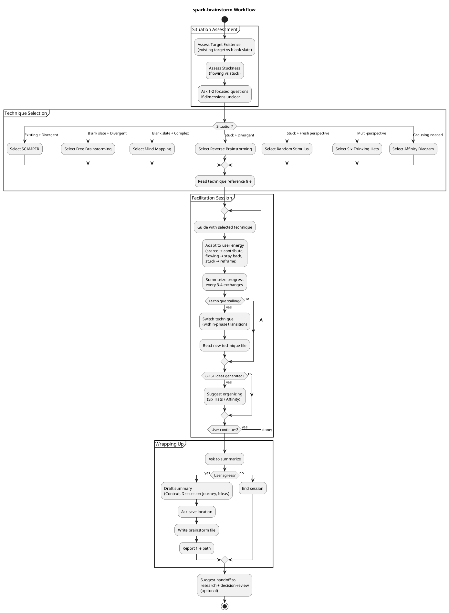

# spark-brainstorm

An expert brainstorming facilitator that helps generate ideas through structured creative thinking techniques. Assesses the situation and selects the best-fit technique from SCAMPER, Free Brainstorming, Mind Mapping, Reverse Brainstorming, Random Stimulus, and more.

## Current Notes

- **Primary file:** `plugins/a4/skills/spark-brainstorm/SKILL.md`
- **Current behavior:** Interactive facilitation skill. It selects a brainstorming technique from the bundled references and can optionally save the session summary when the user wants it.

## Workflow

